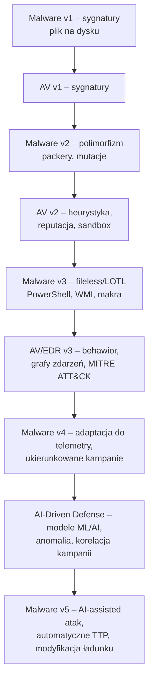

# Ewolucja malware – od sygnatur do adaptacyjnych technologii AI

Fileless, living-off-the-land i współewolucja z systemami detekcji

<em>
Na poziomie logów i procesów wszystko wygląda prosto: plik, hash, proces, alert.  
Ale współczesne malware nie jest już pojedynczym plikiem, tylko <strong>procesem współewolucji</strong> między atakującymi a systemami detekcji.  
Ten write-up traktuje ewolucję malware jak eksperyment laboratoryjny w skali internetu: od prostych sygnatur, przez robaki pokroju WannaCry, po fileless, living-off-the-land i pierwsze próby użycia AI po obu stronach barykady.
</em>

---

## Spis treści

1. [Abstrakt](#1-abstrakt)
2. [Wprowadzenie: od sygnatur do współewolucji](#2-wprowadzenie-od-sygnatur-do-współewolucji)
3. [Studium przypadków: WannaCry, NotPetya, PowerGhost](#3-studium-przypadków-wannacry-notpetya-powerghost)

   * [WannaCry – ostatni wielki „robak sygnaturowy”](#31-wannacry--ostatni-wielki-robak-sygnaturowy)
   * [NotPetya – destrukcja podszyta pod ransomware](#32-notpetya--destrukcja-podszyta-pod-ransomware)
   * [PowerGhost – fileless, koparka i stealth](#33-powerghost--fileless-koparka-i-stealth)
4. [Warstwy obserwacji W₁–W₅: jak naprawdę widzimy malware](#4-warstwy-obserwacji-w₁w₅-jak-naprawdę-widzimy-malware)
5. [Od sygnatur do modeli: AV jako system metryczny](#5-od-sygnatur-do-modeli-av-jako-system-metryczny)
6. [Malware nowej generacji – adaptacja, fileless, living-off-the-land](#6-malware-nowej-generacji--adaptacja-fileless-living-off-the-land)
7. [Teza samo-falsyfikująca (M): granice adaptacji malware wobec AI](#7-teza-samo-falsyfikująca-m-granice-adaptacji-malware-wobec-ai)
8. [Scenariusze rozwoju (1–4)](#8-scenariusze-rozwoju-14)
9. [Wnioski dla praktyki (blue-team, red-team, soc)](#9-wnioski-dla-praktyki-blue-team-red-team-soc)
10. [Bibliografia](#10-bibliografia)

---

## 1. Abstrakt

W artykule traktuję ewolucję malware jako <strong>współewolucję systemu ataku i systemu obserwacji</strong>. Od prostych sygnatur binarnych, przez polimorfizm i packery, po ataki fileless oraz techniki living-off-the-land (LOTL), złośliwe oprogramowanie przesuwa się z warstwy „pliku na dysku” do warstw:

1. <em>procesów w pamięci</em>,
2. <em>zachowań w czasie</em>,
3. <em>śladów w telemetrii i logach tekstowych</em>,
4. <em>anomalii w profilach użytkowników i systemów</em>.

Formułuję <strong>tezę samo-falsyfikującą (M)</strong>:

> **Teza (M)**
> W systemie, w którym:
> – telemetria obejmuje warstwy W₁–W₅ (kod, proces, sieć, host, logi/ASCII),
> – a modele AI uczą się na iteracyjnie aktualizowanym zestawie tych warstw,
> każda <em>długotrwała</em> i <em>utrzymywana w skali</em> kampania malware wymaga:
> – albo <strong>niszy, w której telemetria jest niepełna</strong>,
> – albo <strong>adaptacji po stronie malware do poziomu zbliżonego do AI po stronie obrony</strong>.
>
> Innymi słowy: w granicy „dobrze zebranych danych i dobrze skolibrowanych modeli” <strong>proste malware bez własnej adaptacji nie ma gdzie uciec</strong> – zostaje mu mikro-nisza, krótkie okno zero-day albo eskalacja w stronę <em>równie adaptacyjnych technik po stronie ataku</em>.

Teza (M) jest samo-falsyfikująca: wystarczy wykazać scenariusz, w którym kampania prostego, nieadaptacyjnego malware utrzymuje się długo i w dużej skali <em>mimo</em> kompletnej, gęstej telemetrii i dobrze działających modeli AI po stronie obrony.

---

## 2. Wprowadzenie: od sygnatur do współewolucji

Pierwsze antywirusy traktowały malware jak <strong>skałę z wyrytym podpisem</strong>: jeśli podpis (sygnatura) jest znany, skałę można odrzucić. Wraz z pojawieniem się:

* polimorfizmu,
* packerów,
* mutujących rodzin malware,

ten model się załamał. Sygnatura przestała być stałym podpisem, a zaczęła przypominać <em>rozmytą chmurę punktów</em> w przestrzeni cech.

Równolegle ewoluowało samo środowisko:

* systemy operacyjne zyskały wbudowane mechanizmy bezpieczeństwa,
* sieci przedsiębiorstw zaczęły zbierać telemetrię (proxy, IDS/IPS, EDR/XDR),
* pojawiły się publiczne taksonomie jak MITRE ATT&CK, które opisują techniki na poziomie <em>zachowań</em>, a nie plików.

W efekcie <strong>ewolucja malware stała się ewolucją względem systemu pomiarowego</strong>. To, jak wygląda współczesny atak, jest wprost pochodną tego, co potrafią zmierzyć:

* AV/EDR,
* sieć (NetFlow, PCAP),
* logi systemowe,
* modele ML/AI.

---

## 3. Studium przypadków: WannaCry, NotPetya, PowerGhost

### 3.1. WannaCry – ostatni wielki „robak sygnaturowy”

**WannaCry (2017)** wykorzystał exploit <code>EternalBlue</code> na SMBv1 i w kilka dni zainfekował ponad 200 000 komputerów w ponad 150 krajach, szyfrując dane i żądając okupu w bitcoinach.
To był jeszcze świat, w którym:

* pojedynczy exploit sieciowy mógł wynieść robaka na skalę globalną,
* łatanie podatności było opóźnione,
* detekcja opierała się głównie na sygnaturach plików i ruchu.

WannaCry jest dobrą ilustracją <strong>końca ery, w której „plik = zagrożenie” było wystarczająco dobrym przybliżeniem</strong>.

### 3.2. NotPetya – destrukcja podszyta pod ransomware

**NotPetya (2017)**, zaczynając od łańcucha dostaw (zainfekowana aktualizacja oprogramowania księgowego), wykorzystał szereg technik lateral movement i w praktyce działał jak <em>wiper</em>, mimo pozorów ransomware.
Na poziomie modeli:

* pokazał, że <strong>ontologia „ransomware” była za prosta</strong>,
* a ścieżka infekcji (supply-chain, uprzywilejowane konta) jest równie ważna jak końcowy payload.

Dla naszej tezy istotne jest, że NotPetya <em>wymusił</em> rozwój:

* telemetrii lateral movement,
* korelacji zdarzeń między hostami,
* myślenia o kampanii jako o <strong>procesie w czasie</strong>, a nie pojedynczym pliku.

### 3.3. PowerGhost – fileless, koparka i stealth

**PowerGhost** (opisany m.in. przez Kaspersky) reprezentuje kolejne przesunięcie: malware, które:

* <strong>działa głównie w pamięci</strong> (fileless),
* używa PowerShella i WMI do utrzymania się w systemie,
* kopie kryptowalutę, starając się pozostać niezauważonym jak najdłużej.

Tu atak jest już nie plikiem, ale <strong>sekwencją zachowań</strong>:

1. inicjalizacja (PowerShell / WMI),
2. ustanowienie persistencji,
3. komunikacja z C2,
4. cicha eksploatacja zasobów (CPU/GPU) w tle.

W klasycznym modelu sygnaturowym takie coś jest praktycznie niewidoczne – bo nie ma „pliku do złapania”.

---

## 4. Warstwy obserwacji W₁–W₅: jak naprawdę widzimy malware

Podobnie jak w tekście o protokołach czasu, wprowadzimy sobie <strong>warstwy obserwacji</strong>, ale tymczasem dla malware:

* **W₁ – kod i artefakty binarne**
  Hash, PE/ELF, packery, sekcje, importy, fragmenty shellcode’u.

* **W₂ – procesy i pamięć**
  Tworzenie procesów, injekcja, alokacje pamięci, hooki, moduły DLL.

* **W₃ – sieć**
  Połączenia wychodzące, C2, DNS, nietypowe protokoły, tunelowanie.

* **W₄ – host i środowisko**
  Zmiany w rejestrze, harmonogramie zadań, usługach, logach systemowych.

* **W₅ – warstwa tekstowa i telemetria wysokiego poziomu**
  Logi aplikacyjne, zapisy EDR/XDR, ciągi znaków (ASCII) używane przez malware, opisy zdarzeń, alerty.

Kluczowa obserwacja:

> <strong>Im bardziej malware „ucieka” z W₁ (pliki), tym bardziej musi „wejść” w W₂–W₅.</strong>
> Fileless i LOTL redukują obecność w W₁, ale zostawiają bogatszy ślad w W₂–W₅.

W modelu AI-centric to właśnie W₂–W₅ są paliwem dla:

* detekcji anomalii,
* profilowania behawioralnego,
* korelacji kampanii w czasie.

---

## 5. Od sygnatur do modeli: AV jako system metryczny

Tradycyjny AV można traktować jak <strong>system orzeczniczy oparty na funkcji podobieństwa</strong> w W₁:

* jeśli hash/kawałek kodu jest podobny do znanego malware → „złośliwe”,
* jeśli nie → „niezidentyfikowane” (często: „bezpieczne”).

Wraz z wprowadzeniem:

* heurystyk,
* reputacji,
* analizy behawioralnej,

system detekcji zaczął działać jak prosty <strong>klasyfikator wielowymiarowy</strong>, gdzie cechy pochodzą z W₁–W₅.

Dzisiejsze EDR/XDR to już explicite:

* modele uczenia maszynowego,
* grafy zależności między procesami i hostami,
* systemy scoringowe (ryzyko hosta / użytkownika).

### 5.1. Flowchart ewolucji: malware ↔ detekcja

Ten diagram podkreśla, że:

* <strong>każdy krok po stronie ataku generuje krok po stronie detekcji</strong>,
* a kolejne generacje detekcji <strong>tworzą nową presję selekcyjną</strong> na malware.

---

## 6. Malware nowej generacji – adaptacja, fileless, living-off-the-land

Współczesne kampanie malware korzystają z kilku powtarzających się motywów:

1. **Fileless i LOTL**
   Wykorzystanie natywnych narzędzi systemu (PowerShell, WMI, certutil, mshta, wbudowane interpretery) oraz uruchamianie payloadu w pamięci. Cel: <strong>minimalizacja śladu w W₁</strong>.

2. **Ataki na łańcuch dostaw (supply-chain)**
   Zaufane aktualizacje, komponenty open-source, biblioteki. Malware „dziedziczy” zaufanie infrastruktury, w której się pojawia.

3. **Ukierunkowane kampanie z rekonesansem**
   Mapowanie topologii sieci, kont uprzywilejowanych, krytycznych systemów (SCADA, systemy bankowe, ICS), a dopiero potem dobranie ładunku.

4. **Pierwsze użycia AI po stronie ataku** (jeszcze głównie „semi-manualne”)
   – generowanie phishingu i lure’ów,
   – automatyczne testowanie konfiguracji defensywnych,
   – selekcja TTP w oparciu o zebrane dane o środowisku.

To wszystko składa się na <strong>malware jako proces adaptacyjny</strong>, a nie pojedynczy binarny artefakt.

---

## 7. Teza samo-falsyfikująca (M): granice adaptacji malware wobec AI

Sformalizujmy Tezę (M) trochę bardziej.

Niech:

* **D** – system detekcji (telemetria + modele + reguły),
* **A** – system ataku (kampania malware, TTP, infrastruktura C2),
* **Θ** – zbiór parametrów środowiska (topologia, konfiguracje, polityki).

Załóżmy, że:

* telemetria D obejmuje W₁–W₅,
* modele ML/AI po stronie D są regularnie trenowane na nowych danych,
* istnieje ciągła pętla feedbacku: incydent → analiza → nowy model / nowe reguły.

<strong>Teza (M):</strong>

> W takim układzie każda kampania A, która:
> – trwa długo (okna miesięcy/lat),
> – działa w skali istotnej (wiele organizacji / szerokie spektrum środowisk),
> musi:
>
> 1. albo znaleźć stabilną niszę, w której D nie widzi kluczowej części W₂–W₅,
> 2. albo sama stać się procesem adaptacyjnym na poziomie zbliżonym do D (AI-assisted, ciągłe modyfikacje TTP, eksperymenty z ładunkami).

Teza jest <strong>samo-falsyfikująca</strong>, bo:

* aby ją obalić, wystarczy pokazać kampanię prostego, nieadaptacyjnego malware, która w środowisku z gęstą telemetrią i AI-driven defense <em>utrzymuje się długo i w skali</em> bez istotnych modyfikacji,
* albo udowodnić, że istnieje klasa środowisk, w której <strong>telemetria nigdy nie będzie kompletna</strong> (np. ze względów regulacyjnych, prywatnościowych, technicznych), przez co malware zawsze ma „ciemny kąt” do wykorzystania.

---

## 8. Scenariusze rozwoju (1–4)

### 8.1. Scenariusz 1 – AI wzmacnia obronę

* SOC-e działają w trybie „asystowanym” przez modele,
* incydenty są korelowane między organizacjami (threat intel + wspólne modele),
* malware jest „spychane” do nisz: air-gap, bardzo specyficzne ICS, słabo zarządzane legacy.

W tym scenariuszu detekcja staje się na tyle gęsta, że <em>przetrwanie prostego malware jest krótkie</em>, a realnym problemem stają się pojedyncze, bardzo zaawansowane kampanie.

### 8.2. Scenariusz 2 – AI wzmacnia atak

* cyberprzestępcy budują własne „SOC w lustrze”: modele analizujące odpowiedzi systemów obronnych,
* TTP są dobierane automatycznie do środowiska ofiary,
* powstają narzędzia typu „malware-as-a-service z AI”, które generują kampanie pod konkretne branże / regiony.

Tu Teza (M) oznacza, że <strong>równie adaptacyjne stają się obie strony</strong>, a przewaga wynika z jakości danych i czasu reakcji.

### 8.3. Scenariusz 3 – wyścig zbrojeń (koegzystencja)

* D i A współewoluują jak dwie populacje w modelu ewolucyjnym,
* pojawiają się cykle: nowa technika → nowy moduł detekcji → migracja TTP → nowy model AI,
* rośnie znaczenie <strong>standardów wymiany wiedzy</strong> (ATT&CK, STIX/TAXII, wspólne repozytoria).

Ten scenariusz jest najbardziej realistyczny w perspektywie najbliższych lat.

### 8.4. Scenariusz 4 – regulacje i ograniczenia

* regulacje prawne spowalniają rozwój i użycie AI po stronie obrony,
* nieformalne lub przestępcze grupy atakujące nie są tym ograniczone,
* luka kompetencyjna rośnie.

Tutaj Teza (M) może zostać sfalsyfikowana w praktyce: <em>nie dlatego, że jest zła konceptualnie</em>, ale dlatego, że D nigdy nie osiąga wymaganej gęstości telemetrii i jakości modeli ze względu na ograniczenia pozatechniczne.

---

## 9. Wnioski dla praktyki (blue-team, red-team, SOC)

Kilka praktycznych implikacji z perspektywy „ewolucja malware ↔ ewolucja systemu pomiarowego”:

1. **Nie ma powrotu do myślenia „plikocentrycznego”**
   – fileless, LOTL i supply-chain wymuszają myślenie w kategoriach W₂–W₅ i kampanii jako procesu.

2. **Największą przewagą jest jakość telemetrii i jej połączeń**
   – nawet bardzo dobry model AI nie pomoże, jeśli W₂–W₅ są dziurawe lub niespójne między systemami.

3. **MITRE ATT&CK jako język ontologii ataku**
   – mówienie o kampaniach na poziomie TTP (zamiast nazw malware) zbliża praktykę do modelu, w którym <strong>to zachowania są pierwszorzędne, a sample – wtórne</strong>.

4. **Red-team jako „generator danych” dla modeli**
   – kontrolowane kampanie ofensywne dostarczają wysokiej jakości przykładów do treningu i walidacji modeli ML/AI, przyspieszając ewolucję D.

5. **Świadomość, że malware też ma swój „R&D”**
   – podobnie jak obrońcy eksperymentują z modelami, tak atakujący eksperymentują z TTP, packerami, infrastrukturą C2.
   – ignorowanie tego faktu prowadzi do złudnego poczucia bezpieczeństwa („nasze AV ma 99% skuteczności”).

W tym sensie „ewolucja malware” nie jest historią zewnętrznego wroga – jest opisem <strong>tego, jak wygląda rzeczywistość w systemach, w których AI, człowiek i kod złośliwy zamieszkują to samo środowisko pomiarowe</strong>.

---

## 10. Bibliografia

1. WannaCry ransomware attack – opis i skala ataku.
   – [https://en.wikipedia.org/wiki/WannaCry_ransomware_attack](https://en.wikipedia.org/wiki/WannaCry_ransomware_attack)

2. NotPetya – case study i analiza skutków dla Maersk i innych organizacji.
   – [https://www.sipa.columbia.edu/sites/default/files/2022-11/NotPetya%20Final.pdf](https://www.sipa.columbia.edu/sites/default/files/2022-11/NotPetya%20Final.pdf)

3. PowerGhost – fileless cryptominer i analiza techniczna.
   – [https://securelist.com/a-mining-multitool/86950/](https://securelist.com/a-mining-multitool/86950/)

4. MITRE ATT&CK – taksonomia technik ataku, ze szczególnym uwzględnieniem wykonania przez PowerShell / CLI.
   – [https://attack.mitre.org/](https://attack.mitre.org/)
   – [https://attack.mitre.org/techniques/T1059/](https://attack.mitre.org/techniques/T1059/)

5. Literatura techniczna i książki:
   – M. Sikorski, A. Honig, <em>Practical Malware Analysis: The Hands-On Guide to Dissecting Malicious Software</em>, No Starch Press, 2012.
   – Publiczne raporty APT (FireEye, Kaspersky, Microsoft, itp.) dla przykładów kampanii i TTP.

---

> [Powrót do głównego dokumentu](https://github.com/DonkeyJJLove/writeups/blob/Fileless-Malware/README.MD#fileless-malware--analiza-techniczna-system%C3%B3w-windows)
> [Powrót na górę](#ewolucja-malware--od-sygnatur-do-adaptacyjnych-technologii-ai)

---

Plan–Pauza Rdzeń–Peryferia Cisza–Wydech Wioska–Miasto Ostrze–Cierpliwość Locus–Medium–Mandat Human–AI‡ Próg–Przejście Semantyka–Energia
