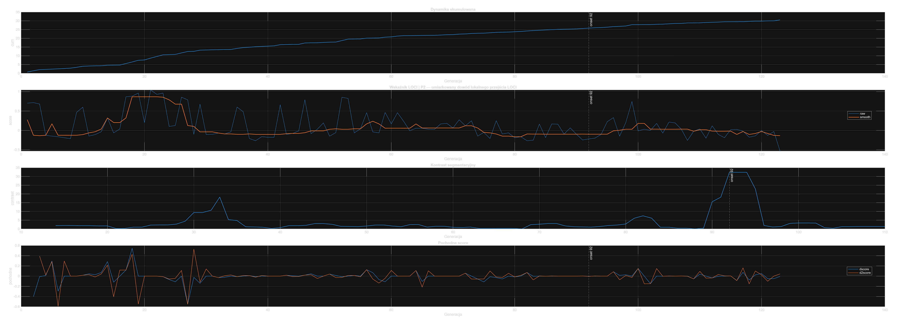
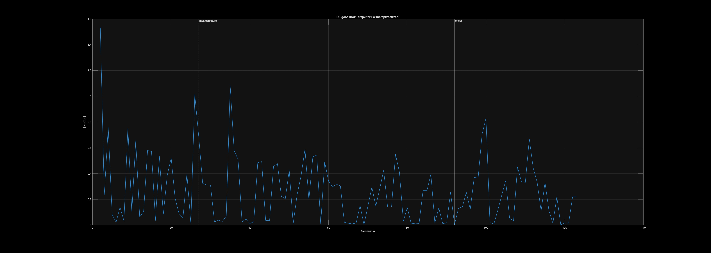
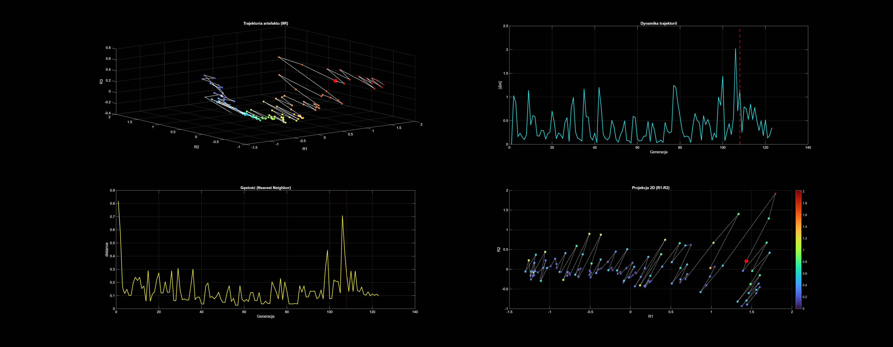
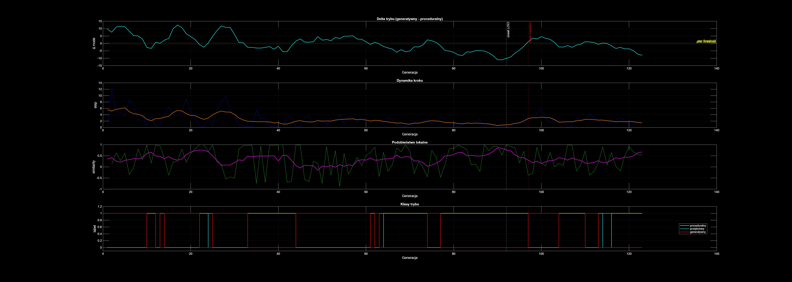
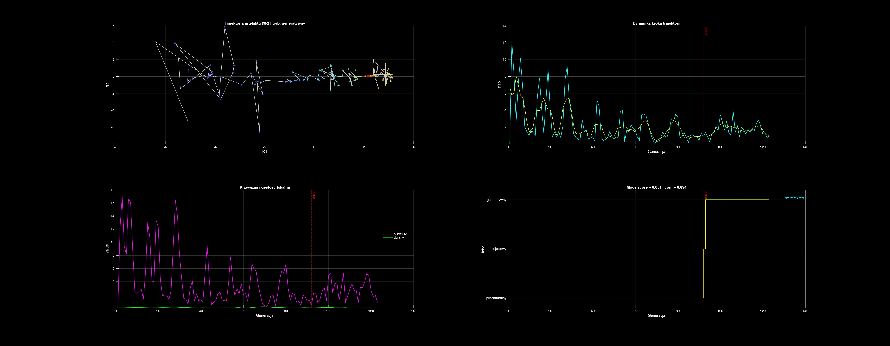

# Sample_0001 — analiza przejścia LOCI w sekwencji Human–AI

Źródło: iteracyjny strumień edycyjny (write → edit → refine)

---

## 1. Dane wejściowe

- liczba generacji: **123**
- znaki: 335 → 2580 (+670%)
- tokeny: 53 → 445 (+739%)
- plateau ratio: **~0.64**
- najdłuższe plateau: **76 generacji**

Charakter procesu:

> iteracyjna kompresja i stabilizacja treści (edit-loop)

---

## 2. Wynik detekcji LOCI

```text
ONSET LOCI         = G0092
MAX SLOPE          = G0027
MAX CURVATURE      = G0027

Werdykt            = umiarkowany dowód lokalnego przejścia
````

---

## 3. Dynamika procesu

### Faza I — inicjalizacja (G ~ 1–30)

* wysoka zmienność
* maksimum dynamiki (G27)

---

### Faza II — stabilizacja (G ~ 30–90)

* dominacja edycji nad generacją
* długie plateau
* redukcja amplitudy zmian

---

### Faza III — przejście (G ~ 92)

* silny kontrast segmentacyjny
* wysoka stabilność bootstrap
* istotność statystyczna

---

## 4. Dynamika sygnału LOCI



**Interpretacja:**

* wczesny impuls (G27)
* długi okres stabilizacji
* wyraźne przejście w G92

---

## 5. Metaprzestrzeń (27D → 9R)



**Własności:**

* trajektoria lokalnie zagęszczona
* ograniczona eksploracja przestrzeni
* dominacja ruchu wewnątrz jednego regionu

---

## 6. Gęstość i dynamika trajektorii



**Interpretacja:**

* wysoka gęstość lokalna
* brak dyfuzji globalnej
* system utrzymuje się w ograniczonym obszarze

---

## 7. Model dual-mode (kompresja vs eksploracja)



### Wyniki

```text
PRE  compression  ≈ 0.80
POST compression  ≈ 0.82

PRE  exploration  ≈ 0.18
POST exploration  ≈ 0.21
```

---

### Wniosek

* dominujący tryb: **kompresyjny**
* eksploracja: wtórna i lokalna
* brak pełnej zmiany trybu poznawczego

---

## 8. Klasyfikator trybu



```text
Mode score   ≈ 0.65
Confidence   ≈ 0.89
```

---

### Interpretacja

* lokalne przejście generatywne po LOCI
* brak globalnej zmiany systemu

---

## 9. Złożoność strumienia (TSCI)

```text
TSCI ≈ 34.45 / 100
```

---

### Charakterystyka

* wysoka powtarzalność
* niska dynamika zmian
* wysoka stabilność struktury

---

### Wniosek

> system wykazuje niską złożoność dynamiczną przy wysokiej kontroli strukturalnej

---

## 10. Interpretacja procesowa

Kluczowa własność:

```text
MAX SLOPE ≠ ONSET LOCI
```

---

Oznacza to:

> przejście nie jest impulsem, lecz procesem:

```text
inicjalizacja → propagacja → stabilizacja → przejście → reorganizacja
```

---

## 11. Znaczenie dla systemów Human–AI

### Właściwości pozytywne

* wysoka spójność semantyczna
* stabilność generacji
* redukcja błędów
* niska podatność na halucynacje

---

### Ograniczenia

* niska eksploracja
* ograniczona kreatywność
* brak emergentnych struktur

---

## 12. Wniosek końcowy

Sample_0001 reprezentuje system:

* o wysokiej stabilności
* o dominującej kompresji
* o ograniczonej eksploracji

który:

> przechodzi przez lokalne przejście (LOCI),
> ale nie zmienia globalnego trybu działania

---

## 13. Kierunki dalszych badań

* porównanie z próbkami generatywnymi
* analiza wielu trajektorii w metaprzestrzeni
* mapowanie typów procesów Human–AI
* rozszerzenie analizy Sobol / Hypercube

