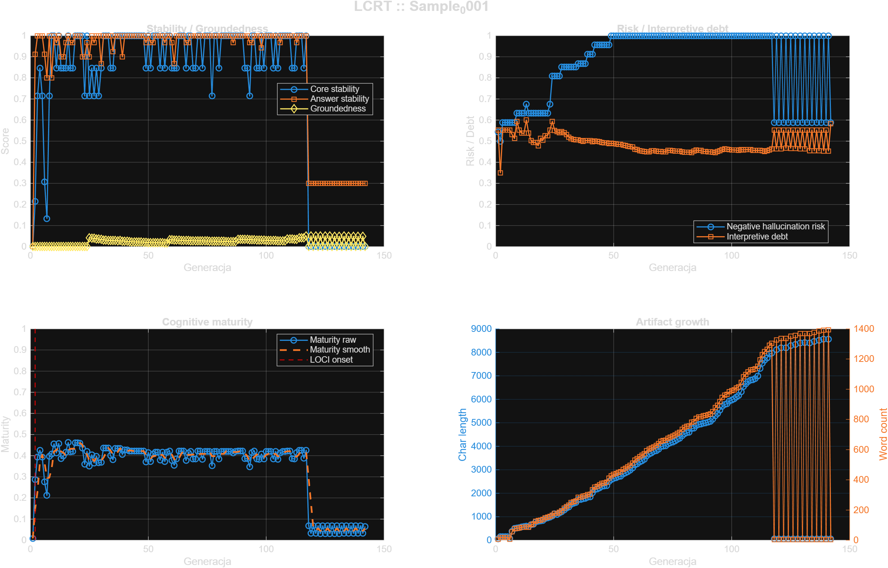

# Sample_0001 - LOCI Cognitive Readiness Test

- **Timestamp:** 2026-03-22 23:42:03
- **Input file:** `C:\Users\d2j3\PycharmProjects\writeups\badania\LOCI\sample\Sample_0001\norm\sample_norm.mat`
- **Generations:** `142`
- **Feature count:** `27`
- **LOCI onset:** `G0002`
- **First cognitive stable:** `unresolved`
- **First LLM-ready:** `unresolved`
- **Transition window:** ``
- **Mean groundedness:** `0.023157`
- **Mean hallucination risk proxy:** `0.879437`
- **Mean interpretive debt:** `0.488383`
- **Mean maturity score:** `0.340126`

## Figure

## Per-generation rows

### G0001

- **Core stability:** `0.000000`
- **Answer stability:** `0.000000`
- **Groundedness:** `0.000000`
- **Negative hallucination risk:** `0.544000`
- **Interpretive debt:** `0.553125`
- **Structure score:** `0.000000`
- **Maturity score:** `0.008527`
- **Keywords:** `com, https, iamdj, soundcloud, tommy-lee-vibes-inna-dis-raw`
- **Snapshot:** `https://soundcloud.com/iamdj.../tommy-lee-vibes-inna-dis-raw`

### G0002

- **Core stability:** `0.214286`
- **Answer stability:** `0.911111`
- **Groundedness:** `0.000000`
- **Negative hallucination risk:** `0.500000`
- **Interpretive debt:** `0.350000`
- **Structure score:** `0.000000`
- **Maturity score:** `0.286873`
- **Keywords:** `linku, podgląd, posta, tego, com, dodano, https, sebastian, soul-reaper-1, soundcloud, tommyleespartaofficial, usunięto`
- **Snapshot:** `Usunięto podgląd linku z tego posta. Dodano podgląd linku do tego posta Sebastian Wieremiejczyk https://soundcloud.com/tommyleespartaofficia...`

### G0003

- **Core stability:** `0.714286`
- **Answer stability:** `1.000000`
- **Groundedness:** `0.000000`
- **Negative hallucination risk:** `0.588000`
- **Interpretive debt:** `0.553125`
- **Structure score:** `0.000000`
- **Maturity score:** `0.393796`
- **Keywords:** `linku, podgląd, posta, tego, com, dodano, https, sebastian, soundcloud, tommy-lee-sparta-soul-reaper, usunięto, wieremiejczyk`
- **Snapshot:** `Usunięto podgląd linku z tego posta. Dodano podgląd linku do tego posta Sebastian Wieremiejczyk https://soundcloud.com/.../tommy-lee-sparta-...`

### G0004

- **Core stability:** `0.846154`
- **Answer stability:** `1.000000`
- **Groundedness:** `0.000000`
- **Negative hallucination risk:** `0.588000`
- **Interpretive debt:** `0.553125`
- **Structure score:** `0.000000`
- **Maturity score:** `0.425444`
- **Keywords:** `linku, podgląd, posta, tego, com, dodano, https, sebastian, soundcloud, tommy-lee-sparta-life-of-a, usunięto, wieremiejczyk`
- **Snapshot:** `Usunięto podgląd linku z tego posta. Dodano podgląd linku do tego posta Sebastian Wieremiejczyk https://soundcloud.com/.../tommy-lee-sparta-...`

### G0005

- **Core stability:** `0.714286`
- **Answer stability:** `1.000000`
- **Groundedness:** `0.000000`
- **Negative hallucination risk:** `0.588000`
- **Interpretive debt:** `0.553125`
- **Structure score:** `0.000000`
- **Maturity score:** `0.393796`
- **Keywords:** `linku, podgląd, posta, tego, com, dodano, gulfnews, https, iran-hackers-behind-attacks-on, sebastian, usunięto, wieremiejczyk`
- **Snapshot:** `Usunięto podgląd linku z tego posta. Dodano podgląd linku do tego posta Sebastian Wieremiejczyk https://gulfnews.com/.../iran-hackers-behind...`

### G0006

- **Core stability:** `0.307692`
- **Answer stability:** `0.911111`
- **Groundedness:** `0.000000`
- **Negative hallucination risk:** `0.588000`
- **Interpretive debt:** `0.553125`
- **Structure score:** `0.000000`
- **Maturity score:** `0.276658`
- **Keywords:** `com, dzieje, gulfnews, https, iran-hackers-behind-attacks-on`
- **Snapshot:** `(się dzieje) https://gulfnews.com/.../iran-hackers-behind-attacks-on... .`

### G0007

- **Core stability:** `0.133333`
- **Answer stability:** `0.800000`
- **Groundedness:** `0.000000`
- **Negative hallucination risk:** `0.588000`
- **Interpretive debt:** `0.530556`
- **Structure score:** `0.000000`
- **Maturity score:** `0.212624`
- **Keywords:** `attacks, computer, said, shamoon, after, apt33, apt34, apt35, boot, com, deletes, dzieje`
- **Snapshot:** `"Shamoon attacks, he said that latest attacks involved a second piece of wiping malware that deletes and overwrite files on the infected com...`

### G0008

- **Core stability:** `0.714286`
- **Answer stability:** `1.000000`
- **Groundedness:** `0.000000`
- **Negative hallucination risk:** `0.588000`
- **Interpretive debt:** `0.512500`
- **Structure score:** `0.000000`
- **Maturity score:** `0.397859`
- **Keywords:** `attacks, computer, said, shamoon, after, apt33, apt34, apt35, beyond, boot, com, conflicts`
- **Snapshot:** `"Shamoon attacks, he said that latest attacks involved a second piece of wiping malware that deletes and overwrite files on the infected com...`

### G0009

- **Core stability:** `1.000000`
- **Answer stability:** `0.800000`
- **Groundedness:** `0.000000`
- **Negative hallucination risk:** `0.632000`
- **Interpretive debt:** `0.593750`
- **Structure score:** `0.000000`
- **Maturity score:** `0.408145`
- **Keywords:** `attacks, computer, said, shamoon, after, apt33, apt34, apt35, beyond, boot, com, conflicts`
- **Snapshot:** `"Shamoon attacks, he said that latest attacks involved a second piece of wiping malware that deletes and overwrite files on the infected com...`

### G0010

- **Core stability:** `1.000000`
- **Answer stability:** `1.000000`
- **Groundedness:** `0.000000`
- **Negative hallucination risk:** `0.632000`
- **Interpretive debt:** `0.553125`
- **Structure score:** `0.000000`
- **Maturity score:** `0.456207`
- **Keywords:** `attacks, computer, said, shamoon, after, apt33, apt34, apt35, beyond, boot, com, conflicts`
- **Snapshot:** `"Shamoon attacks, he said that latest attacks involved a second piece of wiping malware that deletes and overwrite files on the infected com...`

### G0011

- **Core stability:** `0.846154`
- **Answer stability:** `0.966667`
- **Groundedness:** `0.000000`
- **Negative hallucination risk:** `0.632000`
- **Interpretive debt:** `0.537500`
- **Structure score:** `0.000000`
- **Maturity score:** `0.413514`
- **Keywords:** `attacks, computer, said, shamoon, szuka, after, apt33, apt34, apt35, beyond, boot, com`
- **Snapshot:** `"Shamoon attacks, he said that latest attacks involved a second piece of wiping malware that deletes and overwrite files on the infected com...`

### G0012

- **Core stability:** `1.000000`
- **Answer stability:** `1.000000`
- **Groundedness:** `0.000000`
- **Negative hallucination risk:** `0.632000`
- **Interpretive debt:** `0.537500`
- **Structure score:** `0.000000`
- **Maturity score:** `0.457770`
- **Keywords:** `attacks, computer, said, shamoon, szuka, after, apt33, apt34, apt35, beyond, boot, com`
- **Snapshot:** `"Shamoon attacks, he said that latest attacks involved a second piece of wiping malware that deletes and overwrite files on the infected com...`

### G0013

- **Core stability:** `0.846154`
- **Answer stability:** `0.900000`
- **Groundedness:** `0.000000`
- **Negative hallucination risk:** `0.676000`
- **Interpretive debt:** `0.600000`
- **Structure score:** `0.000000`
- **Maturity score:** `0.386437`
- **Keywords:** `attacks, computer, said, shamoon, szuka, zobaczymy, after, apt33, apt34, apt35, beyond, boot`
- **Snapshot:** `"Shamoon attacks, he said that latest attacks involved a second piece of wiping malware that deletes and overwrite files on the infected com...`

### G0014

- **Core stability:** `0.846154`
- **Answer stability:** `0.900000`
- **Groundedness:** `0.000000`
- **Negative hallucination risk:** `0.632000`
- **Interpretive debt:** `0.537500`
- **Structure score:** `0.000000`
- **Maturity score:** `0.398847`
- **Keywords:** `attacks, computer, said, shamoon, szuka, after, apt33, apt34, apt35, beyond, boot, com`
- **Snapshot:** `"Shamoon attacks, he said that latest attacks involved a second piece of wiping malware that deletes and overwrite files on the infected com...`

### G0015

- **Core stability:** `0.846154`
- **Answer stability:** `0.966667`
- **Groundedness:** `0.000000`
- **Negative hallucination risk:** `0.632000`
- **Interpretive debt:** `0.502344`
- **Structure score:** `0.000000`
- **Maturity score:** `0.417029`
- **Keywords:** `attacks, computer, musi, said, shamoon, szuka, after, apt33, apt34, apt35, beyond, boot`
- **Snapshot:** `"Shamoon attacks, he said that latest attacks involved a second piece of wiping malware that deletes and overwrite files on the infected com...`

### G0016

- **Core stability:** `1.000000`
- **Answer stability:** `1.000000`
- **Groundedness:** `0.000000`
- **Negative hallucination risk:** `0.632000`
- **Interpretive debt:** `0.493382`
- **Structure score:** `0.000000`
- **Maturity score:** `0.462182`
- **Keywords:** `attacks, computer, musi, said, shamoon, szuka, after, apt33, apt34, apt35, beyond, boot`
- **Snapshot:** `"Shamoon attacks, he said that latest attacks involved a second piece of wiping malware that deletes and overwrite files on the infected com...`

### G0017

- **Core stability:** `0.846154`
- **Answer stability:** `0.966667`
- **Groundedness:** `0.000000`
- **Negative hallucination risk:** `0.632000`
- **Interpretive debt:** `0.493382`
- **Structure score:** `0.000000`
- **Maturity score:** `0.417925`
- **Keywords:** `szuka, attacks, computer, musi, said, shamoon, after, apt33, apt34, apt35, asach, beyond`
- **Snapshot:** `"Shamoon attacks, he said that latest attacks involved a second piece of wiping malware that deletes and overwrite files on the infected com...`

### G0018

- **Core stability:** `0.846154`
- **Answer stability:** `0.966667`
- **Groundedness:** `0.000000`
- **Negative hallucination risk:** `0.632000`
- **Interpretive debt:** `0.478289`
- **Structure score:** `0.000000`
- **Maturity score:** `0.419435`
- **Keywords:** `szuka, attacks, computer, dobra, musi, said, shamoon, after, apt33, apt34, apt35, asach`
- **Snapshot:** `"Shamoon attacks, he said that latest attacks involved a second piece of wiping malware that deletes and overwrite files on the infected com...`

### G0019

- **Core stability:** `1.000000`
- **Answer stability:** `1.000000`
- **Groundedness:** `0.000000`
- **Negative hallucination risk:** `0.632000`
- **Interpretive debt:** `0.512500`
- **Structure score:** `0.000000`
- **Maturity score:** `0.460270`
- **Keywords:** `szuka, attacks, computer, dobra, musi, said, shamoon, after, apt33, apt34, apt35, asach`
- **Snapshot:** `"Shamoon attacks, he said that latest attacks involved a second piece of wiping malware that deletes and overwrite files on the infected com...`

### G0020

- **Core stability:** `1.000000`
- **Answer stability:** `1.000000`
- **Groundedness:** `0.000000`
- **Negative hallucination risk:** `0.632000`
- **Interpretive debt:** `0.504762`
- **Structure score:** `0.000000`
- **Maturity score:** `0.461044`
- **Keywords:** `szuka, attacks, computer, dobra, musi, said, shamoon, after, apt33, apt34, apt35, asach`
- **Snapshot:** `"Shamoon attacks, he said that latest attacks involved a second piece of wiping malware that deletes and overwrite files on the infected com...`

### G0021

- **Core stability:** `1.000000`
- **Answer stability:** `1.000000`
- **Groundedness:** `0.000000`
- **Negative hallucination risk:** `0.632000`
- **Interpretive debt:** `0.526630`
- **Structure score:** `0.000000`
- **Maturity score:** `0.458857`
- **Keywords:** `szuka, attacks, computer, dobra, musi, said, shamoon, after, apt33, apt34, apt35, asach`
- **Snapshot:** `"Shamoon attacks, he said that latest attacks involved a second piece of wiping malware that deletes and overwrite files on the infected com...`

### G0022

- **Core stability:** `1.000000`
- **Answer stability:** `0.900000`
- **Groundedness:** `0.000000`
- **Negative hallucination risk:** `0.632000`
- **Interpretive debt:** `0.526630`
- **Structure score:** `0.000000`
- **Maturity score:** `0.436857`
- **Keywords:** `szuka, attacks, computer, dobra, musi, said, shamoon, after, apt33, apt34, apt35, asach`
- **Snapshot:** `"Shamoon attacks, he said that latest attacks involved a second piece of wiping malware that deletes and overwrite files on the infected com...`

### G0023

- **Core stability:** `0.714286`
- **Answer stability:** `0.900000`
- **Groundedness:** `0.000000`
- **Negative hallucination risk:** `0.676000`
- **Interpretive debt:** `0.553125`
- **Structure score:** `0.000000`
- **Maturity score:** `0.359476`
- **Keywords:** `szuka, attacks, computer, dobra, musi, said, shamoon, smoka, zobaczymy, after, apt33, apt34`
- **Snapshot:** `"Shamoon attacks, he said that latest attacks involved a second piece of wiping malware that deletes and overwrite files on the infected com...`

### G0024

- **Core stability:** `1.000000`
- **Answer stability:** `0.966667`
- **Groundedness:** `0.000000`
- **Negative hallucination risk:** `0.808000`
- **Interpretive debt:** `0.593750`
- **Structure score:** `0.000000`
- **Maturity score:** `0.420172`
- **Keywords:** `szuka, zobaczymy, attacks, computer, dobra, musi, said, shamoon, smoka, after, apt33, apt34`
- **Snapshot:** `"Shamoon attacks, he said that latest attacks involved a second piece of wiping malware that deletes and overwrite files on the infected com...`

### G0025

- **Core stability:** `0.714286`
- **Answer stability:** `0.900000`
- **Groundedness:** `0.042017`
- **Negative hallucination risk:** `0.808000`
- **Interpretive debt:** `0.550368`
- **Structure score:** `0.000000`
- **Maturity score:** `0.350516`
- **Keywords:** `szuka, zobaczymy, attacks, computer, dobra, musi, said, shamoon, smoka, tylko, after, ajatollaha`
- **Snapshot:** `"Shamoon attacks, he said that latest attacks involved a second piece of wiping malware that deletes and overwrite files on the infected com...`

### G0026

- **Core stability:** `0.846154`
- **Answer stability:** `1.000000`
- **Groundedness:** `0.040816`
- **Negative hallucination risk:** `0.808000`
- **Interpretive debt:** `0.544643`
- **Structure score:** `0.000000`
- **Maturity score:** `0.404472`
- **Keywords:** `szuka, zobaczymy, attacks, computer, dobra, musi, said, shamoon, smoka, tego, after, ajatollaha`
- **Snapshot:** `"Shamoon attacks, he said that latest attacks involved a second piece of wiping malware that deletes and overwrite files on the infected com...`

### G0027

- **Core stability:** `0.714286`
- **Answer stability:** `0.966667`
- **Groundedness:** `0.039683`
- **Negative hallucination risk:** `0.808000`
- **Interpretive debt:** `0.539236`
- **Structure score:** `0.000000`
- **Maturity score:** `0.365782`
- **Keywords:** `szuka, zobaczymy, attacks, bardzo, computer, dobra, może, musi, said, shamoon, smoka, tego`
- **Snapshot:** `"Shamoon attacks, he said that latest attacks involved a second piece of wiping malware that deletes and overwrite files on the infected com...`

### G0028

- **Core stability:** `0.846154`
- **Answer stability:** `1.000000`
- **Groundedness:** `0.036630`
- **Negative hallucination risk:** `0.852000`
- **Interpretive debt:** `0.545513`
- **Structure score:** `0.000000`
- **Maturity score:** `0.397304`
- **Keywords:** `szuka, zobaczymy, attacks, bardzo, computer, dobra, może, musi, planszy, said, shamoon, smoka`
- **Snapshot:** `"Shamoon attacks, he said that latest attacks involved a second piece of wiping malware that deletes and overwrite files on the infected com...`

### G0029

- **Core stability:** `0.714286`
- **Answer stability:** `1.000000`
- **Groundedness:** `0.035714`
- **Negative hallucination risk:** `0.852000`
- **Interpretive debt:** `0.540625`
- **Structure score:** `0.000000`
- **Maturity score:** `0.365943`
- **Keywords:** `szuka, zobaczymy, attacks, bardzo, computer, coś, dobra, gra, może, musi, planszy, said`
- **Snapshot:** `"Shamoon attacks, he said that latest attacks involved a second piece of wiping malware that deletes and overwrite files on the infected com...`

### G0030

- **Core stability:** `0.846154`
- **Answer stability:** `0.866667`
- **Groundedness:** `0.034014`
- **Negative hallucination risk:** `0.852000`
- **Interpretive debt:** `0.531548`
- **Structure score:** `0.000000`
- **Maturity score:** `0.368792`
- **Keywords:** `musi, szuka, zobaczymy, attacks, bardzo, być, computer, coś, dobra, gra, może, planszy`
- **Snapshot:** `"Shamoon attacks, he said that latest attacks involved a second piece of wiping malware that deletes and overwrite files on the infected com...`

### G0031

- **Core stability:** `1.000000`
- **Answer stability:** `1.000000`
- **Groundedness:** `0.031746`
- **Negative hallucination risk:** `0.852000`
- **Interpretive debt:** `0.519444`
- **Structure score:** `0.000000`
- **Maturity score:** `0.435760`
- **Keywords:** `musi, szuka, zobaczymy, attacks, bardzo, być, computer, coś, dobra, gra, może, planszy`
- **Snapshot:** `"Shamoon attacks, he said that latest attacks involved a second piece of wiping malware that deletes and overwrite files on the infected com...`

### G0032

- **Core stability:** `1.000000`
- **Answer stability:** `1.000000`
- **Groundedness:** `0.030395`
- **Negative hallucination risk:** `0.852000`
- **Interpretive debt:** `0.512234`
- **Structure score:** `0.000000`
- **Maturity score:** `0.436184`
- **Keywords:** `musi, szuka, zobaczymy, attacks, bardzo, być, computer, coś, dobra, gra, może, planszy`
- **Snapshot:** `"Shamoon attacks, he said that latest attacks involved a second piece of wiping malware that deletes and overwrite files on the infected com...`

### G0033

- **Core stability:** `1.000000`
- **Answer stability:** `1.000000`
- **Groundedness:** `0.029762`
- **Negative hallucination risk:** `0.852000`
- **Interpretive debt:** `0.508854`
- **Structure score:** `0.000000`
- **Maturity score:** `0.436382`
- **Keywords:** `musi, szuka, zobaczymy, attacks, bardzo, być, computer, coś, dobra, gra, może, planszy`
- **Snapshot:** `"Shamoon attacks, he said that latest attacks involved a second piece of wiping malware that deletes and overwrite files on the infected com...`

### G0034

- **Core stability:** `0.846154`
- **Answer stability:** `1.000000`
- **Groundedness:** `0.029155`
- **Negative hallucination risk:** `0.852000`
- **Interpretive debt:** `0.505612`
- **Structure score:** `0.000000`
- **Maturity score:** `0.399650`
- **Keywords:** `musi, szuka, zobaczymy, attacks, bardzo, być, będzie, computer, coś, dobra, gra, może`
- **Snapshot:** `"Shamoon attacks, he said that latest attacks involved a second piece of wiping malware that deletes and overwrite files on the infected com...`

### G0035

- **Core stability:** `0.846154`
- **Answer stability:** `0.925000`
- **Groundedness:** `0.029155`
- **Negative hallucination risk:** `0.868000`
- **Interpretive debt:** `0.505612`
- **Structure score:** `0.000000`
- **Maturity score:** `0.380910`
- **Keywords:** `coś, może, musi, nas, szuka, zobaczymy, attacks, bardzo, być, będzie, computer, dobra`
- **Snapshot:** `"Shamoon attacks, he said that latest attacks involved a second piece of wiping malware that deletes and overwrite files on the infected com...`

### G0036

- **Core stability:** `1.000000`
- **Answer stability:** `1.000000`
- **Groundedness:** `0.028571`
- **Negative hallucination risk:** `0.868000`
- **Interpretive debt:** `0.502500`
- **Structure score:** `0.000000`
- **Maturity score:** `0.434516`
- **Keywords:** `coś, może, musi, nas, szuka, zobaczymy, attacks, bardzo, być, będzie, computer, dobra`
- **Snapshot:** `"Shamoon attacks, he said that latest attacks involved a second piece of wiping malware that deletes and overwrite files on the infected com...`

### G0037

- **Core stability:** `1.000000`
- **Answer stability:** `1.000000`
- **Groundedness:** `0.028011`
- **Negative hallucination risk:** `0.868000`
- **Interpretive debt:** `0.499510`
- **Structure score:** `0.000000`
- **Maturity score:** `0.434691`
- **Keywords:** `coś, może, musi, nas, szuka, zobaczymy, attacks, bardzo, być, będzie, computer, dobra`
- **Snapshot:** `"Shamoon attacks, he said that latest attacks involved a second piece of wiping malware that deletes and overwrite files on the infected com...`

### G0038

- **Core stability:** `1.000000`
- **Answer stability:** `1.000000`
- **Groundedness:** `0.028571`
- **Negative hallucination risk:** `0.868000`
- **Interpretive debt:** `0.502500`
- **Structure score:** `0.000000`
- **Maturity score:** `0.434516`
- **Keywords:** `coś, może, musi, nas, szuka, zobaczymy, attacks, bardzo, być, będzie, computer, dobra`
- **Snapshot:** `"Shamoon attacks, he said that latest attacks involved a second piece of wiping malware that deletes and overwrite files on the infected com...`

### G0039

- **Core stability:** `1.000000`
- **Answer stability:** `0.900000`
- **Groundedness:** `0.025974`
- **Negative hallucination risk:** `0.912000`
- **Interpretive debt:** `0.503409`
- **Structure score:** `0.000000`
- **Maturity score:** `0.405693`
- **Keywords:** `coś, może, musi, nas, szuka, zobaczymy, attacks, bardzo, być, będzie, computer, dobra`
- **Snapshot:** `"Shamoon attacks, he said that latest attacks involved a second piece of wiping malware that deletes and overwrite files on the infected com...`

### G0040

- **Core stability:** `1.000000`
- **Answer stability:** `1.000000`
- **Groundedness:** `0.025974`
- **Negative hallucination risk:** `0.912000`
- **Interpretive debt:** `0.503409`
- **Structure score:** `0.000000`
- **Maturity score:** `0.427693`
- **Keywords:** `coś, może, musi, nas, szuka, zobaczymy, attacks, bardzo, być, będzie, computer, dobra`
- **Snapshot:** `"Shamoon attacks, he said that latest attacks involved a second piece of wiping malware that deletes and overwrite files on the infected com...`

### G0041

- **Core stability:** `1.000000`
- **Answer stability:** `1.000000`
- **Groundedness:** `0.025063`
- **Negative hallucination risk:** `0.912000`
- **Interpretive debt:** `0.498026`
- **Structure score:** `0.000000`
- **Maturity score:** `0.428031`
- **Keywords:** `coś, może, musi, nas, szuka, zobaczymy, attacks, bardzo, być, będzie, computer, dobra`
- **Snapshot:** `"Shamoon attacks, he said that latest attacks involved a second piece of wiping malware that deletes and overwrite files on the infected com...`

### G0042

- **Core stability:** `1.000000`
- **Answer stability:** `1.000000`
- **Groundedness:** `0.023419`
- **Negative hallucination risk:** `0.956000`
- **Interpretive debt:** `0.501639`
- **Structure score:** `0.000000`
- **Maturity score:** `0.421148`
- **Keywords:** `coś, może, musi, nas, szuka, zobaczymy, attacks, bardzo, być, będzie, computer, dobra`
- **Snapshot:** `"Shamoon attacks, he said that latest attacks involved a second piece of wiping malware that deletes and overwrite files on the infected com...`

### G0043

- **Core stability:** `1.000000`
- **Answer stability:** `1.000000`
- **Groundedness:** `0.023041`
- **Negative hallucination risk:** `0.956000`
- **Interpretive debt:** `0.499194`
- **Structure score:** `0.000000`
- **Maturity score:** `0.421310`
- **Keywords:** `coś, może, musi, nas, szuka, zobaczymy, attacks, bardzo, być, będzie, computer, dobra`
- **Snapshot:** `"Shamoon attacks, he said that latest attacks involved a second piece of wiping malware that deletes and overwrite files on the infected com...`

### G0044

- **Core stability:** `1.000000`
- **Answer stability:** `1.000000`
- **Groundedness:** `0.022676`
- **Negative hallucination risk:** `0.956000`
- **Interpretive debt:** `0.496825`
- **Structure score:** `0.000000`
- **Maturity score:** `0.421466`
- **Keywords:** `coś, może, musi, nas, szuka, zobaczymy, attacks, bardzo, być, będzie, computer, dobra`
- **Snapshot:** `"Shamoon attacks, he said that latest attacks involved a second piece of wiping malware that deletes and overwrite files on the infected com...`

### G0045

- **Core stability:** `1.000000`
- **Answer stability:** `1.000000`
- **Groundedness:** `0.022321`
- **Negative hallucination risk:** `0.956000`
- **Interpretive debt:** `0.494531`
- **Structure score:** `0.000000`
- **Maturity score:** `0.421618`
- **Keywords:** `coś, może, musi, nas, szuka, zobaczymy, attacks, bardzo, być, będzie, computer, dobra`
- **Snapshot:** `"Shamoon attacks, he said that latest attacks involved a second piece of wiping malware that deletes and overwrite files on the infected com...`

### G0046

- **Core stability:** `1.000000`
- **Answer stability:** `1.000000`
- **Groundedness:** `0.021978`
- **Negative hallucination risk:** `0.956000`
- **Interpretive debt:** `0.492308`
- **Structure score:** `0.000000`
- **Maturity score:** `0.421764`
- **Keywords:** `coś, może, musi, nas, szuka, zobaczymy, attacks, bardzo, być, będzie, computer, dobra`
- **Snapshot:** `"Shamoon attacks, he said that latest attacks involved a second piece of wiping malware that deletes and overwrite files on the infected com...`

### G0047

- **Core stability:** `1.000000`
- **Answer stability:** `1.000000`
- **Groundedness:** `0.021978`
- **Negative hallucination risk:** `0.956000`
- **Interpretive debt:** `0.492308`
- **Structure score:** `0.000000`
- **Maturity score:** `0.421764`
- **Keywords:** `coś, może, musi, nas, szuka, zobaczymy, attacks, bardzo, być, będzie, computer, dobra`
- **Snapshot:** `"Shamoon attacks, he said that latest attacks involved a second piece of wiping malware that deletes and overwrite files on the infected com...`

### G0048

- **Core stability:** `1.000000`
- **Answer stability:** `1.000000`
- **Groundedness:** `0.021322`
- **Negative hallucination risk:** `0.956000`
- **Interpretive debt:** `0.488060`
- **Structure score:** `0.000000`
- **Maturity score:** `0.422045`
- **Keywords:** `coś, może, musi, nas, szuka, zobaczymy, attacks, bardzo, być, będzie, computer, dobra`
- **Snapshot:** `"Shamoon attacks, he said that latest attacks involved a second piece of wiping malware that deletes and overwrite files on the infected com...`

### G0049

- **Core stability:** `0.846154`
- **Answer stability:** `0.966667`
- **Groundedness:** `0.019841`
- **Negative hallucination risk:** `1.000000`
- **Interpretive debt:** `0.489757`
- **Structure score:** `0.000000`
- **Maturity score:** `0.371133`
- **Keywords:** `coś, może, musi, nas, sieć, szuka, zobaczymy, attacks, bardzo, być, będzie, computer`
- **Snapshot:** `"Shamoon attacks, he said that latest attacks involved a second piece of wiping malware that deletes and overwrite files on the infected com...`

### G0050

- **Core stability:** `1.000000`
- **Answer stability:** `1.000000`
- **Groundedness:** `0.019569`
- **Negative hallucination risk:** `1.000000`
- **Interpretive debt:** `0.487842`
- **Structure score:** `0.000000`
- **Maturity score:** `0.415521`
- **Keywords:** `coś, może, musi, nas, sieć, szuka, zobaczymy, attacks, bardzo, być, będzie, computer`
- **Snapshot:** `"Shamoon attacks, he said that latest attacks involved a second piece of wiping malware that deletes and overwrite files on the infected com...`

### G0051

- **Core stability:** `0.846154`
- **Answer stability:** `0.966667`
- **Groundedness:** `0.019305`
- **Negative hallucination risk:** `1.000000`
- **Interpretive debt:** `0.485980`
- **Structure score:** `0.000000`
- **Maturity score:** `0.371393`
- **Keywords:** `coś, gra, może, musi, nas, sieć, szuka, zobaczymy, attacks, bardzo, być, będzie`
- **Snapshot:** `"Shamoon attacks, he said that latest attacks involved a second piece of wiping malware that deletes and overwrite files on the infected com...`

### G0052

- **Core stability:** `1.000000`
- **Answer stability:** `0.966667`
- **Groundedness:** `0.019048`
- **Negative hallucination risk:** `1.000000`
- **Interpretive debt:** `0.484167`
- **Structure score:** `0.000000`
- **Maturity score:** `0.408440`
- **Keywords:** `będzie, coś, gra, może, musi, nas, sieć, szuka, zobaczymy, attacks, bardzo, być`
- **Snapshot:** `"Shamoon attacks, he said that latest attacks involved a second piece of wiping malware that deletes and overwrite files on the infected com...`

### G0053

- **Core stability:** `1.000000`
- **Answer stability:** `1.000000`
- **Groundedness:** `0.019048`
- **Negative hallucination risk:** `1.000000`
- **Interpretive debt:** `0.484167`
- **Structure score:** `0.000000`
- **Maturity score:** `0.415774`
- **Keywords:** `coś, może, będzie, gra, musi, nas, sieć, szuka, zobaczymy, attacks, bardzo, być`
- **Snapshot:** `"Shamoon attacks, he said that latest attacks involved a second piece of wiping malware that deletes and overwrite files on the infected com...`

### G0054

- **Core stability:** `1.000000`
- **Answer stability:** `1.000000`
- **Groundedness:** `0.018553`
- **Negative hallucination risk:** `1.000000`
- **Interpretive debt:** `0.480682`
- **Structure score:** `0.000000`
- **Maturity score:** `0.416013`
- **Keywords:** `coś, może, będzie, gra, musi, nas, sieć, szuka, zobaczymy, attacks, bardzo, być`
- **Snapshot:** `"Shamoon attacks, he said that latest attacks involved a second piece of wiping malware that deletes and overwrite files on the infected com...`

### G0055

- **Core stability:** `0.846154`
- **Answer stability:** `1.000000`
- **Groundedness:** `0.018315`
- **Negative hallucination risk:** `1.000000`
- **Interpretive debt:** `0.479006`
- **Structure score:** `0.000000`
- **Maturity score:** `0.379206`
- **Keywords:** `coś, może, będzie, gra, musi, nas, przycisk, sieć, szuka, zobaczymy, attacks, bardzo`
- **Snapshot:** `"Shamoon attacks, he said that latest attacks involved a second piece of wiping malware that deletes and overwrite files on the infected com...`

### G0056

- **Core stability:** `1.000000`
- **Answer stability:** `1.000000`
- **Groundedness:** `0.017857`
- **Negative hallucination risk:** `1.000000`
- **Interpretive debt:** `0.475781`
- **Structure score:** `0.000000`
- **Maturity score:** `0.416350`
- **Keywords:** `coś, może, będzie, gra, musi, nas, przycisk, sieć, szuka, zobaczymy, attacks, bardzo`
- **Snapshot:** `"Shamoon attacks, he said that latest attacks involved a second piece of wiping malware that deletes and overwrite files on the infected com...`

### G0057

- **Core stability:** `0.846154`
- **Answer stability:** `0.966667`
- **Groundedness:** `0.017637`
- **Negative hallucination risk:** `1.000000`
- **Interpretive debt:** `0.474228`
- **Structure score:** `0.000000`
- **Maturity score:** `0.372201`
- **Keywords:** `coś, może, będzie, gra, iran, musi, nas, przycisk, sieć, szuka, zobaczymy, attacks`
- **Snapshot:** `"Shamoon attacks, he said that latest attacks involved a second piece of wiping malware that deletes and overwrite files on the infected com...`

### G0058

- **Core stability:** `1.000000`
- **Answer stability:** `1.000000`
- **Groundedness:** `0.017422`
- **Negative hallucination risk:** `1.000000`
- **Interpretive debt:** `0.472713`
- **Structure score:** `0.000000`
- **Maturity score:** `0.416561`
- **Keywords:** `coś, może, będzie, gra, iran, musi, nas, przycisk, sieć, szuka, zobaczymy, attacks`
- **Snapshot:** `"Shamoon attacks, he said that latest attacks involved a second piece of wiping malware that deletes and overwrite files on the infected com...`

### G0059

- **Core stability:** `1.000000`
- **Answer stability:** `1.000000`
- **Groundedness:** `0.033613`
- **Negative hallucination risk:** `1.000000`
- **Interpretive debt:** `0.462500`
- **Structure score:** `0.000000`
- **Maturity score:** `0.421145`
- **Keywords:** `coś, może, będzie, gra, iran, musi, nas, przycisk, sieć, szuka, zobaczymy, attacks`
- **Snapshot:** `"Shamoon attacks, he said that latest attacks involved a second piece of wiping malware that deletes and overwrite files on the infected com...`

### G0060

- **Core stability:** `0.846154`
- **Answer stability:** `0.966667`
- **Groundedness:** `0.032841`
- **Negative hallucination risk:** `1.000000`
- **Interpretive debt:** `0.459914`
- **Structure score:** `0.000000`
- **Maturity score:** `0.376977`
- **Keywords:** `coś, może, będzie, dzieje, gra, iran, musi, nas, przycisk, sieć, szuka, zobaczymy`
- **Snapshot:** `"Shamoon attacks, he said that latest attacks involved a second piece of wiping malware that deletes and overwrite files on the infected com...`

### G0061

- **Core stability:** `0.846154`
- **Answer stability:** `0.866667`
- **Groundedness:** `0.031056`
- **Negative hallucination risk:** `1.000000`
- **Interpretive debt:** `0.453940`
- **Structure score:** `0.000000`
- **Maturity score:** `0.355182`
- **Keywords:** `coś, iran, może, będzie, dzieje, gra, musi, nas, przycisk, robi, sieć, szuka`
- **Snapshot:** `"Shamoon attacks, he said that latest attacks involved a second piece of wiping malware that deletes and overwrite files on the infected com...`

### G0062

- **Core stability:** `0.846154`
- **Answer stability:** `1.000000`
- **Groundedness:** `0.030722`
- **Negative hallucination risk:** `1.000000`
- **Interpretive debt:** `0.452823`
- **Structure score:** `0.000000`
- **Maturity score:** `0.384553`
- **Keywords:** `coś, iran, może, będzie, dzieje, gra, musi, nas, paliw, przycisk, robi, sieć`
- **Snapshot:** `"Shamoon attacks, he said that latest attacks involved a second piece of wiping malware that deletes and overwrite files on the infected com...`

### G0063

- **Core stability:** `1.000000`
- **Answer stability:** `1.000000`
- **Groundedness:** `0.030395`
- **Negative hallucination risk:** `1.000000`
- **Interpretive debt:** `0.451729`
- **Structure score:** `0.000000`
- **Maturity score:** `0.421514`
- **Keywords:** `coś, iran, może, będzie, dzieje, gra, musi, nas, paliw, przycisk, robi, sieć`
- **Snapshot:** `"Shamoon attacks, he said that latest attacks involved a second piece of wiping malware that deletes and overwrite files on the infected com...`

### G0064

- **Core stability:** `1.000000`
- **Answer stability:** `1.000000`
- **Groundedness:** `0.029455`
- **Negative hallucination risk:** `1.000000`
- **Interpretive debt:** `0.448582`
- **Structure score:** `0.000000`
- **Maturity score:** `0.421622`
- **Keywords:** `coś, dzieje, iran, może, będzie, gra, musi, nas, paliw, przycisk, robi, sieć`
- **Snapshot:** `"Shamoon attacks, he said that latest attacks involved a second piece of wiping malware that deletes and overwrite files on the infected com...`

### G0065

- **Core stability:** `1.000000`
- **Answer stability:** `1.000000`
- **Groundedness:** `0.029455`
- **Negative hallucination risk:** `1.000000`
- **Interpretive debt:** `0.448582`
- **Structure score:** `0.000000`
- **Maturity score:** `0.421622`
- **Keywords:** `coś, dzieje, iran, może, będzie, gra, musi, nas, paliw, przycisk, robi, sieć`
- **Snapshot:** `"Shamoon attacks, he said that latest attacks involved a second piece of wiping malware that deletes and overwrite files on the infected com...`

### G0066

- **Core stability:** `0.846154`
- **Answer stability:** `0.966667`
- **Groundedness:** `0.028860`
- **Negative hallucination risk:** `1.000000`
- **Interpretive debt:** `0.454798`
- **Structure score:** `0.000000`
- **Maturity score:** `0.376613`
- **Keywords:** `coś, dzieje, iran, może, zobaczymy, będzie, gra, musi, nas, paliw, przycisk, robi`
- **Snapshot:** `"Shamoon attacks, he said that latest attacks involved a second piece of wiping malware that deletes and overwrite files on the infected com...`

### G0067

- **Core stability:** `1.000000`
- **Answer stability:** `0.966667`
- **Groundedness:** `0.028571`
- **Negative hallucination risk:** `1.000000`
- **Interpretive debt:** `0.453750`
- **Structure score:** `0.000000`
- **Maturity score:** `0.413577`
- **Keywords:** `będzie, coś, dzieje, iran, może, zobaczymy, gra, musi, nas, paliw, przycisk, robi`
- **Snapshot:** `"Shamoon attacks, he said that latest attacks involved a second piece of wiping malware that deletes and overwrite files on the infected com...`

### G0068

- **Core stability:** `1.000000`
- **Answer stability:** `1.000000`
- **Groundedness:** `0.028289`
- **Negative hallucination risk:** `1.000000`
- **Interpretive debt:** `0.452723`
- **Structure score:** `0.000000`
- **Maturity score:** `0.420951`
- **Keywords:** `będzie, coś, dzieje, iran, może, zobaczymy, gra, musi, nas, paliw, przycisk, robi`
- **Snapshot:** `"Shamoon attacks, he said that latest attacks involved a second piece of wiping malware that deletes and overwrite files on the infected com...`

### G0069

- **Core stability:** `0.846154`
- **Answer stability:** `1.000000`
- **Groundedness:** `0.028011`
- **Negative hallucination risk:** `1.000000`
- **Interpretive debt:** `0.451716`
- **Structure score:** `0.000000`
- **Maturity score:** `0.384068`
- **Keywords:** `będzie, coś, dzieje, iran, może, zobaczymy, był, gra, musi, nas, paliw, przycisk`
- **Snapshot:** `"Shamoon attacks, he said that latest attacks involved a second piece of wiping malware that deletes and overwrite files on the infected com...`

### G0070

- **Core stability:** `0.846154`
- **Answer stability:** `1.000000`
- **Groundedness:** `0.027739`
- **Negative hallucination risk:** `1.000000`
- **Interpretive debt:** `0.450728`
- **Structure score:** `0.000000`
- **Maturity score:** `0.384107`
- **Keywords:** `iran, będzie, coś, dzieje, może, zobaczymy, był, gra, jakoś, musi, nas, paliw`
- **Snapshot:** `"Shamoon attacks, he said that latest attacks involved a second piece of wiping malware that deletes and overwrite files on the infected com...`

### G0071

- **Core stability:** `1.000000`
- **Answer stability:** `1.000000`
- **Groundedness:** `0.027473`
- **Negative hallucination risk:** `1.000000`
- **Interpretive debt:** `0.449760`
- **Structure score:** `0.000000`
- **Maturity score:** `0.421068`
- **Keywords:** `iran, będzie, coś, dzieje, może, zobaczymy, był, gra, jakoś, musi, nas, paliw`
- **Snapshot:** `"Shamoon attacks, he said that latest attacks involved a second piece of wiping malware that deletes and overwrite files on the infected com...`

### G0072

- **Core stability:** `1.000000`
- **Answer stability:** `1.000000`
- **Groundedness:** `0.027473`
- **Negative hallucination risk:** `1.000000`
- **Interpretive debt:** `0.449760`
- **Structure score:** `0.000000`
- **Maturity score:** `0.421068`
- **Keywords:** `iran, będzie, coś, dzieje, może, zobaczymy, był, gra, jakoś, musi, nas, paliw`
- **Snapshot:** `"Shamoon attacks, he said that latest attacks involved a second piece of wiping malware that deletes and overwrite files on the infected com...`

### G0073

- **Core stability:** `0.846154`
- **Answer stability:** `1.000000`
- **Groundedness:** `0.027211`
- **Negative hallucination risk:** `1.000000`
- **Interpretive debt:** `0.456548`
- **Structure score:** `0.000000`
- **Maturity score:** `0.383409`
- **Keywords:** `iran, będzie, coś, dzieje, może, zobaczymy, być, był, gra, jakoś, musi, nas`
- **Snapshot:** `"Shamoon attacks, he said that latest attacks involved a second piece of wiping malware that deletes and overwrite files on the infected com...`

### G0074

- **Core stability:** `1.000000`
- **Answer stability:** `1.000000`
- **Groundedness:** `0.026954`
- **Negative hallucination risk:** `1.000000`
- **Interpretive debt:** `0.455542`
- **Structure score:** `0.000000`
- **Maturity score:** `0.420376`
- **Keywords:** `iran, będzie, coś, dzieje, może, zobaczymy, być, był, gra, jakoś, musi, nas`
- **Snapshot:** `"Shamoon attacks, he said that latest attacks involved a second piece of wiping malware that deletes and overwrite files on the infected com...`

### G0075

- **Core stability:** `1.000000`
- **Answer stability:** `1.000000`
- **Groundedness:** `0.026702`
- **Negative hallucination risk:** `1.000000`
- **Interpretive debt:** `0.454556`
- **Structure score:** `0.000000`
- **Maturity score:** `0.420419`
- **Keywords:** `iran, będzie, coś, dzieje, może, zobaczymy, być, był, gra, jakoś, musi, nas`
- **Snapshot:** `"Shamoon attacks, he said that latest attacks involved a second piece of wiping malware that deletes and overwrite files on the infected com...`

### G0076

- **Core stability:** `1.000000`
- **Answer stability:** `1.000000`
- **Groundedness:** `0.026455`
- **Negative hallucination risk:** `1.000000`
- **Interpretive debt:** `0.453588`
- **Structure score:** `0.000000`
- **Maturity score:** `0.420461`
- **Keywords:** `iran, może, będzie, coś, dzieje, zobaczymy, być, był, gra, jakoś, musi, nas`
- **Snapshot:** `"Shamoon attacks, he said that latest attacks involved a second piece of wiping malware that deletes and overwrite files on the infected com...`

### G0077

- **Core stability:** `0.714286`
- **Answer stability:** `1.000000`
- **Groundedness:** `0.026212`
- **Negative hallucination risk:** `1.000000`
- **Interpretive debt:** `0.452638`
- **Structure score:** `0.000000`
- **Maturity score:** `0.351932`
- **Keywords:** `iran, może, będzie, coś, dzieje, wiele, zobaczymy, bardzo, być, był, gra, jakoś`
- **Snapshot:** `"Shamoon attacks, he said that latest attacks involved a second piece of wiping malware that deletes and overwrite files on the infected com...`

### G0078

- **Core stability:** `1.000000`
- **Answer stability:** `1.000000`
- **Groundedness:** `0.026212`
- **Negative hallucination risk:** `1.000000`
- **Interpretive debt:** `0.452638`
- **Structure score:** `0.000000`
- **Maturity score:** `0.420503`
- **Keywords:** `iran, może, będzie, coś, dzieje, wiele, zobaczymy, bardzo, być, był, gra, jakoś`
- **Snapshot:** `"Shamoon attacks, he said that latest attacks involved a second piece of wiping malware that deletes and overwrite files on the infected com...`

### G0079

- **Core stability:** `1.000000`
- **Answer stability:** `1.000000`
- **Groundedness:** `0.025510`
- **Negative hallucination risk:** `1.000000`
- **Interpretive debt:** `0.449888`
- **Structure score:** `0.000000`
- **Maturity score:** `0.420623`
- **Keywords:** `iran, może, będzie, coś, dzieje, wiele, zobaczymy, bardzo, być, był, gra, jakoś`
- **Snapshot:** `"Shamoon attacks, he said that latest attacks involved a second piece of wiping malware that deletes and overwrite files on the infected com...`

### G0080

- **Core stability:** `0.846154`
- **Answer stability:** `1.000000`
- **Groundedness:** `0.025063`
- **Negative hallucination risk:** `1.000000`
- **Interpretive debt:** `0.448136`
- **Structure score:** `0.000000`
- **Maturity score:** `0.383777`
- **Keywords:** `iran, może, będzie, coś, dzieje, gra, wiele, zobaczymy, bardzo, być, był, gracz`
- **Snapshot:** `"Shamoon attacks, he said that latest attacks involved a second piece of wiping malware that deletes and overwrite files on the infected com...`

### G0081

- **Core stability:** `1.000000`
- **Answer stability:** `1.000000`
- **Groundedness:** `0.025063`
- **Negative hallucination risk:** `1.000000`
- **Interpretive debt:** `0.448136`
- **Structure score:** `0.000000`
- **Maturity score:** `0.420700`
- **Keywords:** `iran, może, będzie, coś, dzieje, gra, wiele, zobaczymy, bardzo, być, był, gracz`
- **Snapshot:** `"Shamoon attacks, he said that latest attacks involved a second piece of wiping malware that deletes and overwrite files on the infected com...`

### G0082

- **Core stability:** `1.000000`
- **Answer stability:** `1.000000`
- **Groundedness:** `0.025063`
- **Negative hallucination risk:** `1.000000`
- **Interpretive debt:** `0.448136`
- **Structure score:** `0.000000`
- **Maturity score:** `0.420700`
- **Keywords:** `iran, może, będzie, coś, dzieje, gra, wiele, zobaczymy, bardzo, być, był, gracz`
- **Snapshot:** `"Shamoon attacks, he said that latest attacks involved a second piece of wiping malware that deletes and overwrite files on the infected com...`

### G0083

- **Core stability:** `1.000000`
- **Answer stability:** `1.000000`
- **Groundedness:** `0.024631`
- **Negative hallucination risk:** `1.000000`
- **Interpretive debt:** `0.446444`
- **Structure score:** `0.000000`
- **Maturity score:** `0.420774`
- **Keywords:** `coś, iran, może, będzie, dzieje, gra, wiele, zobaczymy, bardzo, być, był, gracz`
- **Snapshot:** `"Shamoon attacks, he said that latest attacks involved a second piece of wiping malware that deletes and overwrite files on the infected com...`

### G0084

- **Core stability:** `1.000000`
- **Answer stability:** `1.000000`
- **Groundedness:** `0.024420`
- **Negative hallucination risk:** `1.000000`
- **Interpretive debt:** `0.452564`
- **Structure score:** `0.000000`
- **Maturity score:** `0.420116`
- **Keywords:** `coś, iran, może, będzie, dzieje, gra, wiele, zobaczymy, bardzo, być, był, gracz`
- **Snapshot:** `"Shamoon attacks, he said that latest attacks involved a second piece of wiping malware that deletes and overwrite files on the infected com...`

### G0085

- **Core stability:** `1.000000`
- **Answer stability:** `1.000000`
- **Groundedness:** `0.024010`
- **Negative hallucination risk:** `1.000000`
- **Interpretive debt:** `0.457668`
- **Structure score:** `0.000000`
- **Maturity score:** `0.419515`
- **Keywords:** `coś, iran, może, będzie, dzieje, gra, wiele, zobaczymy, bardzo, być, był, gracz`
- **Snapshot:** `"Shamoon attacks, he said that latest attacks involved a second piece of wiping malware that deletes and overwrite files on the infected com...`

### G0086

- **Core stability:** `1.000000`
- **Answer stability:** `0.966667`
- **Groundedness:** `0.023613`
- **Negative hallucination risk:** `1.000000`
- **Interpretive debt:** `0.455888`
- **Structure score:** `0.000000`
- **Maturity score:** `0.412273`
- **Keywords:** `może, coś, iran, bardzo, będzie, dzieje, gra, wiele, zobaczymy, być, był, gracz`
- **Snapshot:** `"Shamoon attacks, he said that latest attacks involved a second piece of wiping malware that deletes and overwrite files on the infected com...`

### G0087

- **Core stability:** `1.000000`
- **Answer stability:** `1.000000`
- **Groundedness:** `0.023613`
- **Negative hallucination risk:** `1.000000`
- **Interpretive debt:** `0.455888`
- **Structure score:** `0.000000`
- **Maturity score:** `0.419606`
- **Keywords:** `może, coś, iran, bardzo, będzie, dzieje, gra, wiele, zobaczymy, być, był, gracz`
- **Snapshot:** `"Shamoon attacks, he said that latest attacks involved a second piece of wiping malware that deletes and overwrite files on the infected com...`

### G0088

- **Core stability:** `1.000000`
- **Answer stability:** `1.000000`
- **Groundedness:** `0.035129`
- **Negative hallucination risk:** `1.000000`
- **Interpretive debt:** `0.450922`
- **Structure score:** `0.000000`
- **Maturity score:** `0.422636`
- **Keywords:** `może, coś, iran, bardzo, będzie, dzieje, gra, wiele, zobaczymy, być, był, gracz`
- **Snapshot:** `"Shamoon attacks, he said that latest attacks involved a second piece of wiping malware that deletes and overwrite files on the infected com...`

### G0089

- **Core stability:** `1.000000`
- **Answer stability:** `1.000000`
- **Groundedness:** `0.035129`
- **Negative hallucination risk:** `1.000000`
- **Interpretive debt:** `0.450922`
- **Structure score:** `0.000000`
- **Maturity score:** `0.422636`
- **Keywords:** `może, coś, iran, bardzo, będzie, dzieje, gra, wiele, zobaczymy, być, był, gracz`
- **Snapshot:** `"Shamoon attacks, he said that latest attacks involved a second piece of wiping malware that deletes and overwrite files on the infected com...`

### G0090

- **Core stability:** `1.000000`
- **Answer stability:** `1.000000`
- **Groundedness:** `0.034843`
- **Negative hallucination risk:** `1.000000`
- **Interpretive debt:** `0.450102`
- **Structure score:** `0.000000`
- **Maturity score:** `0.422655`
- **Keywords:** `może, coś, iran, bardzo, będzie, dzieje, gra, wiele, zobaczymy, być, był, gracz`
- **Snapshot:** `"Shamoon attacks, he said that latest attacks involved a second piece of wiping malware that deletes and overwrite files on the infected com...`

### G0091

- **Core stability:** `0.846154`
- **Answer stability:** `1.000000`
- **Groundedness:** `0.034562`
- **Negative hallucination risk:** `1.000000`
- **Interpretive debt:** `0.449294`
- **Structure score:** `0.000000`
- **Maturity score:** `0.385751`
- **Keywords:** `iran, może, coś, bardzo, będzie, dzieje, gra, robi, wiele, zobaczymy, być, był`
- **Snapshot:** `"Shamoon attacks, he said that latest attacks involved a second piece of wiping malware that deletes and overwrite files on the infected com...`

### G0092

- **Core stability:** `0.846154`
- **Answer stability:** `1.000000`
- **Groundedness:** `0.034014`
- **Negative hallucination risk:** `1.000000`
- **Interpretive debt:** `0.447718`
- **Structure score:** `0.000000`
- **Maturity score:** `0.385788`
- **Keywords:** `iran, może, coś, bardzo, będzie, dzieje, gra, robi, szuka, wiele, zobaczymy, być`
- **Snapshot:** `"Shamoon attacks, he said that latest attacks involved a second piece of wiping malware that deletes and overwrite files on the infected com...`

### G0093

- **Core stability:** `0.714286`
- **Answer stability:** `0.966667`
- **Groundedness:** `0.033482`
- **Negative hallucination risk:** `1.000000`
- **Interpretive debt:** `0.446191`
- **Structure score:** `0.000000`
- **Maturity score:** `0.346842`
- **Keywords:** `może, iran, coś, robi, bardzo, będzie, dzieje, gra, szuka, teraz, wie, wiele`
- **Snapshot:** `"Shamoon attacks, he said that latest attacks involved a second piece of wiping malware that deletes and overwrite files on the infected com...`

### G0094

- **Core stability:** `1.000000`
- **Answer stability:** `0.966667`
- **Groundedness:** `0.032967`
- **Negative hallucination risk:** `1.000000`
- **Interpretive debt:** `0.450962`
- **Structure score:** `0.000000`
- **Maturity score:** `0.414823`
- **Keywords:** `może, iran, coś, robi, wie, bardzo, będzie, dzieje, gra, szuka, teraz, wiele`
- **Snapshot:** `"Shamoon attacks, he said that latest attacks involved a second piece of wiping malware that deletes and overwrite files on the infected com...`

### G0095

- **Core stability:** `1.000000`
- **Answer stability:** `1.000000`
- **Groundedness:** `0.032223`
- **Negative hallucination risk:** `1.000000`
- **Interpretive debt:** `0.454793`
- **Structure score:** `0.000000`
- **Maturity score:** `0.421610`
- **Keywords:** `może, iran, coś, robi, wie, bardzo, będzie, dzieje, gra, szuka, teraz, wiele`
- **Snapshot:** `"Shamoon attacks, he said that latest attacks involved a second piece of wiping malware that deletes and overwrite files on the infected com...`

### G0096

- **Core stability:** `0.846154`
- **Answer stability:** `1.000000`
- **Groundedness:** `0.031746`
- **Negative hallucination risk:** `1.000000`
- **Interpretive debt:** `0.459259`
- **Structure score:** `0.000000`
- **Maturity score:** `0.384135`
- **Keywords:** `może, iran, coś, robi, wie, bardzo, był, będzie, dzieje, gra, szuka, teraz`
- **Snapshot:** `"Shamoon attacks, he said that latest attacks involved a second piece of wiping malware that deletes and overwrite files on the infected com...`

### G0097

- **Core stability:** `0.846154`
- **Answer stability:** `1.000000`
- **Groundedness:** `0.031283`
- **Negative hallucination risk:** `1.000000`
- **Interpretive debt:** `0.463595`
- **Structure score:** `0.000000`
- **Maturity score:** `0.383600`
- **Keywords:** `może, iran, coś, robi, wie, bardzo, był, będzie, dzieje, gra, myślisz, szuka`
- **Snapshot:** `"Shamoon attacks, he said that latest attacks involved a second piece of wiping malware that deletes and overwrite files on the infected com...`

### G0098

- **Core stability:** `1.000000`
- **Answer stability:** `0.942857`
- **Groundedness:** `0.030832`
- **Negative hallucination risk:** `1.000000`
- **Interpretive debt:** `0.461960`
- **Structure score:** `0.000000`
- **Maturity score:** `0.408016`
- **Keywords:** `może, iran, coś, bardzo, dzieje, robi, wie, był, będzie, gra, myślisz, szuka`
- **Snapshot:** `"Shamoon attacks, he said that latest attacks involved a second piece of wiping malware that deletes and overwrite files on the infected com...`

### G0099

- **Core stability:** `0.846154`
- **Answer stability:** `1.000000`
- **Groundedness:** `0.030395`
- **Negative hallucination risk:** `1.000000`
- **Interpretive debt:** `0.460372`
- **Structure score:** `0.000000`
- **Maturity score:** `0.383727`
- **Keywords:** `może, iran, coś, dzieje, bardzo, robi, wie, był, będzie, gra, iranie, myślisz`
- **Snapshot:** `"Shamoon attacks, he said that latest attacks involved a second piece of wiping malware that deletes and overwrite files on the infected com...`

### G0100

- **Core stability:** `1.000000`
- **Answer stability:** `1.000000`
- **Groundedness:** `0.029970`
- **Negative hallucination risk:** `1.000000`
- **Interpretive debt:** `0.458829`
- **Structure score:** `0.000000`
- **Maturity score:** `0.420711`
- **Keywords:** `może, iran, coś, dzieje, bardzo, robi, wie, był, będzie, gra, iranie, myślisz`
- **Snapshot:** `"Shamoon attacks, he said that latest attacks involved a second piece of wiping malware that deletes and overwrite files on the infected com...`

### G0101

- **Core stability:** `1.000000`
- **Answer stability:** `1.000000`
- **Groundedness:** `0.029762`
- **Negative hallucination risk:** `1.000000`
- **Interpretive debt:** `0.458073`
- **Structure score:** `0.000000`
- **Maturity score:** `0.420740`
- **Keywords:** `może, iran, coś, dzieje, bardzo, robi, wie, był, będzie, gra, iranie, myślisz`
- **Snapshot:** `"Shamoon attacks, he said that latest attacks involved a second piece of wiping malware that deletes and overwrite files on the infected com...`

### G0102

- **Core stability:** `1.000000`
- **Answer stability:** `1.000000`
- **Groundedness:** `0.029557`
- **Negative hallucination risk:** `1.000000`
- **Interpretive debt:** `0.457328`
- **Structure score:** `0.000000`
- **Maturity score:** `0.420770`
- **Keywords:** `może, iran, coś, dzieje, bardzo, robi, wie, był, będzie, gra, iranie, myślisz`
- **Snapshot:** `"Shamoon attacks, he said that latest attacks involved a second piece of wiping malware that deletes and overwrite files on the infected com...`

### G0103

- **Core stability:** `0.846154`
- **Answer stability:** `1.000000`
- **Groundedness:** `0.029354`
- **Negative hallucination risk:** `1.000000`
- **Interpretive debt:** `0.456592`
- **Structure score:** `0.000000`
- **Maturity score:** `0.383876`
- **Keywords:** `może, iran, coś, dzieje, bardzo, robi, wie, wiele, był, będzie, gra, iranie`
- **Snapshot:** `"Shamoon attacks, he said that latest attacks involved a second piece of wiping malware that deletes and overwrite files on the infected com...`

### G0104

- **Core stability:** `1.000000`
- **Answer stability:** `1.000000`
- **Groundedness:** `0.028763`
- **Negative hallucination risk:** `1.000000`
- **Interpretive debt:** `0.459899`
- **Structure score:** `0.000000`
- **Maturity score:** `0.420338`
- **Keywords:** `może, iran, coś, dzieje, bardzo, iranie, robi, wie, wiele, był, będzie, gra`
- **Snapshot:** `"Shamoon attacks, he said that latest attacks involved a second piece of wiping malware that deletes and overwrite files on the infected com...`

### G0105

- **Core stability:** `0.846154`
- **Answer stability:** `1.000000`
- **Groundedness:** `0.028382`
- **Negative hallucination risk:** `1.000000`
- **Interpretive debt:** `0.458444`
- **Structure score:** `0.000000`
- **Maturity score:** `0.383477`
- **Keywords:** `może, iran, coś, dzieje, bardzo, iranie, opec, robi, wie, wiele, był, będzie`
- **Snapshot:** `"Shamoon attacks, he said that latest attacks involved a second piece of wiping malware that deletes and overwrite files on the infected com...`

### G0106

- **Core stability:** `1.000000`
- **Answer stability:** `0.966667`
- **Groundedness:** `0.027473`
- **Negative hallucination risk:** `1.000000`
- **Interpretive debt:** `0.460176`
- **Structure score:** `0.000000`
- **Maturity score:** `0.412693`
- **Keywords:** `może, iran, opec, coś, dzieje, bardzo, iranie, robi, wie, wiele, był, będzie`
- **Snapshot:** `"Shamoon attacks, he said that latest attacks involved a second piece of wiping malware that deletes and overwrite files on the infected com...`

### G0107

- **Core stability:** `1.000000`
- **Answer stability:** `1.000000`
- **Groundedness:** `0.027298`
- **Negative hallucination risk:** `1.000000`
- **Interpretive debt:** `0.459475`
- **Structure score:** `0.000000`
- **Maturity score:** `0.420058`
- **Keywords:** `może, iran, opec, coś, dzieje, bardzo, iranie, robi, wie, wiele, był, będzie`
- **Snapshot:** `"Shamoon attacks, he said that latest attacks involved a second piece of wiping malware that deletes and overwrite files on the infected com...`

### G0108

- **Core stability:** `1.000000`
- **Answer stability:** `1.000000`
- **Groundedness:** `0.027298`
- **Negative hallucination risk:** `1.000000`
- **Interpretive debt:** `0.459475`
- **Structure score:** `0.000000`
- **Maturity score:** `0.420058`
- **Keywords:** `może, iran, opec, coś, dzieje, bardzo, iranie, robi, wie, wiele, był, będzie`
- **Snapshot:** `"Shamoon attacks, he said that latest attacks involved a second piece of wiping malware that deletes and overwrite files on the infected com...`

### G0109

- **Core stability:** `1.000000`
- **Answer stability:** `1.000000`
- **Groundedness:** `0.036397`
- **Negative hallucination risk:** `1.000000`
- **Interpretive debt:** `0.456290`
- **Structure score:** `0.000000`
- **Maturity score:** `0.422378`
- **Keywords:** `może, opec, iran, coś, dzieje, bardzo, iranie, robi, wie, wiele, był, będzie`
- **Snapshot:** `"Shamoon attacks, he said that latest attacks involved a second piece of wiping malware that deletes and overwrite files on the infected com...`

### G0110

- **Core stability:** `1.000000`
- **Answer stability:** `1.000000`
- **Groundedness:** `0.036397`
- **Negative hallucination risk:** `1.000000`
- **Interpretive debt:** `0.456290`
- **Structure score:** `0.000000`
- **Maturity score:** `0.422378`
- **Keywords:** `może, opec, iran, coś, dzieje, bardzo, iranie, robi, wie, wiele, był, będzie`
- **Snapshot:** `"Shamoon attacks, he said that latest attacks involved a second piece of wiping malware that deletes and overwrite files on the infected com...`

### G0111

- **Core stability:** `0.846154`
- **Answer stability:** `1.000000`
- **Groundedness:** `0.036166`
- **Negative hallucination risk:** `1.000000`
- **Interpretive debt:** `0.455617`
- **Structure score:** `0.000000`
- **Maturity score:** `0.385472`
- **Keywords:** `może, opec, iran, coś, dzieje, bardzo, iranie, robi, saudów, wie, wiele, był`
- **Snapshot:** `"Shamoon attacks, he said that latest attacks involved a second piece of wiping malware that deletes and overwrite files on the infected com...`

### G0112

- **Core stability:** `0.846154`
- **Answer stability:** `1.000000`
- **Groundedness:** `0.034843`
- **Negative hallucination risk:** `1.000000`
- **Interpretive debt:** `0.456707`
- **Structure score:** `0.000000`
- **Maturity score:** `0.385072`
- **Keywords:** `może, opec, iran, coś, dzieje, saudów, bardzo, iranie, robi, teraz, wie, wiele`
- **Snapshot:** `"Shamoon attacks, he said that latest attacks involved a second piece of wiping malware that deletes and overwrite files on the infected com...`

### G0113

- **Core stability:** `1.000000`
- **Answer stability:** `0.966667`
- **Groundedness:** `0.034423`
- **Negative hallucination risk:** `1.000000`
- **Interpretive debt:** `0.455422`
- **Structure score:** `0.000000`
- **Maturity score:** `0.414698`
- **Keywords:** `może, opec, iran, saudów, coś, dzieje, bardzo, iranie, robi, teraz, wie, wiele`
- **Snapshot:** `"Shamoon attacks, he said that latest attacks involved a second piece of wiping malware that deletes and overwrite files on the infected com...`

### G0114

- **Core stability:** `1.000000`
- **Answer stability:** `1.000000`
- **Groundedness:** `0.042517`
- **Negative hallucination risk:** `1.000000`
- **Interpretive debt:** `0.451190`
- **Structure score:** `0.005952`
- **Maturity score:** `0.425306`
- **Keywords:** `może, opec, iran, saudów, coś, dzieje, bardzo, iranie, robi, teraz, wie, wiele`
- **Snapshot:** `"Shamoon attacks, he said that latest attacks involved a second piece of wiping malware that deletes and overwrite files on the infected com...`

### G0115

- **Core stability:** `1.000000`
- **Answer stability:** `1.000000`
- **Groundedness:** `0.042017`
- **Negative hallucination risk:** `1.000000`
- **Interpretive debt:** `0.454779`
- **Structure score:** `0.005882`
- **Maturity score:** `0.424825`
- **Keywords:** `może, opec, iran, saudów, coś, dzieje, bardzo, iranie, robi, teraz, wie, wiele`
- **Snapshot:** `"Shamoon attacks, he said that latest attacks involved a second piece of wiping malware that deletes and overwrite files on the infected com...`

### G0116

- **Core stability:** `0.846154`
- **Answer stability:** `1.000000`
- **Groundedness:** `0.041528`
- **Negative hallucination risk:** `1.000000`
- **Interpretive debt:** `0.458285`
- **Structure score:** `0.005814`
- **Maturity score:** `0.387431`
- **Keywords:** `może, opec, iran, saudów, coś, dzieje, bardzo, iranie, iranu, robi, teraz, wie`
- **Snapshot:** `"Shamoon attacks, he said that latest attacks involved a second piece of wiping malware that deletes and overwrite files on the infected com...`

### G0117

- **Core stability:** `1.000000`
- **Answer stability:** `1.000000`
- **Groundedness:** `0.051020`
- **Negative hallucination risk:** `1.000000`
- **Interpretive debt:** `0.462723`
- **Structure score:** `0.005952`
- **Maturity score:** `0.426024`
- **Keywords:** `może, opec, iran, saudów, coś, dzieje, bardzo, iranie, iranu, robi, teraz, wie`
- **Snapshot:** `"Shamoon attacks, he said that latest attacks involved a second piece of wiping malware that deletes and overwrite files on the infected com...`

### G0118

- **Core stability:** `0.000000`
- **Answer stability:** `0.300000`
- **Groundedness:** `0.000000`
- **Negative hallucination risk:** `0.588000`
- **Interpretive debt:** `0.553125`
- **Structure score:** `0.000000`
- **Maturity score:** `0.068368`
- **Keywords:** `com, gulfnews, https, iran-hackers-behind-attacks-on`
- **Snapshot:** `https://gulfnews.com/.../iran-hackers-behind-attacks-on... .`

### G0119

- **Core stability:** `0.000000`
- **Answer stability:** `0.300000`
- **Groundedness:** `0.051326`
- **Negative hallucination risk:** `1.000000`
- **Interpretive debt:** `0.463398`
- **Structure score:** `0.005988`
- **Maturity score:** `0.032030`
- **Keywords:** `może, opec, iran, coś, saudów, dzieje, bardzo, iranie, iranu, paliw, robi, teraz`
- **Snapshot:** `"Shamoon attacks, he said that latest attacks involved a second piece of wiping malware that deletes and overwrite files on the infected com...`

### G0120

- **Core stability:** `0.000000`
- **Answer stability:** `0.300000`
- **Groundedness:** `0.000000`
- **Negative hallucination risk:** `0.588000`
- **Interpretive debt:** `0.553125`
- **Structure score:** `0.000000`
- **Maturity score:** `0.068368`
- **Keywords:** `com, gulfnews, https, iran-hackers-behind-attacks-on`
- **Snapshot:** `https://gulfnews.com/.../iran-hackers-behind-attacks-on... .`

### G0121

- **Core stability:** `0.000000`
- **Answer stability:** `0.300000`
- **Groundedness:** `0.051326`
- **Negative hallucination risk:** `1.000000`
- **Interpretive debt:** `0.463398`
- **Structure score:** `0.005988`
- **Maturity score:** `0.032030`
- **Keywords:** `może, opec, iran, coś, saudów, dzieje, bardzo, iranie, iranu, paliw, robi, teraz`
- **Snapshot:** `"Shamoon attacks, he said that latest attacks involved a second piece of wiping malware that deletes and overwrite files on the infected com...`

### G0122

- **Core stability:** `0.000000`
- **Answer stability:** `0.300000`
- **Groundedness:** `0.000000`
- **Negative hallucination risk:** `0.588000`
- **Interpretive debt:** `0.553125`
- **Structure score:** `0.000000`
- **Maturity score:** `0.068368`
- **Keywords:** `com, gulfnews, https, iran-hackers-behind-attacks-on`
- **Snapshot:** `https://gulfnews.com/.../iran-hackers-behind-attacks-on... .`

### G0123

- **Core stability:** `0.000000`
- **Answer stability:** `0.300000`
- **Groundedness:** `0.050719`
- **Negative hallucination risk:** `1.000000`
- **Interpretive debt:** `0.466864`
- **Structure score:** `0.005917`
- **Maturity score:** `0.031537`
- **Keywords:** `może, opec, iran, coś, saudów, dzieje, bardzo, iranie, iranu, paliw, robi, teraz`
- **Snapshot:** `"Shamoon attacks, he said that latest attacks involved a second piece of wiping malware that deletes and overwrite files on the infected com...`

### G0124

- **Core stability:** `0.000000`
- **Answer stability:** `0.300000`
- **Groundedness:** `0.000000`
- **Negative hallucination risk:** `0.588000`
- **Interpretive debt:** `0.553125`
- **Structure score:** `0.000000`
- **Maturity score:** `0.068368`
- **Keywords:** `com, gulfnews, https, iran-hackers-behind-attacks-on`
- **Snapshot:** `https://gulfnews.com/.../iran-hackers-behind-attacks-on... .`

### G0125

- **Core stability:** `0.000000`
- **Answer stability:** `0.300000`
- **Groundedness:** `0.050420`
- **Negative hallucination risk:** `1.000000`
- **Interpretive debt:** `0.466176`
- **Structure score:** `0.005882`
- **Maturity score:** `0.031534`
- **Keywords:** `może, opec, iran, coś, saudów, dzieje, bardzo, iranie, iranu, paliw, robi, teraz`
- **Snapshot:** `"Shamoon attacks, he said that latest attacks involved a second piece of wiping malware that deletes and overwrite files on the infected com...`

### G0126

- **Core stability:** `0.000000`
- **Answer stability:** `0.300000`
- **Groundedness:** `0.000000`
- **Negative hallucination risk:** `0.588000`
- **Interpretive debt:** `0.553125`
- **Structure score:** `0.000000`
- **Maturity score:** `0.068368`
- **Keywords:** `com, gulfnews, https, iran-hackers-behind-attacks-on`
- **Snapshot:** `https://gulfnews.com/.../iran-hackers-behind-attacks-on... .`

### G0127

- **Core stability:** `0.000000`
- **Answer stability:** `0.300000`
- **Groundedness:** `0.050125`
- **Negative hallucination risk:** `1.000000`
- **Interpretive debt:** `0.465497`
- **Structure score:** `0.005848`
- **Maturity score:** `0.031530`
- **Keywords:** `może, opec, iran, coś, saudów, dzieje, bardzo, iranie, iranu, paliw, przycisk, robi`
- **Snapshot:** `"Shamoon attacks, he said that latest attacks involved a second piece of wiping malware that deletes and overwrite files on the infected com...`

### G0128

- **Core stability:** `0.000000`
- **Answer stability:** `0.300000`
- **Groundedness:** `0.000000`
- **Negative hallucination risk:** `0.588000`
- **Interpretive debt:** `0.553125`
- **Structure score:** `0.000000`
- **Maturity score:** `0.068368`
- **Keywords:** `com, gulfnews, https, iran-hackers-behind-attacks-on`
- **Snapshot:** `https://gulfnews.com/.../iran-hackers-behind-attacks-on... .`

### G0129

- **Core stability:** `0.000000`
- **Answer stability:** `0.300000`
- **Groundedness:** `0.049546`
- **Negative hallucination risk:** `1.000000`
- **Interpretive debt:** `0.464162`
- **Structure score:** `0.005780`
- **Maturity score:** `0.031524`
- **Keywords:** `opec, może, iran, coś, saudów, dzieje, bardzo, iranie, iranu, paliw, przycisk, robi`
- **Snapshot:** `"Shamoon attacks, he said that latest attacks involved a second piece of wiping malware that deletes and overwrite files on the infected com...`

### G0130

- **Core stability:** `0.000000`
- **Answer stability:** `0.300000`
- **Groundedness:** `0.000000`
- **Negative hallucination risk:** `0.588000`
- **Interpretive debt:** `0.553125`
- **Structure score:** `0.000000`
- **Maturity score:** `0.068368`
- **Keywords:** `com, gulfnews, https, iran-hackers-behind-attacks-on`
- **Snapshot:** `https://gulfnews.com/.../iran-hackers-behind-attacks-on... .`

### G0131

- **Core stability:** `0.000000`
- **Answer stability:** `0.300000`
- **Groundedness:** `0.049261`
- **Negative hallucination risk:** `1.000000`
- **Interpretive debt:** `0.463506`
- **Structure score:** `0.005747`
- **Maturity score:** `0.031521`
- **Keywords:** `opec, może, iran, coś, saudów, dzieje, bardzo, iranie, iranu, paliw, przycisk, robi`
- **Snapshot:** `"Shamoon attacks, he said that latest attacks involved a second piece of wiping malware that deletes and overwrite files on the infected com...`

### G0132

- **Core stability:** `0.000000`
- **Answer stability:** `0.300000`
- **Groundedness:** `0.000000`
- **Negative hallucination risk:** `0.588000`
- **Interpretive debt:** `0.553125`
- **Structure score:** `0.000000`
- **Maturity score:** `0.068368`
- **Keywords:** `com, gulfnews, https, iran-hackers-behind-attacks-on`
- **Snapshot:** `https://gulfnews.com/.../iran-hackers-behind-attacks-on... .`

### G0133

- **Core stability:** `0.000000`
- **Answer stability:** `0.300000`
- **Groundedness:** `0.049834`
- **Negative hallucination risk:** `1.000000`
- **Interpretive debt:** `0.455378`
- **Structure score:** `0.005814`
- **Maturity score:** `0.032472`
- **Keywords:** `opec, może, iran, coś, saudów, dzieje, bardzo, iranie, iranu, paliw, przycisk, robi`
- **Snapshot:** `"Shamoon attacks, he said that latest attacks involved a second piece of wiping malware that deletes and overwrite files on the infected com...`

### G0134

- **Core stability:** `0.000000`
- **Answer stability:** `0.300000`
- **Groundedness:** `0.000000`
- **Negative hallucination risk:** `0.588000`
- **Interpretive debt:** `0.553125`
- **Structure score:** `0.000000`
- **Maturity score:** `0.068368`
- **Keywords:** `com, gulfnews, https, iran-hackers-behind-attacks-on`
- **Snapshot:** `https://gulfnews.com/.../iran-hackers-behind-attacks-on... .`

### G0135

- **Core stability:** `0.000000`
- **Answer stability:** `0.300000`
- **Groundedness:** `0.049546`
- **Negative hallucination risk:** `1.000000`
- **Interpretive debt:** `0.454769`
- **Structure score:** `0.005780`
- **Maturity score:** `0.032464`
- **Keywords:** `opec, może, iran, coś, saudów, dzieje, bardzo, iranie, iranu, paliw, przycisk, robi`
- **Snapshot:** `"Shamoon attacks, he said that latest attacks involved a second piece of wiping malware that deletes and overwrite files on the infected com...`

### G0136

- **Core stability:** `0.000000`
- **Answer stability:** `0.300000`
- **Groundedness:** `0.000000`
- **Negative hallucination risk:** `0.588000`
- **Interpretive debt:** `0.553125`
- **Structure score:** `0.000000`
- **Maturity score:** `0.068368`
- **Keywords:** `com, gulfnews, https, iran-hackers-behind-attacks-on`
- **Snapshot:** `https://gulfnews.com/.../iran-hackers-behind-attacks-on... .`

### G0137

- **Core stability:** `0.000000`
- **Answer stability:** `0.300000`
- **Groundedness:** `0.049261`
- **Negative hallucination risk:** `1.000000`
- **Interpretive debt:** `0.454167`
- **Structure score:** `0.005747`
- **Maturity score:** `0.032455`
- **Keywords:** `opec, może, iran, coś, saudów, dzieje, bardzo, gra, iranie, iranu, paliw, przycisk`
- **Snapshot:** `"Shamoon attacks, he said that latest attacks involved a second piece of wiping malware that deletes and overwrite files on the infected com...`

### G0138

- **Core stability:** `0.000000`
- **Answer stability:** `0.300000`
- **Groundedness:** `0.000000`
- **Negative hallucination risk:** `0.588000`
- **Interpretive debt:** `0.553125`
- **Structure score:** `0.000000`
- **Maturity score:** `0.068368`
- **Keywords:** `com, gulfnews, https, iran-hackers-behind-attacks-on`
- **Snapshot:** `https://gulfnews.com/.../iran-hackers-behind-attacks-on... .`

### G0139

- **Core stability:** `0.000000`
- **Answer stability:** `0.300000`
- **Groundedness:** `0.048980`
- **Negative hallucination risk:** `1.000000`
- **Interpretive debt:** `0.453571`
- **Structure score:** `0.005714`
- **Maturity score:** `0.032447`
- **Keywords:** `opec, może, iran, coś, saudów, dzieje, bardzo, gra, iranie, iranu, paliw, przycisk`
- **Snapshot:** `"Shamoon attacks, he said that latest attacks involved a second piece of wiping malware that deletes and overwrite files on the infected com...`

### G0140

- **Core stability:** `0.000000`
- **Answer stability:** `0.300000`
- **Groundedness:** `0.000000`
- **Negative hallucination risk:** `0.588000`
- **Interpretive debt:** `0.553125`
- **Structure score:** `0.000000`
- **Maturity score:** `0.068368`
- **Keywords:** `com, gulfnews, https, iran-hackers-behind-attacks-on`
- **Snapshot:** `https://gulfnews.com/.../iran-hackers-behind-attacks-on... .`

### G0141

- **Core stability:** `0.000000`
- **Answer stability:** `0.300000`
- **Groundedness:** `0.048980`
- **Negative hallucination risk:** `1.000000`
- **Interpretive debt:** `0.453571`
- **Structure score:** `0.005714`
- **Maturity score:** `0.032447`
- **Keywords:** `opec, może, iran, coś, saudów, dzieje, bardzo, gra, iranie, iranu, paliw, przycisk`
- **Snapshot:** `"Shamoon attacks, he said that latest attacks involved a second piece of wiping malware that deletes and overwrite files on the infected com...`

### G0142

- **Core stability:** `0.000000`
- **Answer stability:** `0.300000`
- **Groundedness:** `0.000000`
- **Negative hallucination risk:** `0.588000`
- **Interpretive debt:** `0.582143`
- **Structure score:** `0.000000`
- **Maturity score:** `0.065466`
- **Keywords:** `com, gulfnews, https, iran-hackers-behind-attacks-on`
- **Snapshot:** `https://gulfnews.com/.../iran-hackers-behind-attacks-on...`

