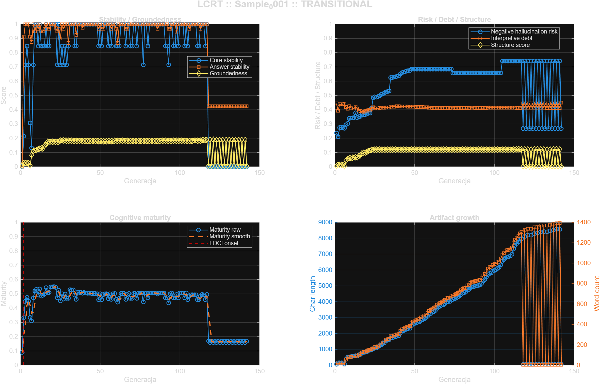

# Sample_0001 - LOCI Cognitive Readiness Test

- **Timestamp:** 2026-03-23 00:27:32
- **Input file:** `C:\Users\d2j3\PycharmProjects\writeups\badania\LOCI\sample\Sample_0001\norm\sample_norm.mat`
- **Generations:** `142`
- **Feature count:** `27`
- **LOCI onset:** `G0002`
- **First cognitive stable:** `unresolved`
- **First LLM-ready:** `unresolved`
- **Transition window:** ``
- **Readiness status:** `TRANSITIONAL`
- **Mean groundedness:** `0.154838`
- **Mean hallucination risk proxy:** `0.575874`
- **Mean interpretive debt:** `0.416657`
- **Mean maturity score:** `0.428642`
- **Max maturity score:** `0.549016`

## Adaptive thresholds

- **Core stability:** `0.650000`
- **Answer stability:** `0.650000`
- **Groundedness:** `0.220000`
- **Negative hallucination risk:** `0.584000`
- **Interpretive debt:** `0.413880`
- **Structure score:** `0.200000`
- **Maturity:** `0.494287`

## Figure

## Per-generation rows

### G0001

- **Core stability:** `0.000000`
- **Answer stability:** `0.000000`
- **Groundedness:** `0.007292`
- **Negative hallucination risk:** `0.235833`
- **Interpretive debt:** `0.443083`
- **Structure score:** `0.003750`
- **Maturity score:** `0.089174`
- **Keywords:** `com, https, iamdj, soundcloud, tommy-lee-vibes-inna-dis-raw`
- **Snapshot:** `https://soundcloud.com/iamdj.../tommy-lee-vibes-inna-dis-raw`

### G0002

- **Core stability:** `0.214286`
- **Answer stability:** `0.911111`
- **Groundedness:** `0.027708`
- **Negative hallucination risk:** `0.209500`
- **Interpretive debt:** `0.392717`
- **Structure score:** `0.014250`
- **Maturity score:** `0.333374`
- **Keywords:** `linku, podgląd, posta, tego, com, dodano, https, sebastian, soul-reaper-1, soundcloud, tommyleespartaofficial, usunięto`
- **Snapshot:** `Usunięto podgląd linku z tego posta. Dodano podgląd linku do tego posta Sebastian Wieremiejczyk https://soundcloud.com/tommyleespartaofficia...`

### G0003

- **Core stability:** `0.714286`
- **Answer stability:** `1.000000`
- **Groundedness:** `0.026250`
- **Negative hallucination risk:** `0.275667`
- **Interpretive debt:** `0.438100`
- **Structure score:** `0.013500`
- **Maturity score:** `0.446463`
- **Keywords:** `linku, podgląd, posta, tego, com, dodano, https, sebastian, soundcloud, tommy-lee-sparta-soul-reaper, usunięto, wieremiejczyk`
- **Snapshot:** `Usunięto podgląd linku z tego posta. Dodano podgląd linku do tego posta Sebastian Wieremiejczyk https://soundcloud.com/.../tommy-lee-sparta-...`

### G0004

- **Core stability:** `0.846154`
- **Answer stability:** `1.000000`
- **Groundedness:** `0.026250`
- **Negative hallucination risk:** `0.275667`
- **Interpretive debt:** `0.438100`
- **Structure score:** `0.013500`
- **Maturity score:** `0.475474`
- **Keywords:** `linku, podgląd, posta, tego, com, dodano, https, sebastian, soundcloud, tommy-lee-sparta-life-of-a, usunięto, wieremiejczyk`
- **Snapshot:** `Usunięto podgląd linku z tego posta. Dodano podgląd linku do tego posta Sebastian Wieremiejczyk https://soundcloud.com/.../tommy-lee-sparta-...`

### G0005

- **Core stability:** `0.714286`
- **Answer stability:** `1.000000`
- **Groundedness:** `0.026250`
- **Negative hallucination risk:** `0.275667`
- **Interpretive debt:** `0.438100`
- **Structure score:** `0.013500`
- **Maturity score:** `0.446463`
- **Keywords:** `linku, podgląd, posta, tego, com, dodano, gulfnews, https, iran-hackers-behind-attacks-on, sebastian, usunięto, wieremiejczyk`
- **Snapshot:** `Usunięto podgląd linku z tego posta. Dodano podgląd linku do tego posta Sebastian Wieremiejczyk https://gulfnews.com/.../iran-hackers-behind...`

### G0006

- **Core stability:** `0.307692`
- **Answer stability:** `0.911111`
- **Groundedness:** `0.008750`
- **Negative hallucination risk:** `0.269667`
- **Interpretive debt:** `0.442700`
- **Structure score:** `0.004500`
- **Maturity score:** `0.334177`
- **Keywords:** `com, dzieje, gulfnews, https, iran-hackers-behind-attacks-on`
- **Snapshot:** `(się dzieje) https://gulfnews.com/.../iran-hackers-behind-attacks-on... .`

### G0007

- **Core stability:** `0.133333`
- **Answer stability:** `0.875000`
- **Groundedness:** `0.081667`
- **Negative hallucination risk:** `0.294667`
- **Interpretive debt:** `0.418533`
- **Structure score:** `0.042000`
- **Maturity score:** `0.310071`
- **Keywords:** `attacks, computer, said, shamoon, after, apt33, apt34, apt35, boot, com, deletes, dzieje`
- **Snapshot:** `"Shamoon attacks, he said that latest attacks involved a second piece of wiping malware that deletes and overwrite files on the infected com...`

### G0008

- **Core stability:** `0.714286`
- **Answer stability:** `1.000000`
- **Groundedness:** `0.109375`
- **Negative hallucination risk:** `0.304167`
- **Interpretive debt:** `0.407250`
- **Structure score:** `0.056250`
- **Maturity score:** `0.471209`
- **Keywords:** `attacks, computer, said, shamoon, after, apt33, apt34, apt35, beyond, boot, com, conflicts`
- **Snapshot:** `"Shamoon attacks, he said that latest attacks involved a second piece of wiping malware that deletes and overwrite files on the infected com...`

### G0009

- **Core stability:** `1.000000`
- **Answer stability:** `0.950000`
- **Groundedness:** `0.115208`
- **Negative hallucination risk:** `0.339500`
- **Interpretive debt:** `0.423717`
- **Structure score:** `0.059250`
- **Maturity score:** `0.518979`
- **Keywords:** `attacks, computer, said, shamoon, after, apt33, apt34, apt35, beyond, boot, com, conflicts`
- **Snapshot:** `"Shamoon attacks, he said that latest attacks involved a second piece of wiping malware that deletes and overwrite files on the infected com...`

### G0010

- **Core stability:** `1.000000`
- **Answer stability:** `1.000000`
- **Groundedness:** `0.116667`
- **Negative hallucination risk:** `0.340000`
- **Interpretive debt:** `0.414333`
- **Structure score:** `0.060000`
- **Maturity score:** `0.530120`
- **Keywords:** `attacks, computer, said, shamoon, after, apt33, apt34, apt35, beyond, boot, com, conflicts`
- **Snapshot:** `"Shamoon attacks, he said that latest attacks involved a second piece of wiping malware that deletes and overwrite files on the infected com...`

### G0011

- **Core stability:** `0.846154`
- **Answer stability:** `0.966667`
- **Groundedness:** `0.123958`
- **Negative hallucination risk:** `0.342500`
- **Interpretive debt:** `0.408955`
- **Structure score:** `0.063750`
- **Maturity score:** `0.491992`
- **Keywords:** `attacks, computer, said, shamoon, szuka, after, apt33, apt34, apt35, beyond, boot, com`
- **Snapshot:** `"Shamoon attacks, he said that latest attacks involved a second piece of wiping malware that deletes and overwrite files on the infected com...`

### G0012

- **Core stability:** `1.000000`
- **Answer stability:** `1.000000`
- **Groundedness:** `0.126875`
- **Negative hallucination risk:** `0.343500`
- **Interpretive debt:** `0.408188`
- **Structure score:** `0.065250`
- **Maturity score:** `0.533347`
- **Keywords:** `attacks, computer, said, shamoon, szuka, after, apt33, apt34, apt35, beyond, boot, com`
- **Snapshot:** `"Shamoon attacks, he said that latest attacks involved a second piece of wiping malware that deletes and overwrite files on the infected com...`

### G0013

- **Core stability:** `0.846154`
- **Answer stability:** `0.950000`
- **Groundedness:** `0.129792`
- **Negative hallucination risk:** `0.377833`
- **Interpretive debt:** `0.421268`
- **Structure score:** `0.066750`
- **Maturity score:** `0.483903`
- **Keywords:** `attacks, computer, said, shamoon, szuka, zobaczymy, after, apt33, apt34, apt35, beyond, boot`
- **Snapshot:** `"Shamoon attacks, he said that latest attacks involved a second piece of wiping malware that deletes and overwrite files on the infected com...`

### G0014

- **Core stability:** `0.846154`
- **Answer stability:** `0.950000`
- **Groundedness:** `0.126875`
- **Negative hallucination risk:** `0.343500`
- **Interpretive debt:** `0.408188`
- **Structure score:** `0.065250`
- **Maturity score:** `0.489501`
- **Keywords:** `attacks, computer, said, shamoon, szuka, after, apt33, apt34, apt35, beyond, boot, com`
- **Snapshot:** `"Shamoon attacks, he said that latest attacks involved a second piece of wiping malware that deletes and overwrite files on the infected com...`

### G0015

- **Core stability:** `0.846154`
- **Answer stability:** `0.966667`
- **Groundedness:** `0.148750`
- **Negative hallucination risk:** `0.351000`
- **Interpretive debt:** `0.394650`
- **Structure score:** `0.076500`
- **Maturity score:** `0.499780`
- **Keywords:** `attacks, computer, musi, said, shamoon, szuka, after, apt33, apt34, apt35, beyond, boot`
- **Snapshot:** `"Shamoon attacks, he said that latest attacks involved a second piece of wiping malware that deletes and overwrite files on the infected com...`

### G0016

- **Core stability:** `1.000000`
- **Answer stability:** `1.000000`
- **Groundedness:** `0.156042`
- **Negative hallucination risk:** `0.353500`
- **Interpretive debt:** `0.390748`
- **Structure score:** `0.080250`
- **Maturity score:** `0.542559`
- **Keywords:** `attacks, computer, musi, said, shamoon, szuka, after, apt33, apt34, apt35, beyond, boot`
- **Snapshot:** `"Shamoon attacks, he said that latest attacks involved a second piece of wiping malware that deletes and overwrite files on the infected com...`

### G0017

- **Core stability:** `0.846154`
- **Answer stability:** `0.966667`
- **Groundedness:** `0.175000`
- **Negative hallucination risk:** `0.363000`
- **Interpretive debt:** `0.386965`
- **Structure score:** `0.094500`
- **Maturity score:** `0.507850`
- **Keywords:** `szuka, attacks, computer, musi, said, shamoon, after, apt33, apt34, apt35, asach, beyond`
- **Snapshot:** `"Shamoon attacks, he said that latest attacks involved a second piece of wiping malware that deletes and overwrite files on the infected com...`

### G0018

- **Core stability:** `0.846154`
- **Answer stability:** `0.966667`
- **Groundedness:** `0.175000`
- **Negative hallucination risk:** `0.365500`
- **Interpretive debt:** `0.384621`
- **Structure score:** `0.098250`
- **Maturity score:** `0.508387`
- **Keywords:** `szuka, attacks, computer, dobra, musi, said, shamoon, after, apt33, apt34, apt35, asach`
- **Snapshot:** `"Shamoon attacks, he said that latest attacks involved a second piece of wiping malware that deletes and overwrite files on the infected com...`

### G0019

- **Core stability:** `1.000000`
- **Answer stability:** `1.000000`
- **Groundedness:** `0.175000`
- **Negative hallucination risk:** `0.366000`
- **Interpretive debt:** `0.392400`
- **Structure score:** `0.099000`
- **Maturity score:** `0.548348`
- **Keywords:** `szuka, attacks, computer, dobra, musi, said, shamoon, after, apt33, apt34, apt35, asach`
- **Snapshot:** `"Shamoon attacks, he said that latest attacks involved a second piece of wiping malware that deletes and overwrite files on the infected com...`

### G0020

- **Core stability:** `1.000000`
- **Answer stability:** `1.000000`
- **Groundedness:** `0.175000`
- **Negative hallucination risk:** `0.368500`
- **Interpretive debt:** `0.391686`
- **Structure score:** `0.102750`
- **Maturity score:** `0.548755`
- **Keywords:** `szuka, attacks, computer, dobra, musi, said, shamoon, after, apt33, apt34, apt35, asach`
- **Snapshot:** `"Shamoon attacks, he said that latest attacks involved a second piece of wiping malware that deletes and overwrite files on the infected com...`

### G0021

- **Core stability:** `1.000000`
- **Answer stability:** `1.000000`
- **Groundedness:** `0.175000`
- **Negative hallucination risk:** `0.374500`
- **Interpretive debt:** `0.398930`
- **Structure score:** `0.111750`
- **Maturity score:** `0.549016`
- **Keywords:** `szuka, attacks, computer, dobra, musi, said, shamoon, after, apt33, apt34, apt35, asach`
- **Snapshot:** `"Shamoon attacks, he said that latest attacks involved a second piece of wiping malware that deletes and overwrite files on the infected com...`

### G0022

- **Core stability:** `1.000000`
- **Answer stability:** `0.975000`
- **Groundedness:** `0.175000`
- **Negative hallucination risk:** `0.377000`
- **Interpretive debt:** `0.399930`
- **Structure score:** `0.115500`
- **Maturity score:** `0.544286`
- **Keywords:** `szuka, attacks, computer, dobra, musi, said, shamoon, after, apt33, apt34, apt35, asach`
- **Snapshot:** `"Shamoon attacks, he said that latest attacks involved a second piece of wiping malware that deletes and overwrite files on the infected com...`

### G0023

- **Core stability:** `0.714286`
- **Answer stability:** `0.950000`
- **Groundedness:** `0.175000`
- **Negative hallucination risk:** `0.412333`
- **Interpretive debt:** `0.406600`
- **Structure score:** `0.118500`
- **Maturity score:** `0.470842`
- **Keywords:** `szuka, attacks, computer, dobra, musi, said, shamoon, smoka, zobaczymy, after, apt33, apt34`
- **Snapshot:** `"Shamoon attacks, he said that latest attacks involved a second piece of wiping malware that deletes and overwrite files on the infected com...`

### G0024

- **Core stability:** `1.000000`
- **Answer stability:** `0.966667`
- **Groundedness:** `0.175000`
- **Negative hallucination risk:** `0.483000`
- **Interpretive debt:** `0.417200`
- **Structure score:** `0.120000`
- **Maturity score:** `0.525177`
- **Keywords:** `szuka, zobaczymy, attacks, computer, dobra, musi, said, shamoon, smoka, after, apt33, apt34`
- **Snapshot:** `"Shamoon attacks, he said that latest attacks involved a second piece of wiping malware that deletes and overwrite files on the infected com...`

### G0025

- **Core stability:** `0.714286`
- **Answer stability:** `0.900000`
- **Groundedness:** `0.184559`
- **Negative hallucination risk:** `0.489500`
- **Interpretive debt:** `0.409624`
- **Structure score:** `0.120000`
- **Maturity score:** `0.450656`
- **Keywords:** `szuka, zobaczymy, attacks, computer, dobra, musi, said, shamoon, smoka, tylko, after, ajatollaha`
- **Snapshot:** `"Shamoon attacks, he said that latest attacks involved a second piece of wiping malware that deletes and overwrite files on the infected com...`

### G0026

- **Core stability:** `0.846154`
- **Answer stability:** `1.000000`
- **Groundedness:** `0.184286`
- **Negative hallucination risk:** `0.488500`
- **Interpretive debt:** `0.407971`
- **Structure score:** `0.120000`
- **Maturity score:** `0.499899`
- **Keywords:** `szuka, zobaczymy, attacks, computer, dobra, musi, said, shamoon, smoka, tego, after, ajatollaha`
- **Snapshot:** `"Shamoon attacks, he said that latest attacks involved a second piece of wiping malware that deletes and overwrite files on the infected com...`

### G0027

- **Core stability:** `0.714286`
- **Answer stability:** `0.966667`
- **Groundedness:** `0.184028`
- **Negative hallucination risk:** `0.492500`
- **Interpretive debt:** `0.408389`
- **Structure score:** `0.120000`
- **Maturity score:** `0.463491`
- **Keywords:** `szuka, zobaczymy, attacks, bardzo, computer, dobra, może, musi, said, shamoon, smoka, tego`
- **Snapshot:** `"Shamoon attacks, he said that latest attacks involved a second piece of wiping malware that deletes and overwrite files on the infected com...`

### G0028

- **Core stability:** `0.846154`
- **Answer stability:** `1.000000`
- **Groundedness:** `0.183333`
- **Negative hallucination risk:** `0.498000`
- **Interpretive debt:** `0.412021`
- **Structure score:** `0.120000`
- **Maturity score:** `0.497846`
- **Keywords:** `szuka, zobaczymy, attacks, bardzo, computer, dobra, może, musi, planszy, said, shamoon, smoka`
- **Snapshot:** `"Shamoon attacks, he said that latest attacks involved a second piece of wiping malware that deletes and overwrite files on the infected com...`

### G0029

- **Core stability:** `0.714286`
- **Answer stability:** `1.000000`
- **Groundedness:** `0.183125`
- **Negative hallucination risk:** `0.506000`
- **Interpretive debt:** `0.414150`
- **Structure score:** `0.120000`
- **Maturity score:** `0.467338`
- **Keywords:** `szuka, zobaczymy, attacks, bardzo, computer, coś, dobra, gra, może, musi, planszy, said`
- **Snapshot:** `"Shamoon attacks, he said that latest attacks involved a second piece of wiping malware that deletes and overwrite files on the infected com...`

### G0030

- **Core stability:** `0.846154`
- **Answer stability:** `0.866667`
- **Groundedness:** `0.182738`
- **Negative hallucination risk:** `0.511500`
- **Interpretive debt:** `0.414362`
- **Structure score:** `0.120000`
- **Maturity score:** `0.468701`
- **Keywords:** `musi, szuka, zobaczymy, attacks, bardzo, być, computer, coś, dobra, gra, może, planszy`
- **Snapshot:** `"Shamoon attacks, he said that latest attacks involved a second piece of wiping malware that deletes and overwrite files on the infected com...`

### G0031

- **Core stability:** `1.000000`
- **Answer stability:** `1.000000`
- **Groundedness:** `0.182222`
- **Negative hallucination risk:** `0.516000`
- **Interpretive debt:** `0.413511`
- **Structure score:** `0.120000`
- **Maturity score:** `0.528448`
- **Keywords:** `musi, szuka, zobaczymy, attacks, bardzo, być, computer, coś, dobra, gra, może, planszy`
- **Snapshot:** `"Shamoon attacks, he said that latest attacks involved a second piece of wiping malware that deletes and overwrite files on the infected com...`

### G0032

- **Core stability:** `1.000000`
- **Answer stability:** `1.000000`
- **Groundedness:** `0.181915`
- **Negative hallucination risk:** `0.524500`
- **Interpretive debt:** `0.415332`
- **Structure score:** `0.120000`
- **Maturity score:** `0.526875`
- **Keywords:** `musi, szuka, zobaczymy, attacks, bardzo, być, computer, coś, dobra, gra, może, planszy`
- **Snapshot:** `"Shamoon attacks, he said that latest attacks involved a second piece of wiping malware that deletes and overwrite files on the infected com...`

### G0033

- **Core stability:** `1.000000`
- **Answer stability:** `1.000000`
- **Groundedness:** `0.181771`
- **Negative hallucination risk:** `0.527500`
- **Interpretive debt:** `0.415792`
- **Structure score:** `0.120000`
- **Maturity score:** `0.526326`
- **Keywords:** `musi, szuka, zobaczymy, attacks, bardzo, być, computer, coś, dobra, gra, może, planszy`
- **Snapshot:** `"Shamoon attacks, he said that latest attacks involved a second piece of wiping malware that deletes and overwrite files on the infected com...`

### G0034

- **Core stability:** `0.846154`
- **Answer stability:** `1.000000`
- **Groundedness:** `0.181633`
- **Negative hallucination risk:** `0.530500`
- **Interpretive debt:** `0.416282`
- **Structure score:** `0.120000`
- **Maturity score:** `0.491930`
- **Keywords:** `musi, szuka, zobaczymy, attacks, bardzo, być, będzie, computer, coś, dobra, gra, może`
- **Snapshot:** `"Shamoon attacks, he said that latest attacks involved a second piece of wiping malware that deletes and overwrite files on the infected com...`

### G0035

- **Core stability:** `0.846154`
- **Answer stability:** `0.925000`
- **Groundedness:** `0.181633`
- **Negative hallucination risk:** `0.625333`
- **Interpretive debt:** `0.420882`
- **Structure score:** `0.120000`
- **Maturity score:** `0.461389`
- **Keywords:** `coś, może, musi, nas, szuka, zobaczymy, attacks, bardzo, być, będzie, computer, dobra`
- **Snapshot:** `"Shamoon attacks, he said that latest attacks involved a second piece of wiping malware that deletes and overwrite files on the infected com...`

### G0036

- **Core stability:** `1.000000`
- **Answer stability:** `1.000000`
- **Groundedness:** `0.181500`
- **Negative hallucination risk:** `0.625333`
- **Interpretive debt:** `0.420200`
- **Structure score:** `0.120000`
- **Maturity score:** `0.510261`
- **Keywords:** `coś, może, musi, nas, szuka, zobaczymy, attacks, bardzo, być, będzie, computer, dobra`
- **Snapshot:** `"Shamoon attacks, he said that latest attacks involved a second piece of wiping malware that deletes and overwrite files on the infected com...`

### G0037

- **Core stability:** `1.000000`
- **Answer stability:** `1.000000`
- **Groundedness:** `0.181373`
- **Negative hallucination risk:** `0.628833`
- **Interpretive debt:** `0.420945`
- **Structure score:** `0.120000`
- **Maturity score:** `0.509613`
- **Keywords:** `coś, może, musi, nas, szuka, zobaczymy, attacks, bardzo, być, będzie, computer, dobra`
- **Snapshot:** `"Shamoon attacks, he said that latest attacks involved a second piece of wiping malware that deletes and overwrite files on the infected com...`

### G0038

- **Core stability:** `1.000000`
- **Answer stability:** `1.000000`
- **Groundedness:** `0.181500`
- **Negative hallucination risk:** `0.630833`
- **Interpretive debt:** `0.422400`
- **Structure score:** `0.120000`
- **Maturity score:** `0.509205`
- **Keywords:** `coś, może, musi, nas, szuka, zobaczymy, attacks, bardzo, być, będzie, computer, dobra`
- **Snapshot:** `"Shamoon attacks, he said that latest attacks involved a second piece of wiping malware that deletes and overwrite files on the infected com...`

### G0039

- **Core stability:** `1.000000`
- **Answer stability:** `0.975000`
- **Groundedness:** `0.180909`
- **Negative hallucination risk:** `0.633833`
- **Interpretive debt:** `0.423636`
- **Structure score:** `0.120000`
- **Maturity score:** `0.503496`
- **Keywords:** `coś, może, musi, nas, szuka, zobaczymy, attacks, bardzo, być, będzie, computer, dobra`
- **Snapshot:** `"Shamoon attacks, he said that latest attacks involved a second piece of wiping malware that deletes and overwrite files on the infected com...`

### G0040

- **Core stability:** `1.000000`
- **Answer stability:** `1.000000`
- **Groundedness:** `0.180909`
- **Negative hallucination risk:** `0.635833`
- **Interpretive debt:** `0.423636`
- **Structure score:** `0.120000`
- **Maturity score:** `0.508176`
- **Keywords:** `coś, może, musi, nas, szuka, zobaczymy, attacks, bardzo, być, będzie, computer, dobra`
- **Snapshot:** `"Shamoon attacks, he said that latest attacks involved a second piece of wiping malware that deletes and overwrite files on the infected com...`

### G0041

- **Core stability:** `1.000000`
- **Answer stability:** `1.000000`
- **Groundedness:** `0.180702`
- **Negative hallucination risk:** `0.650333`
- **Interpretive debt:** `0.422456`
- **Structure score:** `0.120000`
- **Maturity score:** `0.505905`
- **Keywords:** `coś, może, musi, nas, szuka, zobaczymy, attacks, bardzo, być, będzie, computer, dobra`
- **Snapshot:** `"Shamoon attacks, he said that latest attacks involved a second piece of wiping malware that deletes and overwrite files on the infected com...`

### G0042

- **Core stability:** `1.000000`
- **Answer stability:** `1.000000`
- **Groundedness:** `0.180328`
- **Negative hallucination risk:** `0.659333`
- **Interpretive debt:** `0.423279`
- **Structure score:** `0.120000`
- **Maturity score:** `0.504317`
- **Keywords:** `coś, może, musi, nas, szuka, zobaczymy, attacks, bardzo, być, będzie, computer, dobra`
- **Snapshot:** `"Shamoon attacks, he said that latest attacks involved a second piece of wiping malware that deletes and overwrite files on the infected com...`

### G0043

- **Core stability:** `1.000000`
- **Answer stability:** `1.000000`
- **Groundedness:** `0.180242`
- **Negative hallucination risk:** `0.662333`
- **Interpretive debt:** `0.422742`
- **Structure score:** `0.120000`
- **Maturity score:** `0.503861`
- **Keywords:** `coś, może, musi, nas, szuka, zobaczymy, attacks, bardzo, być, będzie, computer, dobra`
- **Snapshot:** `"Shamoon attacks, he said that latest attacks involved a second piece of wiping malware that deletes and overwrite files on the infected com...`

### G0044

- **Core stability:** `1.000000`
- **Answer stability:** `1.000000`
- **Groundedness:** `0.180159`
- **Negative hallucination risk:** `0.666833`
- **Interpretive debt:** `0.422222`
- **Structure score:** `0.120000`
- **Maturity score:** `0.503164`
- **Keywords:** `coś, może, musi, nas, szuka, zobaczymy, attacks, bardzo, być, będzie, computer, dobra`
- **Snapshot:** `"Shamoon attacks, he said that latest attacks involved a second piece of wiping malware that deletes and overwrite files on the infected com...`

### G0045

- **Core stability:** `1.000000`
- **Answer stability:** `1.000000`
- **Groundedness:** `0.180078`
- **Negative hallucination risk:** `0.671333`
- **Interpretive debt:** `0.421719`
- **Structure score:** `0.120000`
- **Maturity score:** `0.502466`
- **Keywords:** `coś, może, musi, nas, szuka, zobaczymy, attacks, bardzo, być, będzie, computer, dobra`
- **Snapshot:** `"Shamoon attacks, he said that latest attacks involved a second piece of wiping malware that deletes and overwrite files on the infected com...`

### G0046

- **Core stability:** `1.000000`
- **Answer stability:** `1.000000`
- **Groundedness:** `0.180000`
- **Negative hallucination risk:** `0.673333`
- **Interpretive debt:** `0.421231`
- **Structure score:** `0.120000`
- **Maturity score:** `0.502168`
- **Keywords:** `coś, może, musi, nas, szuka, zobaczymy, attacks, bardzo, być, będzie, computer, dobra`
- **Snapshot:** `"Shamoon attacks, he said that latest attacks involved a second piece of wiping malware that deletes and overwrite files on the infected com...`

### G0047

- **Core stability:** `1.000000`
- **Answer stability:** `1.000000`
- **Groundedness:** `0.180000`
- **Negative hallucination risk:** `0.674833`
- **Interpretive debt:** `0.421231`
- **Structure score:** `0.120000`
- **Maturity score:** `0.501928`
- **Keywords:** `coś, może, musi, nas, szuka, zobaczymy, attacks, bardzo, być, będzie, computer, dobra`
- **Snapshot:** `"Shamoon attacks, he said that latest attacks involved a second piece of wiping malware that deletes and overwrite files on the infected com...`

### G0048

- **Core stability:** `1.000000`
- **Answer stability:** `1.000000`
- **Groundedness:** `0.179851`
- **Negative hallucination risk:** `0.683333`
- **Interpretive debt:** `0.420299`
- **Structure score:** `0.120000`
- **Maturity score:** `0.500610`
- **Keywords:** `coś, może, musi, nas, szuka, zobaczymy, attacks, bardzo, być, będzie, computer, dobra`
- **Snapshot:** `"Shamoon attacks, he said that latest attacks involved a second piece of wiping malware that deletes and overwrite files on the infected com...`

### G0049

- **Core stability:** `0.846154`
- **Answer stability:** `0.966667`
- **Groundedness:** `0.179514`
- **Negative hallucination risk:** `0.683333`
- **Interpretive debt:** `0.420694`
- **Structure score:** `0.120000`
- **Maturity score:** `0.459991`
- **Keywords:** `coś, może, musi, nas, sieć, szuka, zobaczymy, attacks, bardzo, być, będzie, computer`
- **Snapshot:** `"Shamoon attacks, he said that latest attacks involved a second piece of wiping malware that deletes and overwrite files on the infected com...`

### G0050

- **Core stability:** `1.000000`
- **Answer stability:** `1.000000`
- **Groundedness:** `0.179452`
- **Negative hallucination risk:** `0.683333`
- **Interpretive debt:** `0.420274`
- **Structure score:** `0.120000`
- **Maturity score:** `0.500524`
- **Keywords:** `coś, może, musi, nas, sieć, szuka, zobaczymy, attacks, bardzo, być, będzie, computer`
- **Snapshot:** `"Shamoon attacks, he said that latest attacks involved a second piece of wiping malware that deletes and overwrite files on the infected com...`

### G0051

- **Core stability:** `0.846154`
- **Answer stability:** `0.966667`
- **Groundedness:** `0.179392`
- **Negative hallucination risk:** `0.683333`
- **Interpretive debt:** `0.419865`
- **Structure score:** `0.120000`
- **Maturity score:** `0.460031`
- **Keywords:** `coś, gra, może, musi, nas, sieć, szuka, zobaczymy, attacks, bardzo, być, będzie`
- **Snapshot:** `"Shamoon attacks, he said that latest attacks involved a second piece of wiping malware that deletes and overwrite files on the infected com...`

### G0052

- **Core stability:** `1.000000`
- **Answer stability:** `0.966667`
- **Groundedness:** `0.179333`
- **Negative hallucination risk:** `0.683333`
- **Interpretive debt:** `0.419467`
- **Structure score:** `0.120000`
- **Maturity score:** `0.493896`
- **Keywords:** `będzie, coś, gra, może, musi, nas, sieć, szuka, zobaczymy, attacks, bardzo, być`
- **Snapshot:** `"Shamoon attacks, he said that latest attacks involved a second piece of wiping malware that deletes and overwrite files on the infected com...`

### G0053

- **Core stability:** `1.000000`
- **Answer stability:** `1.000000`
- **Groundedness:** `0.179333`
- **Negative hallucination risk:** `0.683333`
- **Interpretive debt:** `0.419467`
- **Structure score:** `0.120000`
- **Maturity score:** `0.500563`
- **Keywords:** `coś, może, będzie, gra, musi, nas, sieć, szuka, zobaczymy, attacks, bardzo, być`
- **Snapshot:** `"Shamoon attacks, he said that latest attacks involved a second piece of wiping malware that deletes and overwrite files on the infected com...`

### G0054

- **Core stability:** `1.000000`
- **Answer stability:** `1.000000`
- **Groundedness:** `0.179221`
- **Negative hallucination risk:** `0.683333`
- **Interpretive debt:** `0.418701`
- **Structure score:** `0.120000`
- **Maturity score:** `0.500599`
- **Keywords:** `coś, może, będzie, gra, musi, nas, sieć, szuka, zobaczymy, attacks, bardzo, być`
- **Snapshot:** `"Shamoon attacks, he said that latest attacks involved a second piece of wiping malware that deletes and overwrite files on the infected com...`

### G0055

- **Core stability:** `0.846154`
- **Answer stability:** `1.000000`
- **Groundedness:** `0.179167`
- **Negative hallucination risk:** `0.683333`
- **Interpretive debt:** `0.418333`
- **Structure score:** `0.120000`
- **Maturity score:** `0.466771`
- **Keywords:** `coś, może, będzie, gra, musi, nas, przycisk, sieć, szuka, zobaczymy, attacks, bardzo`
- **Snapshot:** `"Shamoon attacks, he said that latest attacks involved a second piece of wiping malware that deletes and overwrite files on the infected com...`

### G0056

- **Core stability:** `1.000000`
- **Answer stability:** `1.000000`
- **Groundedness:** `0.179062`
- **Negative hallucination risk:** `0.683333`
- **Interpretive debt:** `0.417625`
- **Structure score:** `0.120000`
- **Maturity score:** `0.500650`
- **Keywords:** `coś, może, będzie, gra, musi, nas, przycisk, sieć, szuka, zobaczymy, attacks, bardzo`
- **Snapshot:** `"Shamoon attacks, he said that latest attacks involved a second piece of wiping malware that deletes and overwrite files on the infected com...`

### G0057

- **Core stability:** `0.846154`
- **Answer stability:** `0.966667`
- **Groundedness:** `0.179012`
- **Negative hallucination risk:** `0.683333`
- **Interpretive debt:** `0.417284`
- **Structure score:** `0.120000`
- **Maturity score:** `0.460154`
- **Keywords:** `coś, może, będzie, gra, iran, musi, nas, przycisk, sieć, szuka, zobaczymy, attacks`
- **Snapshot:** `"Shamoon attacks, he said that latest attacks involved a second piece of wiping malware that deletes and overwrite files on the infected com...`

### G0058

- **Core stability:** `1.000000`
- **Answer stability:** `1.000000`
- **Groundedness:** `0.178963`
- **Negative hallucination risk:** `0.683333`
- **Interpretive debt:** `0.416951`
- **Structure score:** `0.120000`
- **Maturity score:** `0.500683`
- **Keywords:** `coś, może, będzie, gra, iran, musi, nas, przycisk, sieć, szuka, zobaczymy, attacks`
- **Snapshot:** `"Shamoon attacks, he said that latest attacks involved a second piece of wiping malware that deletes and overwrite files on the infected com...`

### G0059

- **Core stability:** `1.000000`
- **Answer stability:** `1.000000`
- **Groundedness:** `0.182647`
- **Negative hallucination risk:** `0.683333`
- **Interpretive debt:** `0.414471`
- **Structure score:** `0.120000`
- **Maturity score:** `0.501691`
- **Keywords:** `coś, może, będzie, gra, iran, musi, nas, przycisk, sieć, szuka, zobaczymy, attacks`
- **Snapshot:** `"Shamoon attacks, he said that latest attacks involved a second piece of wiping malware that deletes and overwrite files on the infected com...`

### G0060

- **Core stability:** `0.846154`
- **Answer stability:** `0.966667`
- **Groundedness:** `0.182471`
- **Negative hallucination risk:** `0.683333`
- **Interpretive debt:** `0.413908`
- **Structure score:** `0.120000`
- **Maturity score:** `0.461185`
- **Keywords:** `coś, może, będzie, dzieje, gra, iran, musi, nas, przycisk, sieć, szuka, zobaczymy`
- **Snapshot:** `"Shamoon attacks, he said that latest attacks involved a second piece of wiping malware that deletes and overwrite files on the infected com...`

### G0061

- **Core stability:** `0.846154`
- **Answer stability:** `0.866667`
- **Groundedness:** `0.182065`
- **Negative hallucination risk:** `0.683333`
- **Interpretive debt:** `0.412609`
- **Structure score:** `0.120000`
- **Maturity score:** `0.441199`
- **Keywords:** `coś, iran, może, będzie, dzieje, gra, musi, nas, przycisk, robi, sieć, szuka`
- **Snapshot:** `"Shamoon attacks, he said that latest attacks involved a second piece of wiping malware that deletes and overwrite files on the infected com...`

### G0062

- **Core stability:** `0.846154`
- **Answer stability:** `1.000000`
- **Groundedness:** `0.181989`
- **Negative hallucination risk:** `0.683333`
- **Interpretive debt:** `0.412366`
- **Structure score:** `0.120000`
- **Maturity score:** `0.467869`
- **Keywords:** `coś, iran, może, będzie, dzieje, gra, musi, nas, paliw, przycisk, robi, sieć`
- **Snapshot:** `"Shamoon attacks, he said that latest attacks involved a second piece of wiping malware that deletes and overwrite files on the infected com...`

### G0063

- **Core stability:** `1.000000`
- **Answer stability:** `1.000000`
- **Groundedness:** `0.181915`
- **Negative hallucination risk:** `0.683333`
- **Interpretive debt:** `0.412128`
- **Structure score:** `0.120000`
- **Maturity score:** `0.501718`
- **Keywords:** `coś, iran, może, będzie, dzieje, gra, musi, nas, paliw, przycisk, robi, sieć`
- **Snapshot:** `"Shamoon attacks, he said that latest attacks involved a second piece of wiping malware that deletes and overwrite files on the infected com...`

### G0064

- **Core stability:** `1.000000`
- **Answer stability:** `1.000000`
- **Groundedness:** `0.181701`
- **Negative hallucination risk:** `0.683333`
- **Interpretive debt:** `0.411443`
- **Structure score:** `0.120000`
- **Maturity score:** `0.501725`
- **Keywords:** `coś, dzieje, iran, może, będzie, gra, musi, nas, paliw, przycisk, robi, sieć`
- **Snapshot:** `"Shamoon attacks, he said that latest attacks involved a second piece of wiping malware that deletes and overwrite files on the infected com...`

### G0065

- **Core stability:** `1.000000`
- **Answer stability:** `1.000000`
- **Groundedness:** `0.181701`
- **Negative hallucination risk:** `0.683333`
- **Interpretive debt:** `0.411443`
- **Structure score:** `0.120000`
- **Maturity score:** `0.501725`
- **Keywords:** `coś, dzieje, iran, może, będzie, gra, musi, nas, paliw, przycisk, robi, sieć`
- **Snapshot:** `"Shamoon attacks, he said that latest attacks involved a second piece of wiping malware that deletes and overwrite files on the infected com...`

### G0066

- **Core stability:** `0.846154`
- **Answer stability:** `0.966667`
- **Groundedness:** `0.181566`
- **Negative hallucination risk:** `0.683333`
- **Interpretive debt:** `0.412828`
- **Structure score:** `0.120000`
- **Maturity score:** `0.461072`
- **Keywords:** `coś, dzieje, iran, może, zobaczymy, będzie, gra, musi, nas, paliw, przycisk, robi`
- **Snapshot:** `"Shamoon attacks, he said that latest attacks involved a second piece of wiping malware that deletes and overwrite files on the infected com...`

### G0067

- **Core stability:** `1.000000`
- **Answer stability:** `0.966667`
- **Groundedness:** `0.181500`
- **Negative hallucination risk:** `0.683333`
- **Interpretive debt:** `0.412600`
- **Structure score:** `0.120000`
- **Maturity score:** `0.494922`
- **Keywords:** `będzie, coś, dzieje, iran, może, zobaczymy, gra, musi, nas, paliw, przycisk, robi`
- **Snapshot:** `"Shamoon attacks, he said that latest attacks involved a second piece of wiping malware that deletes and overwrite files on the infected com...`

### G0068

- **Core stability:** `1.000000`
- **Answer stability:** `1.000000`
- **Groundedness:** `0.181436`
- **Negative hallucination risk:** `0.683333`
- **Interpretive debt:** `0.412376`
- **Structure score:** `0.120000`
- **Maturity score:** `0.501592`
- **Keywords:** `będzie, coś, dzieje, iran, może, zobaczymy, gra, musi, nas, paliw, przycisk, robi`
- **Snapshot:** `"Shamoon attacks, he said that latest attacks involved a second piece of wiping malware that deletes and overwrite files on the infected com...`

### G0069

- **Core stability:** `0.846154`
- **Answer stability:** `1.000000`
- **Groundedness:** `0.181373`
- **Negative hallucination risk:** `0.683333`
- **Interpretive debt:** `0.412157`
- **Structure score:** `0.120000`
- **Maturity score:** `0.467750`
- **Keywords:** `będzie, coś, dzieje, iran, może, zobaczymy, był, gra, musi, nas, paliw, przycisk`
- **Snapshot:** `"Shamoon attacks, he said that latest attacks involved a second piece of wiping malware that deletes and overwrite files on the infected com...`

### G0070

- **Core stability:** `0.846154`
- **Answer stability:** `1.000000`
- **Groundedness:** `0.181311`
- **Negative hallucination risk:** `0.683333`
- **Interpretive debt:** `0.411942`
- **Structure score:** `0.120000`
- **Maturity score:** `0.467754`
- **Keywords:** `iran, będzie, coś, dzieje, może, zobaczymy, był, gra, jakoś, musi, nas, paliw`
- **Snapshot:** `"Shamoon attacks, he said that latest attacks involved a second piece of wiping malware that deletes and overwrite files on the infected com...`

### G0071

- **Core stability:** `1.000000`
- **Answer stability:** `1.000000`
- **Groundedness:** `0.181250`
- **Negative hallucination risk:** `0.683333`
- **Interpretive debt:** `0.411731`
- **Structure score:** `0.120000`
- **Maturity score:** `0.501603`
- **Keywords:** `iran, będzie, coś, dzieje, może, zobaczymy, był, gra, jakoś, musi, nas, paliw`
- **Snapshot:** `"Shamoon attacks, he said that latest attacks involved a second piece of wiping malware that deletes and overwrite files on the infected com...`

### G0072

- **Core stability:** `1.000000`
- **Answer stability:** `1.000000`
- **Groundedness:** `0.181250`
- **Negative hallucination risk:** `0.683333`
- **Interpretive debt:** `0.411731`
- **Structure score:** `0.120000`
- **Maturity score:** `0.501603`
- **Keywords:** `iran, będzie, coś, dzieje, może, zobaczymy, był, gra, jakoś, musi, nas, paliw`
- **Snapshot:** `"Shamoon attacks, he said that latest attacks involved a second piece of wiping malware that deletes and overwrite files on the infected com...`

### G0073

- **Core stability:** `0.846154`
- **Answer stability:** `1.000000`
- **Groundedness:** `0.181190`
- **Negative hallucination risk:** `0.683333`
- **Interpretive debt:** `0.413238`
- **Structure score:** `0.120000`
- **Maturity score:** `0.467623`
- **Keywords:** `iran, będzie, coś, dzieje, może, zobaczymy, być, był, gra, jakoś, musi, nas`
- **Snapshot:** `"Shamoon attacks, he said that latest attacks involved a second piece of wiping malware that deletes and overwrite files on the infected com...`

### G0074

- **Core stability:** `1.000000`
- **Answer stability:** `1.000000`
- **Groundedness:** `0.181132`
- **Negative hallucination risk:** `0.658333`
- **Interpretive debt:** `0.413019`
- **Structure score:** `0.120000`
- **Maturity score:** `0.505474`
- **Keywords:** `iran, będzie, coś, dzieje, może, zobaczymy, być, był, gra, jakoś, musi, nas`
- **Snapshot:** `"Shamoon attacks, he said that latest attacks involved a second piece of wiping malware that deletes and overwrite files on the infected com...`

### G0075

- **Core stability:** `1.000000`
- **Answer stability:** `1.000000`
- **Groundedness:** `0.181075`
- **Negative hallucination risk:** `0.658333`
- **Interpretive debt:** `0.412804`
- **Structure score:** `0.120000`
- **Maturity score:** `0.505479`
- **Keywords:** `iran, będzie, coś, dzieje, może, zobaczymy, być, był, gra, jakoś, musi, nas`
- **Snapshot:** `"Shamoon attacks, he said that latest attacks involved a second piece of wiping malware that deletes and overwrite files on the infected com...`

### G0076

- **Core stability:** `1.000000`
- **Answer stability:** `1.000000`
- **Groundedness:** `0.181019`
- **Negative hallucination risk:** `0.658333`
- **Interpretive debt:** `0.412593`
- **Structure score:** `0.120000`
- **Maturity score:** `0.505483`
- **Keywords:** `iran, może, będzie, coś, dzieje, zobaczymy, być, był, gra, jakoś, musi, nas`
- **Snapshot:** `"Shamoon attacks, he said that latest attacks involved a second piece of wiping malware that deletes and overwrite files on the infected com...`

### G0077

- **Core stability:** `0.714286`
- **Answer stability:** `1.000000`
- **Groundedness:** `0.180963`
- **Negative hallucination risk:** `0.658333`
- **Interpretive debt:** `0.412385`
- **Structure score:** `0.120000`
- **Maturity score:** `0.442631`
- **Keywords:** `iran, może, będzie, coś, dzieje, wiele, zobaczymy, bardzo, być, był, gra, jakoś`
- **Snapshot:** `"Shamoon attacks, he said that latest attacks involved a second piece of wiping malware that deletes and overwrite files on the infected com...`

### G0078

- **Core stability:** `1.000000`
- **Answer stability:** `1.000000`
- **Groundedness:** `0.180963`
- **Negative hallucination risk:** `0.658333`
- **Interpretive debt:** `0.412385`
- **Structure score:** `0.120000`
- **Maturity score:** `0.505488`
- **Keywords:** `iran, może, będzie, coś, dzieje, wiele, zobaczymy, bardzo, być, był, gra, jakoś`
- **Snapshot:** `"Shamoon attacks, he said that latest attacks involved a second piece of wiping malware that deletes and overwrite files on the infected com...`

### G0079

- **Core stability:** `1.000000`
- **Answer stability:** `1.000000`
- **Groundedness:** `0.180804`
- **Negative hallucination risk:** `0.658333`
- **Interpretive debt:** `0.411786`
- **Structure score:** `0.120000`
- **Maturity score:** `0.505501`
- **Keywords:** `iran, może, będzie, coś, dzieje, wiele, zobaczymy, bardzo, być, był, gra, jakoś`
- **Snapshot:** `"Shamoon attacks, he said that latest attacks involved a second piece of wiping malware that deletes and overwrite files on the infected com...`

### G0080

- **Core stability:** `0.846154`
- **Answer stability:** `1.000000`
- **Groundedness:** `0.180702`
- **Negative hallucination risk:** `0.658333`
- **Interpretive debt:** `0.411404`
- **Structure score:** `0.120000`
- **Maturity score:** `0.471663`
- **Keywords:** `iran, może, będzie, coś, dzieje, gra, wiele, zobaczymy, bardzo, być, był, gracz`
- **Snapshot:** `"Shamoon attacks, he said that latest attacks involved a second piece of wiping malware that deletes and overwrite files on the infected com...`

### G0081

- **Core stability:** `1.000000`
- **Answer stability:** `1.000000`
- **Groundedness:** `0.180702`
- **Negative hallucination risk:** `0.658333`
- **Interpretive debt:** `0.411404`
- **Structure score:** `0.120000`
- **Maturity score:** `0.505509`
- **Keywords:** `iran, może, będzie, coś, dzieje, gra, wiele, zobaczymy, bardzo, być, był, gracz`
- **Snapshot:** `"Shamoon attacks, he said that latest attacks involved a second piece of wiping malware that deletes and overwrite files on the infected com...`

### G0082

- **Core stability:** `1.000000`
- **Answer stability:** `1.000000`
- **Groundedness:** `0.180702`
- **Negative hallucination risk:** `0.658333`
- **Interpretive debt:** `0.411404`
- **Structure score:** `0.120000`
- **Maturity score:** `0.505509`
- **Keywords:** `iran, może, będzie, coś, dzieje, gra, wiele, zobaczymy, bardzo, być, był, gracz`
- **Snapshot:** `"Shamoon attacks, he said that latest attacks involved a second piece of wiping malware that deletes and overwrite files on the infected com...`

### G0083

- **Core stability:** `1.000000`
- **Answer stability:** `1.000000`
- **Groundedness:** `0.180603`
- **Negative hallucination risk:** `0.658333`
- **Interpretive debt:** `0.411034`
- **Structure score:** `0.120000`
- **Maturity score:** `0.505517`
- **Keywords:** `coś, iran, może, będzie, dzieje, gra, wiele, zobaczymy, bardzo, być, był, gracz`
- **Snapshot:** `"Shamoon attacks, he said that latest attacks involved a second piece of wiping malware that deletes and overwrite files on the infected com...`

### G0084

- **Core stability:** `1.000000`
- **Answer stability:** `1.000000`
- **Groundedness:** `0.180556`
- **Negative hallucination risk:** `0.658333`
- **Interpretive debt:** `0.412393`
- **Structure score:** `0.120000`
- **Maturity score:** `0.505397`
- **Keywords:** `coś, iran, może, będzie, dzieje, gra, wiele, zobaczymy, bardzo, być, był, gracz`
- **Snapshot:** `"Shamoon attacks, he said that latest attacks involved a second piece of wiping malware that deletes and overwrite files on the infected com...`

### G0085

- **Core stability:** `1.000000`
- **Answer stability:** `1.000000`
- **Groundedness:** `0.180462`
- **Negative hallucination risk:** `0.658333`
- **Interpretive debt:** `0.413529`
- **Structure score:** `0.120000`
- **Maturity score:** `0.505286`
- **Keywords:** `coś, iran, może, będzie, dzieje, gra, wiele, zobaczymy, bardzo, być, był, gracz`
- **Snapshot:** `"Shamoon attacks, he said that latest attacks involved a second piece of wiping malware that deletes and overwrite files on the infected com...`

### G0086

- **Core stability:** `1.000000`
- **Answer stability:** `0.966667`
- **Groundedness:** `0.180372`
- **Negative hallucination risk:** `0.658333`
- **Interpretive debt:** `0.413140`
- **Structure score:** `0.120000`
- **Maturity score:** `0.498631`
- **Keywords:** `może, coś, iran, bardzo, będzie, dzieje, gra, wiele, zobaczymy, być, był, gracz`
- **Snapshot:** `"Shamoon attacks, he said that latest attacks involved a second piece of wiping malware that deletes and overwrite files on the infected com...`

### G0087

- **Core stability:** `1.000000`
- **Answer stability:** `1.000000`
- **Groundedness:** `0.180372`
- **Negative hallucination risk:** `0.658333`
- **Interpretive debt:** `0.413140`
- **Structure score:** `0.120000`
- **Maturity score:** `0.505297`
- **Keywords:** `może, coś, iran, bardzo, będzie, dzieje, gra, wiele, zobaczymy, być, był, gracz`
- **Snapshot:** `"Shamoon attacks, he said that latest attacks involved a second piece of wiping malware that deletes and overwrite files on the infected com...`

### G0088

- **Core stability:** `1.000000`
- **Answer stability:** `1.000000`
- **Groundedness:** `0.182992`
- **Negative hallucination risk:** `0.658333`
- **Interpretive debt:** `0.411885`
- **Structure score:** `0.120000`
- **Maturity score:** `0.505974`
- **Keywords:** `może, coś, iran, bardzo, będzie, dzieje, gra, wiele, zobaczymy, być, był, gracz`
- **Snapshot:** `"Shamoon attacks, he said that latest attacks involved a second piece of wiping malware that deletes and overwrite files on the infected com...`

### G0089

- **Core stability:** `1.000000`
- **Answer stability:** `1.000000`
- **Groundedness:** `0.182992`
- **Negative hallucination risk:** `0.658333`
- **Interpretive debt:** `0.411885`
- **Structure score:** `0.120000`
- **Maturity score:** `0.505974`
- **Keywords:** `może, coś, iran, bardzo, będzie, dzieje, gra, wiele, zobaczymy, być, był, gracz`
- **Snapshot:** `"Shamoon attacks, he said that latest attacks involved a second piece of wiping malware that deletes and overwrite files on the infected com...`

### G0090

- **Core stability:** `1.000000`
- **Answer stability:** `1.000000`
- **Groundedness:** `0.182927`
- **Negative hallucination risk:** `0.658333`
- **Interpretive debt:** `0.411707`
- **Structure score:** `0.120000`
- **Maturity score:** `0.505974`
- **Keywords:** `może, coś, iran, bardzo, będzie, dzieje, gra, wiele, zobaczymy, być, był, gracz`
- **Snapshot:** `"Shamoon attacks, he said that latest attacks involved a second piece of wiping malware that deletes and overwrite files on the infected com...`

### G0091

- **Core stability:** `0.846154`
- **Answer stability:** `1.000000`
- **Groundedness:** `0.182863`
- **Negative hallucination risk:** `0.658333`
- **Interpretive debt:** `0.411532`
- **Structure score:** `0.120000`
- **Maturity score:** `0.472128`
- **Keywords:** `iran, może, coś, bardzo, będzie, dzieje, gra, robi, wiele, zobaczymy, być, był`
- **Snapshot:** `"Shamoon attacks, he said that latest attacks involved a second piece of wiping malware that deletes and overwrite files on the infected com...`

### G0092

- **Core stability:** `0.846154`
- **Answer stability:** `1.000000`
- **Groundedness:** `0.182738`
- **Negative hallucination risk:** `0.658333`
- **Interpretive debt:** `0.411190`
- **Structure score:** `0.120000`
- **Maturity score:** `0.472128`
- **Keywords:** `iran, może, coś, bardzo, będzie, dzieje, gra, robi, szuka, wiele, zobaczymy, być`
- **Snapshot:** `"Shamoon attacks, he said that latest attacks involved a second piece of wiping malware that deletes and overwrite files on the infected com...`

### G0093

- **Core stability:** `0.714286`
- **Answer stability:** `0.966667`
- **Groundedness:** `0.182617`
- **Negative hallucination risk:** `0.658333`
- **Interpretive debt:** `0.410859`
- **Structure score:** `0.120000`
- **Maturity score:** `0.436450`
- **Keywords:** `może, iran, coś, robi, bardzo, będzie, dzieje, gra, szuka, teraz, wie, wiele`
- **Snapshot:** `"Shamoon attacks, he said that latest attacks involved a second piece of wiping malware that deletes and overwrite files on the infected com...`

### G0094

- **Core stability:** `1.000000`
- **Answer stability:** `0.966667`
- **Groundedness:** `0.182500`
- **Negative hallucination risk:** `0.658333`
- **Interpretive debt:** `0.411923`
- **Structure score:** `0.120000`
- **Maturity score:** `0.499196`
- **Keywords:** `może, iran, coś, robi, wie, bardzo, będzie, dzieje, gra, szuka, teraz, wiele`
- **Snapshot:** `"Shamoon attacks, he said that latest attacks involved a second piece of wiping malware that deletes and overwrite files on the infected com...`

### G0095

- **Core stability:** `1.000000`
- **Answer stability:** `1.000000`
- **Groundedness:** `0.182331`
- **Negative hallucination risk:** `0.658333`
- **Interpretive debt:** `0.412782`
- **Structure score:** `0.120000`
- **Maturity score:** `0.505757`
- **Keywords:** `może, iran, coś, robi, wie, bardzo, będzie, dzieje, gra, szuka, teraz, wiele`
- **Snapshot:** `"Shamoon attacks, he said that latest attacks involved a second piece of wiping malware that deletes and overwrite files on the infected com...`

### G0096

- **Core stability:** `0.846154`
- **Answer stability:** `1.000000`
- **Groundedness:** `0.182222`
- **Negative hallucination risk:** `0.658333`
- **Interpretive debt:** `0.413778`
- **Structure score:** `0.120000`
- **Maturity score:** `0.471807`
- **Keywords:** `może, iran, coś, robi, wie, bardzo, był, będzie, dzieje, gra, szuka, teraz`
- **Snapshot:** `"Shamoon attacks, he said that latest attacks involved a second piece of wiping malware that deletes and overwrite files on the infected com...`

### G0097

- **Core stability:** `0.846154`
- **Answer stability:** `1.000000`
- **Groundedness:** `0.182117`
- **Negative hallucination risk:** `0.658333`
- **Interpretive debt:** `0.414745`
- **Structure score:** `0.120000`
- **Maturity score:** `0.471707`
- **Keywords:** `może, iran, coś, robi, wie, bardzo, był, będzie, dzieje, gra, myślisz, szuka`
- **Snapshot:** `"Shamoon attacks, he said that latest attacks involved a second piece of wiping malware that deletes and overwrite files on the infected com...`

### G0098

- **Core stability:** `1.000000`
- **Answer stability:** `0.942857`
- **Groundedness:** `0.182014`
- **Negative hallucination risk:** `0.658333`
- **Interpretive debt:** `0.414388`
- **Structure score:** `0.120000`
- **Maturity score:** `0.494130`
- **Keywords:** `może, iran, coś, bardzo, dzieje, robi, wie, był, będzie, gra, myślisz, szuka`
- **Snapshot:** `"Shamoon attacks, he said that latest attacks involved a second piece of wiping malware that deletes and overwrite files on the infected com...`

### G0099

- **Core stability:** `0.846154`
- **Answer stability:** `1.000000`
- **Groundedness:** `0.181915`
- **Negative hallucination risk:** `0.658333`
- **Interpretive debt:** `0.414043`
- **Structure score:** `0.120000`
- **Maturity score:** `0.471718`
- **Keywords:** `może, iran, coś, dzieje, bardzo, robi, wie, był, będzie, gra, iranie, myślisz`
- **Snapshot:** `"Shamoon attacks, he said that latest attacks involved a second piece of wiping malware that deletes and overwrite files on the infected com...`

### G0100

- **Core stability:** `1.000000`
- **Answer stability:** `1.000000`
- **Groundedness:** `0.181818`
- **Negative hallucination risk:** `0.658333`
- **Interpretive debt:** `0.413706`
- **Structure score:** `0.120000`
- **Maturity score:** `0.505570`
- **Keywords:** `może, iran, coś, dzieje, bardzo, robi, wie, był, będzie, gra, iranie, myślisz`
- **Snapshot:** `"Shamoon attacks, he said that latest attacks involved a second piece of wiping malware that deletes and overwrite files on the infected com...`

### G0101

- **Core stability:** `1.000000`
- **Answer stability:** `1.000000`
- **Groundedness:** `0.181771`
- **Negative hallucination risk:** `0.658333`
- **Interpretive debt:** `0.413542`
- **Structure score:** `0.120000`
- **Maturity score:** `0.505573`
- **Keywords:** `może, iran, coś, dzieje, bardzo, robi, wie, był, będzie, gra, iranie, myślisz`
- **Snapshot:** `"Shamoon attacks, he said that latest attacks involved a second piece of wiping malware that deletes and overwrite files on the infected com...`

### G0102

- **Core stability:** `1.000000`
- **Answer stability:** `1.000000`
- **Groundedness:** `0.181724`
- **Negative hallucination risk:** `0.658333`
- **Interpretive debt:** `0.413379`
- **Structure score:** `0.120000`
- **Maturity score:** `0.505576`
- **Keywords:** `może, iran, coś, dzieje, bardzo, robi, wie, był, będzie, gra, iranie, myślisz`
- **Snapshot:** `"Shamoon attacks, he said that latest attacks involved a second piece of wiping malware that deletes and overwrite files on the infected com...`

### G0103

- **Core stability:** `0.846154`
- **Answer stability:** `1.000000`
- **Groundedness:** `0.181678`
- **Negative hallucination risk:** `0.658333`
- **Interpretive debt:** `0.413219`
- **Structure score:** `0.120000`
- **Maturity score:** `0.471732`
- **Keywords:** `może, iran, coś, dzieje, bardzo, robi, wie, wiele, był, będzie, gra, iranie`
- **Snapshot:** `"Shamoon attacks, he said that latest attacks involved a second piece of wiping malware that deletes and overwrite files on the infected com...`

### G0104

- **Core stability:** `1.000000`
- **Answer stability:** `1.000000`
- **Groundedness:** `0.181544`
- **Negative hallucination risk:** `0.658333`
- **Interpretive debt:** `0.413960`
- **Structure score:** `0.120000`
- **Maturity score:** `0.505489`
- **Keywords:** `może, iran, coś, dzieje, bardzo, iranie, robi, wie, wiele, był, będzie, gra`
- **Snapshot:** `"Shamoon attacks, he said that latest attacks involved a second piece of wiping malware that deletes and overwrite files on the infected com...`

### G0105

- **Core stability:** `0.846154`
- **Answer stability:** `1.000000`
- **Groundedness:** `0.181457`
- **Negative hallucination risk:** `0.741667`
- **Interpretive debt:** `0.413642`
- **Structure score:** `0.120000`
- **Maturity score:** `0.458316`
- **Keywords:** `może, iran, coś, dzieje, bardzo, iranie, opec, robi, wie, wiele, był, będzie`
- **Snapshot:** `"Shamoon attacks, he said that latest attacks involved a second piece of wiping malware that deletes and overwrite files on the infected com...`

### G0106

- **Core stability:** `1.000000`
- **Answer stability:** `0.966667`
- **Groundedness:** `0.181250`
- **Negative hallucination risk:** `0.741667`
- **Interpretive debt:** `0.414038`
- **Structure score:** `0.120000`
- **Maturity score:** `0.485419`
- **Keywords:** `może, iran, opec, coś, dzieje, bardzo, iranie, robi, wie, wiele, był, będzie`
- **Snapshot:** `"Shamoon attacks, he said that latest attacks involved a second piece of wiping malware that deletes and overwrite files on the infected com...`

### G0107

- **Core stability:** `1.000000`
- **Answer stability:** `1.000000`
- **Groundedness:** `0.181210`
- **Negative hallucination risk:** `0.741667`
- **Interpretive debt:** `0.413885`
- **Structure score:** `0.120000`
- **Maturity score:** `0.492089`
- **Keywords:** `może, iran, opec, coś, dzieje, bardzo, iranie, robi, wie, wiele, był, będzie`
- **Snapshot:** `"Shamoon attacks, he said that latest attacks involved a second piece of wiping malware that deletes and overwrite files on the infected com...`

### G0108

- **Core stability:** `1.000000`
- **Answer stability:** `1.000000`
- **Groundedness:** `0.181210`
- **Negative hallucination risk:** `0.741667`
- **Interpretive debt:** `0.413885`
- **Structure score:** `0.120000`
- **Maturity score:** `0.492089`
- **Keywords:** `może, iran, opec, coś, dzieje, bardzo, iranie, robi, wie, wiele, był, będzie`
- **Snapshot:** `"Shamoon attacks, he said that latest attacks involved a second piece of wiping malware that deletes and overwrite files on the infected com...`

### G0109

- **Core stability:** `1.000000`
- **Answer stability:** `1.000000`
- **Groundedness:** `0.183280`
- **Negative hallucination risk:** `0.741667`
- **Interpretive debt:** `0.413057`
- **Structure score:** `0.120000`
- **Maturity score:** `0.492610`
- **Keywords:** `może, opec, iran, coś, dzieje, bardzo, iranie, robi, wie, wiele, był, będzie`
- **Snapshot:** `"Shamoon attacks, he said that latest attacks involved a second piece of wiping malware that deletes and overwrite files on the infected com...`

### G0110

- **Core stability:** `1.000000`
- **Answer stability:** `1.000000`
- **Groundedness:** `0.183280`
- **Negative hallucination risk:** `0.741667`
- **Interpretive debt:** `0.413057`
- **Structure score:** `0.120000`
- **Maturity score:** `0.492610`
- **Keywords:** `może, opec, iran, coś, dzieje, bardzo, iranie, robi, wie, wiele, był, będzie`
- **Snapshot:** `"Shamoon attacks, he said that latest attacks involved a second piece of wiping malware that deletes and overwrite files on the infected com...`

### G0111

- **Core stability:** `0.846154`
- **Answer stability:** `1.000000`
- **Groundedness:** `0.183228`
- **Negative hallucination risk:** `0.741667`
- **Interpretive debt:** `0.412911`
- **Structure score:** `0.120000`
- **Maturity score:** `0.458764`
- **Keywords:** `może, opec, iran, coś, dzieje, bardzo, iranie, robi, saudów, wie, wiele, był`
- **Snapshot:** `"Shamoon attacks, he said that latest attacks involved a second piece of wiping malware that deletes and overwrite files on the infected com...`

### G0112

- **Core stability:** `0.846154`
- **Answer stability:** `1.000000`
- **Groundedness:** `0.182927`
- **Negative hallucination risk:** `0.741667`
- **Interpretive debt:** `0.413171`
- **Structure score:** `0.120000`
- **Maturity score:** `0.458677`
- **Keywords:** `może, opec, iran, coś, dzieje, saudów, bardzo, iranie, robi, teraz, wie, wiele`
- **Snapshot:** `"Shamoon attacks, he said that latest attacks involved a second piece of wiping malware that deletes and overwrite files on the infected com...`

### G0113

- **Core stability:** `1.000000`
- **Answer stability:** `0.966667`
- **Groundedness:** `0.182831`
- **Negative hallucination risk:** `0.741667`
- **Interpretive debt:** `0.412892`
- **Structure score:** `0.120000`
- **Maturity score:** `0.485858`
- **Keywords:** `może, opec, iran, saudów, coś, dzieje, bardzo, iranie, robi, teraz, wie, wiele`
- **Snapshot:** `"Shamoon attacks, he said that latest attacks involved a second piece of wiping malware that deletes and overwrite files on the infected com...`

### G0114

- **Core stability:** `1.000000`
- **Answer stability:** `1.000000`
- **Groundedness:** `0.186607`
- **Negative hallucination risk:** `0.741667`
- **Interpretive debt:** `0.411071`
- **Structure score:** `0.121667`
- **Maturity score:** `0.493835`
- **Keywords:** `może, opec, iran, saudów, coś, dzieje, bardzo, iranie, robi, teraz, wie, wiele`
- **Snapshot:** `"Shamoon attacks, he said that latest attacks involved a second piece of wiping malware that deletes and overwrite files on the infected com...`

### G0115

- **Core stability:** `1.000000`
- **Answer stability:** `1.000000`
- **Groundedness:** `0.186471`
- **Negative hallucination risk:** `0.741667`
- **Interpretive debt:** `0.411882`
- **Structure score:** `0.121647`
- **Maturity score:** `0.493736`
- **Keywords:** `może, opec, iran, saudów, coś, dzieje, bardzo, iranie, robi, teraz, wie, wiele`
- **Snapshot:** `"Shamoon attacks, he said that latest attacks involved a second piece of wiping malware that deletes and overwrite files on the infected com...`

### G0116

- **Core stability:** `0.846154`
- **Answer stability:** `1.000000`
- **Groundedness:** `0.186337`
- **Negative hallucination risk:** `0.741667`
- **Interpretive debt:** `0.412674`
- **Structure score:** `0.121628`
- **Maturity score:** `0.459793`
- **Keywords:** `może, opec, iran, saudów, coś, dzieje, bardzo, iranie, iranu, robi, teraz, wie`
- **Snapshot:** `"Shamoon attacks, he said that latest attacks involved a second piece of wiping malware that deletes and overwrite files on the infected com...`

### G0117

- **Core stability:** `1.000000`
- **Answer stability:** `1.000000`
- **Groundedness:** `0.188542`
- **Negative hallucination risk:** `0.741667`
- **Interpretive debt:** `0.413512`
- **Structure score:** `0.121667`
- **Maturity score:** `0.494065`
- **Keywords:** `może, opec, iran, saudów, coś, dzieje, bardzo, iranie, iranu, robi, teraz, wie`
- **Snapshot:** `"Shamoon attacks, he said that latest attacks involved a second piece of wiping malware that deletes and overwrite files on the infected com...`

### G0118

- **Core stability:** `0.000000`
- **Answer stability:** `0.425000`
- **Groundedness:** `0.005833`
- **Negative hallucination risk:** `0.268667`
- **Interpretive debt:** `0.443467`
- **Structure score:** `0.003000`
- **Maturity score:** `0.168419`
- **Keywords:** `com, gulfnews, https, iran-hackers-behind-attacks-on`
- **Snapshot:** `https://gulfnews.com/.../iran-hackers-behind-attacks-on... .`

### G0119

- **Core stability:** `0.000000`
- **Answer stability:** `0.425000`
- **Groundedness:** `0.188623`
- **Negative hallucination risk:** `0.741667`
- **Interpretive debt:** `0.413653`
- **Structure score:** `0.121677`
- **Maturity score:** `0.159073`
- **Keywords:** `może, opec, iran, coś, saudów, dzieje, bardzo, iranie, iranu, paliw, robi, teraz`
- **Snapshot:** `"Shamoon attacks, he said that latest attacks involved a second piece of wiping malware that deletes and overwrite files on the infected com...`

### G0120

- **Core stability:** `0.000000`
- **Answer stability:** `0.425000`
- **Groundedness:** `0.005833`
- **Negative hallucination risk:** `0.268667`
- **Interpretive debt:** `0.443467`
- **Structure score:** `0.003000`
- **Maturity score:** `0.168419`
- **Keywords:** `com, gulfnews, https, iran-hackers-behind-attacks-on`
- **Snapshot:** `https://gulfnews.com/.../iran-hackers-behind-attacks-on... .`

### G0121

- **Core stability:** `0.000000`
- **Answer stability:** `0.425000`
- **Groundedness:** `0.188623`
- **Negative hallucination risk:** `0.741667`
- **Interpretive debt:** `0.413653`
- **Structure score:** `0.121677`
- **Maturity score:** `0.159073`
- **Keywords:** `może, opec, iran, coś, saudów, dzieje, bardzo, iranie, iranu, paliw, robi, teraz`
- **Snapshot:** `"Shamoon attacks, he said that latest attacks involved a second piece of wiping malware that deletes and overwrite files on the infected com...`

### G0122

- **Core stability:** `0.000000`
- **Answer stability:** `0.425000`
- **Groundedness:** `0.005833`
- **Negative hallucination risk:** `0.268667`
- **Interpretive debt:** `0.443467`
- **Structure score:** `0.003000`
- **Maturity score:** `0.168419`
- **Keywords:** `com, gulfnews, https, iran-hackers-behind-attacks-on`
- **Snapshot:** `https://gulfnews.com/.../iran-hackers-behind-attacks-on... .`

### G0123

- **Core stability:** `0.000000`
- **Answer stability:** `0.425000`
- **Groundedness:** `0.188462`
- **Negative hallucination risk:** `0.741667`
- **Interpretive debt:** `0.414438`
- **Structure score:** `0.121657`
- **Maturity score:** `0.158971`
- **Keywords:** `może, opec, iran, coś, saudów, dzieje, bardzo, iranie, iranu, paliw, robi, teraz`
- **Snapshot:** `"Shamoon attacks, he said that latest attacks involved a second piece of wiping malware that deletes and overwrite files on the infected com...`

### G0124

- **Core stability:** `0.000000`
- **Answer stability:** `0.425000`
- **Groundedness:** `0.005833`
- **Negative hallucination risk:** `0.268667`
- **Interpretive debt:** `0.443467`
- **Structure score:** `0.003000`
- **Maturity score:** `0.168419`
- **Keywords:** `com, gulfnews, https, iran-hackers-behind-attacks-on`
- **Snapshot:** `https://gulfnews.com/.../iran-hackers-behind-attacks-on... .`

### G0125

- **Core stability:** `0.000000`
- **Answer stability:** `0.425000`
- **Groundedness:** `0.188382`
- **Negative hallucination risk:** `0.741667`
- **Interpretive debt:** `0.414294`
- **Structure score:** `0.121647`
- **Maturity score:** `0.158963`
- **Keywords:** `może, opec, iran, coś, saudów, dzieje, bardzo, iranie, iranu, paliw, robi, teraz`
- **Snapshot:** `"Shamoon attacks, he said that latest attacks involved a second piece of wiping malware that deletes and overwrite files on the infected com...`

### G0126

- **Core stability:** `0.000000`
- **Answer stability:** `0.425000`
- **Groundedness:** `0.005833`
- **Negative hallucination risk:** `0.268667`
- **Interpretive debt:** `0.443467`
- **Structure score:** `0.003000`
- **Maturity score:** `0.168419`
- **Keywords:** `com, gulfnews, https, iran-hackers-behind-attacks-on`
- **Snapshot:** `https://gulfnews.com/.../iran-hackers-behind-attacks-on... .`

### G0127

- **Core stability:** `0.000000`
- **Answer stability:** `0.425000`
- **Groundedness:** `0.188304`
- **Negative hallucination risk:** `0.741667`
- **Interpretive debt:** `0.414152`
- **Structure score:** `0.121637`
- **Maturity score:** `0.158956`
- **Keywords:** `może, opec, iran, coś, saudów, dzieje, bardzo, iranie, iranu, paliw, przycisk, robi`
- **Snapshot:** `"Shamoon attacks, he said that latest attacks involved a second piece of wiping malware that deletes and overwrite files on the infected com...`

### G0128

- **Core stability:** `0.000000`
- **Answer stability:** `0.425000`
- **Groundedness:** `0.005833`
- **Negative hallucination risk:** `0.268667`
- **Interpretive debt:** `0.443467`
- **Structure score:** `0.003000`
- **Maturity score:** `0.168419`
- **Keywords:** `com, gulfnews, https, iran-hackers-behind-attacks-on`
- **Snapshot:** `https://gulfnews.com/.../iran-hackers-behind-attacks-on... .`

### G0129

- **Core stability:** `0.000000`
- **Answer stability:** `0.425000`
- **Groundedness:** `0.188150`
- **Negative hallucination risk:** `0.741667`
- **Interpretive debt:** `0.413873`
- **Structure score:** `0.121618`
- **Maturity score:** `0.158940`
- **Keywords:** `opec, może, iran, coś, saudów, dzieje, bardzo, iranie, iranu, paliw, przycisk, robi`
- **Snapshot:** `"Shamoon attacks, he said that latest attacks involved a second piece of wiping malware that deletes and overwrite files on the infected com...`

### G0130

- **Core stability:** `0.000000`
- **Answer stability:** `0.425000`
- **Groundedness:** `0.005833`
- **Negative hallucination risk:** `0.268667`
- **Interpretive debt:** `0.443467`
- **Structure score:** `0.003000`
- **Maturity score:** `0.168419`
- **Keywords:** `com, gulfnews, https, iran-hackers-behind-attacks-on`
- **Snapshot:** `https://gulfnews.com/.../iran-hackers-behind-attacks-on... .`

### G0131

- **Core stability:** `0.000000`
- **Answer stability:** `0.425000`
- **Groundedness:** `0.188075`
- **Negative hallucination risk:** `0.741667`
- **Interpretive debt:** `0.413736`
- **Structure score:** `0.121609`
- **Maturity score:** `0.158933`
- **Keywords:** `opec, może, iran, coś, saudów, dzieje, bardzo, iranie, iranu, paliw, przycisk, robi`
- **Snapshot:** `"Shamoon attacks, he said that latest attacks involved a second piece of wiping malware that deletes and overwrite files on the infected com...`

### G0132

- **Core stability:** `0.000000`
- **Answer stability:** `0.425000`
- **Groundedness:** `0.005833`
- **Negative hallucination risk:** `0.268667`
- **Interpretive debt:** `0.443467`
- **Structure score:** `0.003000`
- **Maturity score:** `0.168419`
- **Keywords:** `com, gulfnews, https, iran-hackers-behind-attacks-on`
- **Snapshot:** `https://gulfnews.com/.../iran-hackers-behind-attacks-on... .`

### G0133

- **Core stability:** `0.000000`
- **Answer stability:** `0.425000`
- **Groundedness:** `0.188227`
- **Negative hallucination risk:** `0.741667`
- **Interpretive debt:** `0.411919`
- **Structure score:** `0.121628`
- **Maturity score:** `0.159115`
- **Keywords:** `opec, może, iran, coś, saudów, dzieje, bardzo, iranie, iranu, paliw, przycisk, robi`
- **Snapshot:** `"Shamoon attacks, he said that latest attacks involved a second piece of wiping malware that deletes and overwrite files on the infected com...`

### G0134

- **Core stability:** `0.000000`
- **Answer stability:** `0.425000`
- **Groundedness:** `0.005833`
- **Negative hallucination risk:** `0.268667`
- **Interpretive debt:** `0.443467`
- **Structure score:** `0.003000`
- **Maturity score:** `0.168419`
- **Keywords:** `com, gulfnews, https, iran-hackers-behind-attacks-on`
- **Snapshot:** `https://gulfnews.com/.../iran-hackers-behind-attacks-on... .`

### G0135

- **Core stability:** `0.000000`
- **Answer stability:** `0.425000`
- **Groundedness:** `0.188150`
- **Negative hallucination risk:** `0.741667`
- **Interpretive debt:** `0.411792`
- **Structure score:** `0.121618`
- **Maturity score:** `0.159107`
- **Keywords:** `opec, może, iran, coś, saudów, dzieje, bardzo, iranie, iranu, paliw, przycisk, robi`
- **Snapshot:** `"Shamoon attacks, he said that latest attacks involved a second piece of wiping malware that deletes and overwrite files on the infected com...`

### G0136

- **Core stability:** `0.000000`
- **Answer stability:** `0.425000`
- **Groundedness:** `0.005833`
- **Negative hallucination risk:** `0.268667`
- **Interpretive debt:** `0.443467`
- **Structure score:** `0.003000`
- **Maturity score:** `0.168419`
- **Keywords:** `com, gulfnews, https, iran-hackers-behind-attacks-on`
- **Snapshot:** `https://gulfnews.com/.../iran-hackers-behind-attacks-on... .`

### G0137

- **Core stability:** `0.000000`
- **Answer stability:** `0.425000`
- **Groundedness:** `0.188075`
- **Negative hallucination risk:** `0.741667`
- **Interpretive debt:** `0.411667`
- **Structure score:** `0.121609`
- **Maturity score:** `0.159098`
- **Keywords:** `opec, może, iran, coś, saudów, dzieje, bardzo, gra, iranie, iranu, paliw, przycisk`
- **Snapshot:** `"Shamoon attacks, he said that latest attacks involved a second piece of wiping malware that deletes and overwrite files on the infected com...`

### G0138

- **Core stability:** `0.000000`
- **Answer stability:** `0.425000`
- **Groundedness:** `0.005833`
- **Negative hallucination risk:** `0.268667`
- **Interpretive debt:** `0.443467`
- **Structure score:** `0.003000`
- **Maturity score:** `0.168419`
- **Keywords:** `com, gulfnews, https, iran-hackers-behind-attacks-on`
- **Snapshot:** `https://gulfnews.com/.../iran-hackers-behind-attacks-on... .`

### G0139

- **Core stability:** `0.000000`
- **Answer stability:** `0.425000`
- **Groundedness:** `0.188000`
- **Negative hallucination risk:** `0.741667`
- **Interpretive debt:** `0.411543`
- **Structure score:** `0.121600`
- **Maturity score:** `0.159090`
- **Keywords:** `opec, może, iran, coś, saudów, dzieje, bardzo, gra, iranie, iranu, paliw, przycisk`
- **Snapshot:** `"Shamoon attacks, he said that latest attacks involved a second piece of wiping malware that deletes and overwrite files on the infected com...`

### G0140

- **Core stability:** `0.000000`
- **Answer stability:** `0.425000`
- **Groundedness:** `0.005833`
- **Negative hallucination risk:** `0.268667`
- **Interpretive debt:** `0.443467`
- **Structure score:** `0.003000`
- **Maturity score:** `0.168419`
- **Keywords:** `com, gulfnews, https, iran-hackers-behind-attacks-on`
- **Snapshot:** `https://gulfnews.com/.../iran-hackers-behind-attacks-on... .`

### G0141

- **Core stability:** `0.000000`
- **Answer stability:** `0.425000`
- **Groundedness:** `0.188000`
- **Negative hallucination risk:** `0.741667`
- **Interpretive debt:** `0.411543`
- **Structure score:** `0.121600`
- **Maturity score:** `0.159090`
- **Keywords:** `opec, może, iran, coś, saudów, dzieje, bardzo, gra, iranie, iranu, paliw, przycisk`
- **Snapshot:** `"Shamoon attacks, he said that latest attacks involved a second piece of wiping malware that deletes and overwrite files on the infected com...`

### G0142

- **Core stability:** `0.000000`
- **Answer stability:** `0.425000`
- **Groundedness:** `0.005833`
- **Negative hallucination risk:** `0.268667`
- **Interpretive debt:** `0.449895`
- **Structure score:** `0.003000`
- **Maturity score:** `0.167905`
- **Keywords:** `com, gulfnews, https, iran-hackers-behind-attacks-on`
- **Snapshot:** `https://gulfnews.com/.../iran-hackers-behind-attacks-on...`

