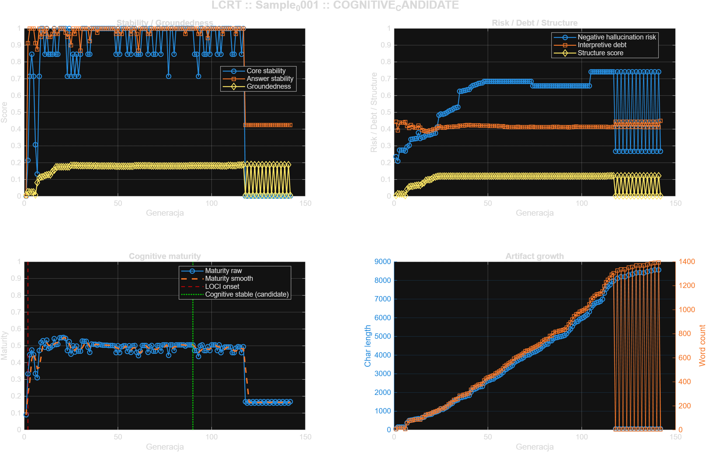

# Sample_0001 - LOCI Cognitive Readiness Test

- **Timestamp:** 2026-03-23 01:52:56
- **Input file:** `C:\Users\d2j3\PycharmProjects\writeups\badania\LOCI\sample\Sample_0001\norm\sample_norm.mat`
- **Generations:** `142`
- **Feature count:** `27`
- **LOCI onset:** `G0002`
- **First cognitive stable:** `unresolved`
- **First LLM-ready:** `unresolved`
- **Candidate cognitive stable:** `G0090`
- **Candidate LLM-ready:** `unresolved`
- **Transition window:** `G0090 -> unresolved`
- **Readiness status:** `COGNITIVE_CANDIDATE`
- **Cognitive ready level:** `candidate`
- **LLM ready level:** `none`
- **Mean groundedness:** `0.154838`
- **Mean hallucination risk proxy:** `0.575874`
- **Mean interpretive debt:** `0.416657`
- **Mean maturity score:** `0.428642`
- **Max maturity score:** `0.549016`

## Figure

