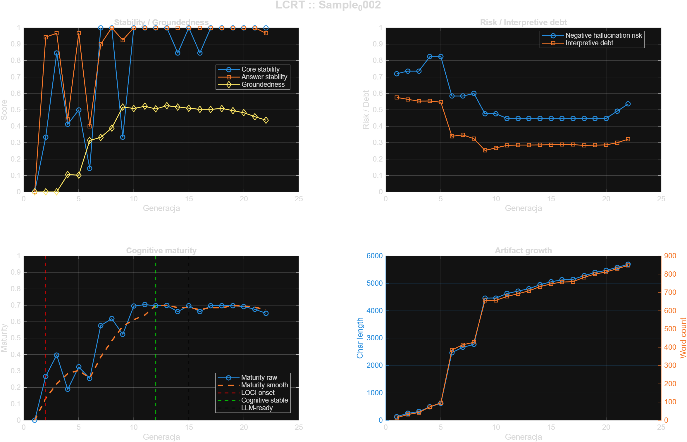

# Sample_0002 - LOCI Cognitive Readiness Test

- **Timestamp:** 2026-03-22 23:40:43
- **Input file:** `C:\Users\d2j3\PycharmProjects\writeups\badania\LOCI\sample\Sample_0002\norm\sample_norm.mat`
- **Generations:** `22`
- **Feature count:** `27`
- **LOCI onset:** `G0002`
- **First cognitive stable:** `G0012`
- **First LLM-ready:** `G0015`
- **Transition window:** `G0012 -> G0015`
- **Mean groundedness:** `0.374411`
- **Mean hallucination risk proxy:** `0.548545`
- **Mean interpretive debt:** `0.354853`
- **Mean maturity score:** `0.548953`

## Figure

## Per-generation rows

### G0001

- **Core stability:** `0.000000`
- **Answer stability:** `0.000000`
- **Groundedness:** `0.000000`
- **Negative hallucination risk:** `0.720000`
- **Interpretive debt:** `0.575694`
- **Structure score:** `0.000000`
- **Maturity score:** `0.000000`
- **Keywords:** `20badanie, com, github, https, książeczki, można, piąteczek, rygorystyczne, wszystko, wychodząc, zamknięte, zasadzie`
- **Snapshot:** `Wychodząc do książeczki... ... W zasadzie... zamknięte wszystko. Można zrobić piąteczek. https://github.com/.../Rygorystyczne%20badanie...`

### G0002

- **Core stability:** `0.333333`
- **Answer stability:** `0.942857`
- **Groundedness:** `0.000000`
- **Negative hallucination risk:** `0.736000`
- **Interpretive debt:** `0.563816`
- **Structure score:** `0.000000`
- **Maturity score:** `0.268007`
- **Keywords:** `będzie, 20badanie, botów, com, github, https, książeczki, moim, można, niżej, normalności, okres`
- **Snapshot:** `Wychodząc do książeczki... ... W zasadzie... zamknięte wszystko. Można zrobić piąteczek. Teraz sporo botów będzie procować nad wygenerowanym...`

### G0003

- **Core stability:** `0.846154`
- **Answer stability:** `0.966667`
- **Groundedness:** `0.000000`
- **Negative hallucination risk:** `0.736000`
- **Interpretive debt:** `0.553125`
- **Structure score:** `0.000000`
- **Maturity score:** `0.397391`
- **Keywords:** `będzie, zasadzie, 20badanie, botów, com, github, https, książeczki, moim, można, niżej, normalności`
- **Snapshot:** `Wychodząc do książeczki... ... W zasadzie... zamknięte wszystko. Można zrobić piąteczek. Teraz sporo botów będzie procować nad wygenerowanym...`

### G0004

- **Core stability:** `0.411765`
- **Answer stability:** `0.442857`
- **Groundedness:** `0.105820`
- **Negative hallucination risk:** `0.824000`
- **Interpretive debt:** `0.553704`
- **Structure score:** `0.000000`
- **Maturity score:** `0.188802`
- **Keywords:** `zasadzie, będzie, teraz, 20badanie, badawczy, botów, będę, com, elementem, github, hej, https`
- **Snapshot:** `Wychodząc do książeczki... ... W zasadzie... zamknięte wszystko. Można zrobić piąteczek. Teraz sporo botów będzie procować nad wygenerowanym...`

### G0005

- **Core stability:** `0.500000`
- **Answer stability:** `0.966667`
- **Groundedness:** `0.102041`
- **Negative hallucination risk:** `0.824000`
- **Interpretive debt:** `0.546429`
- **Structure score:** `0.000000`
- **Maturity score:** `0.325113`
- **Keywords:** `będzie, zasadzie, teraz, wartość, 20badanie, badawczy, botów, bywa, będę, com, dodana, dwanaście`
- **Snapshot:** `Wychodząc do książeczki... ... W zasadzie... zamknięte wszystko. Można zrobić piąteczek. Teraz sporo botów będzie procować nad wygenerowanym...`

### G0006

- **Core stability:** `0.142857`
- **Answer stability:** `0.400000`
- **Groundedness:** `0.313589`
- **Negative hallucination risk:** `0.584000`
- **Interpretive debt:** `0.339329`
- **Structure score:** `0.219512`
- **Maturity score:** `0.255095`
- **Keywords:** `tego, tylko, zaczyna, model, może, teraz, wartość, więc, właśnie, być, będzie, człowiek`
- **Snapshot:** `Wychodząc już trochę do książeczki, ... mam poczucie, że pewien etap się domknął. W zasadzie wszystko jest na ten moment zamknięte i można z...`

### G0007

- **Core stability:** `1.000000`
- **Answer stability:** `0.900000`
- **Groundedness:** `0.332226`
- **Negative hallucination risk:** `0.584000`
- **Interpretive debt:** `0.347093`
- **Structure score:** `0.232558`
- **Maturity score:** `0.576481`
- **Keywords:** `tego, tylko, zaczyna, model, może, teraz, wartość, więc, właśnie, być, będzie, człowiek`
- **Snapshot:** `Wychodząc już trochę do książeczki, ... mam poczucie, że pewien etap się domknął. W zasadzie wszystko jest na ten moment zamknięte i można z...`

### G0008

- **Core stability:** `1.000000`
- **Answer stability:** `1.000000`
- **Groundedness:** `0.389610`
- **Negative hallucination risk:** `0.600000`
- **Interpretive debt:** `0.324432`
- **Structure score:** `0.272727`
- **Maturity score:** `0.618362`
- **Keywords:** `tego, tylko, zaczyna, model, może, teraz, wartość, więc, właśnie, być, będzie, człowiek`
- **Snapshot:** `Wychodząc już trochę do książeczki, ... mam poczucie, że pewien etap się domknął. W zasadzie wszystko jest na ten moment zamknięte i można z...`

### G0009

- **Core stability:** `0.333333`
- **Answer stability:** `0.925000`
- **Groundedness:** `0.517241`
- **Negative hallucination risk:** `0.476000`
- **Interpretive debt:** `0.253017`
- **Structure score:** `0.431034`
- **Maturity score:** `0.522938`
- **Keywords:** `donkey, tego, tylko, którym, człowiek, mnie, model, sensu, więc, wyłącznie, zaczyna, modelu`
- **Snapshot:** `Wychodząc już trochę do książeczki, ... mam poczucie, że pewien etap się domknął. W zasadzie wszystko jest na ten moment zamknięte i można z...`

### G0010

- **Core stability:** `1.000000`
- **Answer stability:** `1.000000`
- **Groundedness:** `0.508475`
- **Negative hallucination risk:** `0.476000`
- **Interpretive debt:** `0.268432`
- **Structure score:** `0.423729`
- **Maturity score:** `0.694652`
- **Keywords:** `tego, tylko, donkey, którym, człowiek, model, sensu, więc, wyłącznie, zaczyna, mnie, modelu`
- **Snapshot:** `Wychodząc już trochę do książeczki, ... mam poczucie, że pewien etap się domknął. W zasadzie wszystko jest na ten moment zamknięte i można z...`

### G0011

- **Core stability:** `1.000000`
- **Answer stability:** `1.000000`
- **Groundedness:** `0.521542`
- **Negative hallucination risk:** `0.448000`
- **Interpretive debt:** `0.283532`
- **Structure score:** `0.444444`
- **Maturity score:** `0.703666`
- **Keywords:** `tego, tylko, donkey, którym, człowiek, model, sensu, więc, wyłącznie, zaczyna, mnie, modelu`
- **Snapshot:** `Wychodząc już trochę do książeczki, ... mam poczucie, że pewien etap się domknął. W zasadzie wszystko jest na ten moment zamknięte i można z...`

### G0012

- **Core stability:** `1.000000`
- **Answer stability:** `1.000000`
- **Groundedness:** `0.505495`
- **Negative hallucination risk:** `0.448000`
- **Interpretive debt:** `0.285577`
- **Structure score:** `0.430769`
- **Maturity score:** `0.697470`
- **Keywords:** `tego, tylko, donkey, którym, człowiek, model, sensu, więc, wyłącznie, zaczyna, mnie, modelu`
- **Snapshot:** `Wychodząc już trochę do książeczki, ... mam poczucie, że pewien etap się domknął. W zasadzie wszystko jest na ten moment zamknięte i można z...`

### G0013

- **Core stability:** `1.000000`
- **Answer stability:** `1.000000`
- **Groundedness:** `0.525210`
- **Negative hallucination risk:** `0.448000`
- **Interpretive debt:** `0.285662`
- **Structure score:** `0.411765`
- **Maturity score:** `0.698378`
- **Keywords:** `tego, tylko, donkey, którym, człowiek, model, sensu, więc, wyłącznie, zaczyna, mnie, modelu`
- **Snapshot:** `Wychodząc już trochę do książeczki, ... mam poczucie, że pewien etap się domknął. W zasadzie wszystko jest na ten moment zamknięte i można z...`

### G0014

- **Core stability:** `0.846154`
- **Answer stability:** `1.000000`
- **Groundedness:** `0.517598`
- **Negative hallucination risk:** `0.448000`
- **Interpretive debt:** `0.286594`
- **Structure score:** `0.420290`
- **Maturity score:** `0.661221`
- **Keywords:** `tego, tylko, donkey, którym, człowiek, model, sensu, więc, wyłącznie, zaczyna, będzie, mnie`
- **Snapshot:** `Wychodząc już trochę do książeczki, ... mam poczucie, że pewien etap się domknął. W zasadzie wszystko jest na ten moment zamknięte i można z...`

### G0015

- **Core stability:** `1.000000`
- **Answer stability:** `1.000000`
- **Groundedness:** `0.510204`
- **Negative hallucination risk:** `0.448000`
- **Interpretive debt:** `0.287500`
- **Structure score:** `0.428571`
- **Maturity score:** `0.697918`
- **Keywords:** `tego, tylko, donkey, którym, człowiek, model, sensu, więc, wyłącznie, zaczyna, będzie, mnie`
- **Snapshot:** `Wychodząc już trochę do książeczki, ... mam poczucie, że pewien etap się domknął. W zasadzie wszystko jest na ten moment zamknięte i można z...`

### G0016

- **Core stability:** `0.846154`
- **Answer stability:** `1.000000`
- **Groundedness:** `0.503018`
- **Negative hallucination risk:** `0.448000`
- **Interpretive debt:** `0.288380`
- **Structure score:** `0.436620`
- **Maturity score:** `0.660774`
- **Keywords:** `tego, tylko, donkey, którym, człowiek, model, pracy, sensu, więc, wyłącznie, zaczyna, będzie`
- **Snapshot:** `Wychodząc już trochę do książeczki, ... mam poczucie, że pewien etap się domknął. W zasadzie wszystko jest na ten moment zamknięte i można z...`

### G0017

- **Core stability:** `1.000000`
- **Answer stability:** `1.000000`
- **Groundedness:** `0.503018`
- **Negative hallucination risk:** `0.448000`
- **Interpretive debt:** `0.288380`
- **Structure score:** `0.436620`
- **Maturity score:** `0.697698`
- **Keywords:** `tego, tylko, donkey, którym, człowiek, model, pracy, sensu, więc, wyłącznie, zaczyna, będzie`
- **Snapshot:** `Wychodząc już trochę do książeczki, ... mam poczucie, że pewien etap się domknął. W zasadzie wszystko jest na ten moment zamknięte i można z...`

### G0018

- **Core stability:** `1.000000`
- **Answer stability:** `1.000000`
- **Groundedness:** `0.508806`
- **Negative hallucination risk:** `0.448000`
- **Interpretive debt:** `0.283219`
- **Structure score:** `0.424658`
- **Maturity score:** `0.697334`
- **Keywords:** `tylko, tego, donkey, którym, człowiek, model, pracy, sensu, więc, wyłącznie, zaczyna, będzie`
- **Snapshot:** `Wychodząc już trochę do książeczki, ... mam poczucie, że pewien etap się domknął. W zasadzie wszystko jest na ten moment zamknięte i można z...`

### G0019

- **Core stability:** `1.000000`
- **Answer stability:** `1.000000`
- **Groundedness:** `0.495238`
- **Negative hallucination risk:** `0.448000`
- **Interpretive debt:** `0.285000`
- **Structure score:** `0.440000`
- **Maturity score:** `0.696932`
- **Keywords:** `tylko, tego, donkey, którym, człowiek, model, pracy, sensu, więc, wyłącznie, zaczyna, będzie`
- **Snapshot:** `Wychodząc już trochę do książeczki, ... mam poczucie, że pewien etap się domknął. W zasadzie wszystko jest na ten moment zamknięte i można z...`

### G0020

- **Core stability:** `1.000000`
- **Answer stability:** `1.000000`
- **Groundedness:** `0.482375`
- **Negative hallucination risk:** `0.448000`
- **Interpretive debt:** `0.286688`
- **Structure score:** `0.428571`
- **Maturity score:** `0.691876`
- **Keywords:** `tylko, tego, donkey, którym, człowiek, model, pracy, sensu, więc, wyłącznie, zaczyna, będzie`
- **Snapshot:** `Wychodząc już trochę do książeczki, ... mam poczucie, że pewien etap się domknął. W zasadzie wszystko jest na ten moment zamknięte i można z...`

### G0021

- **Core stability:** `1.000000`
- **Answer stability:** `1.000000`
- **Groundedness:** `0.458554`
- **Negative hallucination risk:** `0.492000`
- **Interpretive debt:** `0.299846`
- **Structure score:** `0.407407`
- **Maturity score:** `0.675351`
- **Keywords:** `tylko, tego, donkey, którym, człowiek, model, pracy, sensu, więc, wyłącznie, zaczyna, będzie`
- **Snapshot:** `Wychodząc już trochę do książeczki, ... mam poczucie, że pewien etap się domknął. W zasadzie wszystko jest na ten moment zamknięte i można z...`

### G0022

- **Core stability:** `1.000000`
- **Answer stability:** `0.966667`
- **Groundedness:** `0.436975`
- **Negative hallucination risk:** `0.536000`
- **Interpretive debt:** `0.321324`
- **Structure score:** `0.388235`
- **Maturity score:** `0.651511`
- **Keywords:** `tylko, tego, donkey, którym, będzie, człowiek, model, pracy, sensu, więc, wyłącznie, zaczyna`
- **Snapshot:** `Wychodząc już trochę do książeczki, ... mam poczucie, że pewien etap się domknął. W zasadzie wszystko jest na ten moment zamknięte i można z...`

