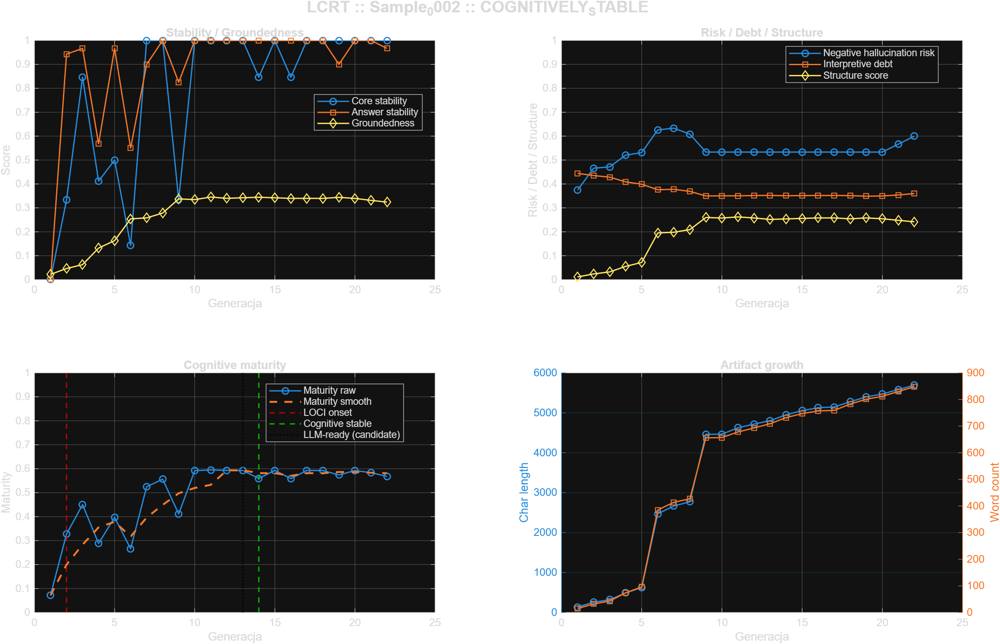

# Sample_0002 - LOCI Cognitive Readiness Test

- **Timestamp:** 2026-03-23 01:27:36
- **Input file:** `C:\Users\d2j3\PycharmProjects\writeups\badania\LOCI\sample\Sample_0002\norm\sample_norm.mat`
- **Generations:** `22`
- **Feature count:** `27`
- **LOCI onset:** `G0002`
- **First cognitive stable:** `G0014`
- **First LLM-ready:** `unresolved`
- **Candidate cognitive stable:** `G0013`
- **Candidate LLM-ready:** `G0013`
- **Transition window:** `G0014 -> G0013`
- **Readiness status:** `COGNITIVELY_STABLE`
- **Mean groundedness:** `0.271012`
- **Mean hallucination risk proxy:** `0.536250`
- **Mean interpretive debt:** `0.371046`
- **Mean maturity score:** `0.494511`
- **Max maturity score:** `0.595025`

## Figure

