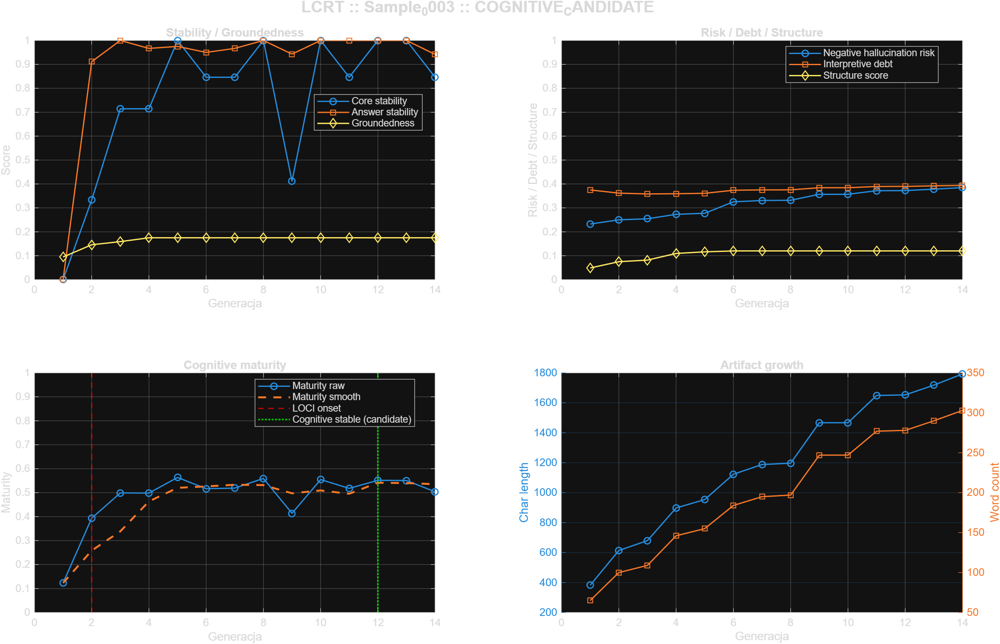

# Sample_0003 - LOCI Cognitive Readiness Test

- **Timestamp:** 2026-03-23 16:00:42
- **Input file:** `C:\Users\d2j3\PycharmProjects\writeups\badania\LOCI\sample\Sample_0003\norm\sample_norm.mat`
- **Generations:** `14`
- **Feature count:** `27`
- **LOCI onset:** `G0002`
- **First cognitive stable:** `unresolved`
- **First LLM-ready:** `unresolved`
- **Candidate cognitive stable:** `G0012`
- **Candidate LLM-ready:** `unresolved`
- **Transition window:** `G0012 -> unresolved`
- **Readiness status:** `COGNITIVE_CANDIDATE`
- **Cognitive ready level:** `candidate`
- **LLM ready level:** `none`
- **Mean groundedness:** `0.166042`
- **Mean hallucination risk proxy:** `0.321179`
- **Mean interpretive debt:** `0.376658`
- **Mean maturity score:** `0.483284`
- **Max maturity score:** `0.563470`

## Figure

