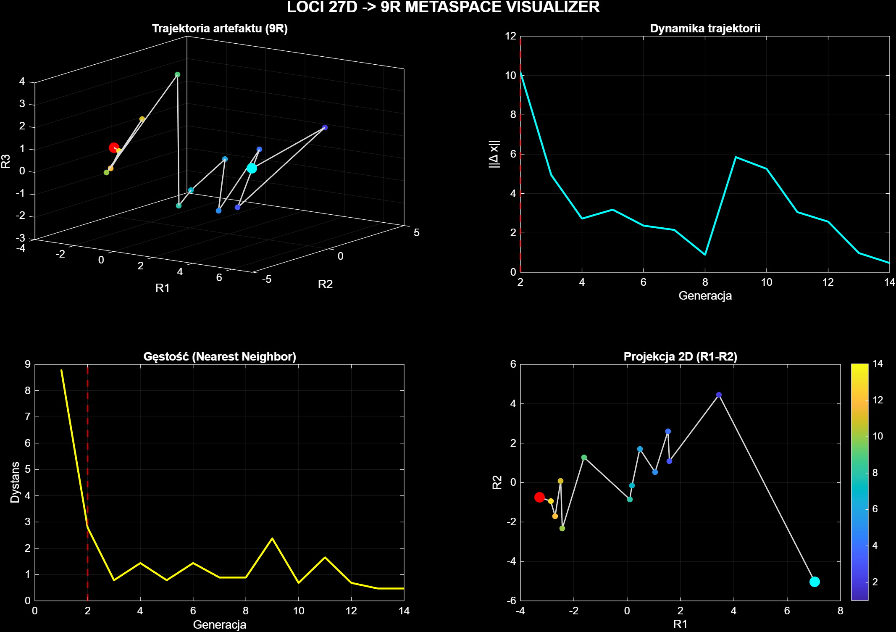

# Sample_0003 - LOCI 27D -> 9R report

- **Timestamp:** 2026-03-23 16:02:12
- **Input file:** `C:\Users\d2j3\PycharmProjects\writeups\badania\LOCI\sample\Sample_0003\norm\sample_norm.mat`
- **Result dir:** `C:\Users\d2j3\PycharmProjects\writeups\badania\LOCI\results\Sample_0003`
- **Generations:** `14`
- **Feature count:** `27`
- **Onset (LOCI approx):** `G0002`
- **Mean step:** `3.432126`
- **Max step:** `10.157270`
- **Trajectory length:** `44.617641`
- **Explained variance (3D):** `43.962329, 27.729316, 12.917272`

## Figure

## Feature names

- `char_len`
- `word_count`
- `line_count`
- `avg_word_len`
- `unique_word_ratio`
- `uppercase_ratio`
- `digit_ratio`
- `punct_ratio`
- `ellipsis_count`
- `question_count`
- `exclamation_count`
- `url_count`
- `masked_entity_count`
- `has_parent`
- `is_root`
- `entry_type_code`
- `author_role_code`
- `similarity_score_safe`
- `delta_char_len`
- `delta_word_count`
- `delta_unique_word_ratio`
- `token_jaccard_prev`
- `prefix_overlap_prev`
- `suffix_overlap_prev`
- `newline_density`
- `comma_density`
- `semantic_expansion_score`

## Saved files

- PNG: `C:\Users\d2j3\PycharmProjects\writeups\badania\LOCI\results\Sample_0003\Sample_0003_metaspace_run_2026-03-23_160211.png`
- FIG: `C:\Users\d2j3\PycharmProjects\writeups\badania\LOCI\results\Sample_0003\Sample_0003_metaspace_run_2026-03-23_160211.fig`
- TXT: `C:\Users\d2j3\PycharmProjects\writeups\badania\LOCI\results\Sample_0003\Sample_0003_metaspace_run_2026-03-23_160211.txt`
- JSON: `C:\Users\d2j3\PycharmProjects\writeups\badania\LOCI\results\Sample_0003\Sample_0003_metaspace_run_2026-03-23_160211.json`
- MD: `C:\Users\d2j3\PycharmProjects\writeups\badania\LOCI\results\Sample_0003\Sample_0003_metaspace_run_2026-03-23_160211.md`
