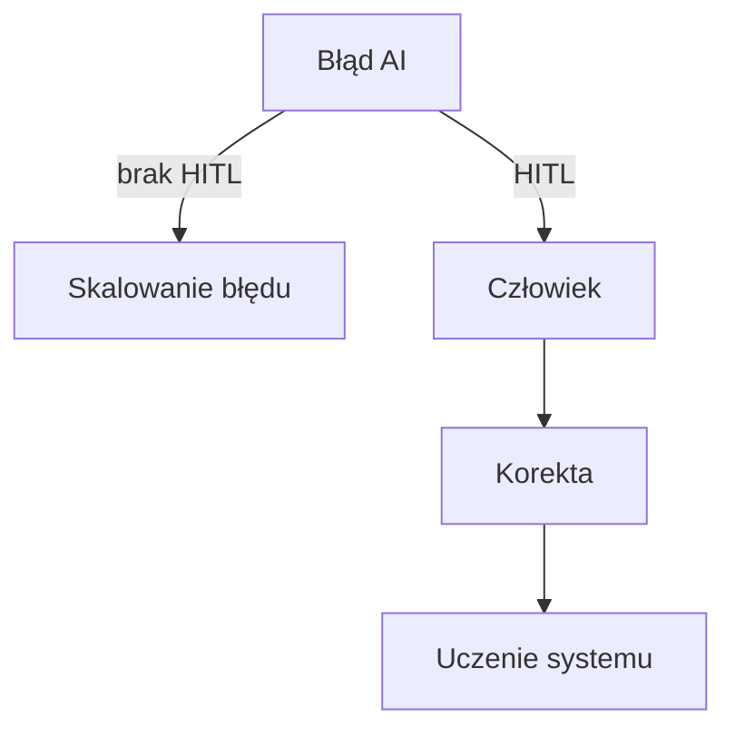

# Opłacalność Human-AI-In-The-Loop  
## Przegląd badań empirycznych i koncepcyjnych (Research Write-Up)

### Repozytorium badań (źródło pierwotne)
👉 https://github.com/DonkeyJJLove/writeups/tree/master/badania

---

## Abstrakt

Niniejszy dokument stanowi **artykuł przeglądowy (review paper)** opisujący
zestaw badań prowadzonych w katalogu `writeups/badania`.
Celem README jest **integracja wyników** z zakresu ekonomii danych,
architektur Human-AI-In-The-Loop (HITL),
neurokognitywnych ograniczeń człowieka
oraz modeli społeczno-technicznych produkcji wartości.

README **nie wprowadza nowych tez** – rekonstruuje i syntetyzuje
wnioski już obecne w badaniach źródłowych.

---

## Metodologia przeglądu

- **Źródło danych**: write-ups badawcze (katalog `badania/`)
- **Charakter badań**: koncepcyjno-empiryczny, eksploracyjny
- **Metoda**:
  - analiza porównawcza modeli ekonomicznych
  - analiza kosztów poznawczych i organizacyjnych
  - synteza wniosków międzydyscyplinarnych
- **Kryteria oceny**:
  - opłacalność (ROI, koszt błędu, koszt koordynacji)
  - stabilność epistemiczna
  - rola człowieka w pętli AI

---

## Katalog badań (opis i wnioski)

### 1. Ekonomiczna „taśma prototypowa danych” poniżej progu startupu

**Teza**  
Brak danych nie jest barierą ekonomiczną – barierą jest brak procesu ich
systematycznej produkcji.

**Wyniki kluczowe**
- HITL umożliwia seryjne wytwarzanie danych bez kosztownej infrastruktury
- człowiek pełni funkcję generatora semantyki i sensu
- AI pełni funkcję akceleratora iteracji

**Wniosek ekonomiczny**  
Człowiek w pętli **obniża próg wejścia**, zamiast podnosić koszty.

---

### 2. Ekonomiczna falsyfikacja modelu „data-only”

**Teza**  
Model „więcej danych → lepsza AI” jest długoterminowo nieopłacalny.

**Wyniki kluczowe**
- wzrost kosztów walidacji i czyszczenia danych
- dryf semantyczny modeli
- rosnący koszt korekty błędów

**Wniosek ekonomiczny**  
Brak człowieka powoduje **inflację kosztów błędu**.

---

### 3. Ekonomiczny dowód opłacalności modelu „idealnej wioski kosmicznej”

**Teza**  
Zamknięte ekosystemy Human-AI są efektywniejsze niż rynki danych.

**Wyniki kluczowe**
- wartość powstaje w relacjach, nie w wolumenie
- koordynacja zastępuje skalę
- wiedza zastępuje kapitał

**Wniosek ekonomiczny**  
Opłacalność = funkcja spójności relacji, nie skali produkcji.

---

### 4. Pięć racjonalnych modeli hybrydowej „wioski kosmicznej” Social-AI

**Teza**  
Nie każdy model HITL jest ekonomicznie stabilny.

**Wyniki kluczowe**
- istnieje skończona liczba stabilnych archetypów
- kluczowa jest architektura sprzężeń zwrotnych
- błędna struktura relacji prowadzi do entropii organizacyjnej

**Wniosek ekonomiczny**  
Architektura relacji > architektura techniczna.

---

### 5. Neurokognitywne skutki środowiska cyfrowego dla roli człowieka w pętli AI

**Teza**  
Człowiek w pętli jest zasobem o ograniczonej pojemności poznawczej.

**Wyniki kluczowe**
- przeciążenie poznawcze obniża jakość danych
- brak higieny poznawczej generuje błędy systemowe
- rytuały, CBT i struktury redukują koszt poznawczy

**Wniosek ekonomiczny**  
Koszt poznawczy jest **ukrytym składnikiem TCO systemów AI**.

---

### 6. Rytuał, CBT i „mózg zwierzęcy” jako stabilizator HITL

**Teza**  
Bez stabilizacji psychologicznej człowiek staje się najsłabszym ogniwem pętli.

**Wyniki kluczowe**
- rytuały redukują zmienność decyzyjną
- CBT zwiększa odporność na stres informacyjny
- struktura dnia pracy wpływa na jakość sprzężenia z AI

**Wniosek ekonomiczny**  
Psychologia człowieka wpływa bezpośrednio na ROI AI.

---

## Synteza ekonomiczna (wnioski zbiorcze)

### 1. Funkcja opłacalności HITL

```mermaid
graph LR
A[Człowiek] -->|semantyka| B[Pętla HITL]
C[AI] -->|akceleracja| B
B --> D[Wartość]
B --> E[Redukcja ryzyka]
B --> F[Kontrola kosztu błędu]
````

**Wniosek**
Wartość nie powstaje w AI ani w człowieku, lecz **w pętli**.

---

### 2. Porównanie modeli ekonomicznych

```mermaid
xychart-beta
title "Koszt całkowity vs stabilność systemu"
x-axis ["Data-only", "AI-heavy", "Human-AI-In-The-Loop"]
y-axis "Koszt długoterminowy" 0 --> 100
line [30, 55, 25]
```

**Interpretacja**
HITL ma niższy koszt długoterminowy mimo wyższego kosztu początkowego.

---

### 3. Koszt błędu a architektura



**Wniosek**
HITL działa jak **amortyzator błędu**.

---

## Wnioski końcowe

1. Opłacalność AI jest funkcją **relacji**, nie automatyzacji.
2. Modele data-only są krótkoterminowo atrakcyjne, długoterminowo niestabilne.
3. Człowiek w pętli:

   * stabilizuje system,
   * obniża koszt błędu,
   * dostarcza sens i intencję.
4. Koszty poznawcze muszą być traktowane jako element ekonomiczny.

---

## Status badań

* charakter: **living research**
* katalog `badania/` pozostaje źródłem pierwotnym
* README pełni rolę **syntetycznego artykułu przeglądowego**

---

## Jak czytać repozytorium

1. **badania/** – prace źródłowe, eksperymenty, modele
2. **README.md** – synteza, wnioski, mapa pojęć
3. dalsze repo (SBOM, DevSecOps, AI-Ops) – warstwa aplikacyjna

---

