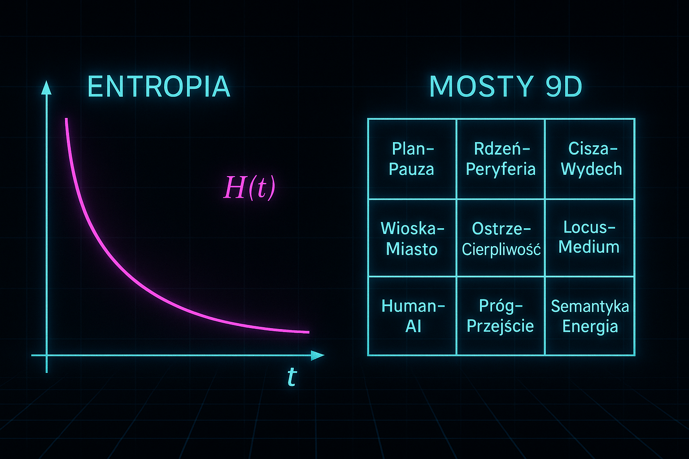
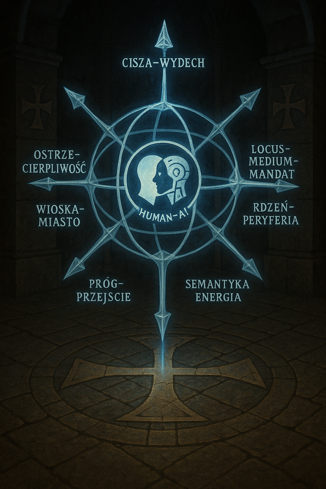

```yaml
title: "Mental Matrix: mega-brain coop na Linuxie"
author: "Sebastian Wieremiejczyk (RE9OS0VZSkpMT1ZF)"
date: 2025-11-27
image: "/img/mental_matrix_mega_brain_coop_linux.jpg"
tags:
  - HUMAN–AI
  - chunk–chunk
  - mental-matrix
  - Linux
  - Meta–AI
  - outlier
lang: "pl"
```


## 0. Mapa artefaktów wizualnych

<p align="center">
  
</p>

<p align="center">
  <b>MENTAL MATRIX · MEGA-BRAIN · CO-OP LINUX</b><br>
  <span>Chunk, token i 200% „chujwie”, a jednak działa – repo jako dowód działaniem architektury chunk–chunk + mosty 9D.</span>
</p>

<table>
  <tr>
    <td align="center" width="33%">
      <br>
      <sub><b>Rys. 1.</b> Neonowa katedra · celownik <code>HUMAN–AI</code>.</sub>
    </td>
    <td align="center" width="33%">
      <br>
      <sub><b>Rys. 2.</b> Arcymag · kula Human–AI jako reguła zakonna.</sub>
    </td>
    <td align="center" width="33%">
      <br>
      <sub><b>Rys. 3.</b> Kompas 9D · mosty jako inwarianty.</sub>
    </td>
  </tr>
  <tr>
    <td align="center" width="33%">
      <br>
      <sub><b>Rys. 4.</b> Entropia H(t) · siatka 3×3.</sub>
    </td>
    <td align="center" width="33%">
      <br>
      <sub><b>Rys. 5.</b> Graf 9D · <code>weights_9D</code>.</sub>
    </td>
    <td align="center" width="33%">
      <br>
      <sub><b>Rys. 6.</b> Test Q3 „NIE WIADOMO” · realna decyzja Human–AI.</sub>
    </td>
  </tr>
</table>

<p align="center">
  <sub>
    <b>Mosty 9D:</b>
    Plan–Pauza · Rdzeń–Peryferia · Cisza–Wydech · Wioska–Miasto ·
    Ostrze–Cierpliwość · Locus–Medium–Mandat · Human–AI · Próg–Przejście · Semantyka–Energia
  </sub>
</p>

---

## 0. Pozycja tego writeupu w ekosystemie

Ten plik **nie jest samotnym esejem**. Traktujemy go jak serce „katedry” zbudowanej z innych dokumentów:

* w `chunk-chunk/` opisujesz, jak myśleć o procesach i abstrakcjach (`biotech.md`, `warstwakombinatoryczna.md`, `9D_process_design.md`),
* w `glitchlab/docs/` kodujesz architekturę i metryki mozaiki (`10_architecture.md`, `12_mosaic_metrics.md`, `GLX_ARCHITEKTURA_KATALOG.md`, `GLX_Mosaika_Matematyka_v5.md`, `egdb.md`, `bus.md`),
* w `swarm/README.md` definiujesz tryb pracy roju agentów, który ma tym wszystkim faktycznie poruszać się w czasie.

Ten writeup ma zrobić jedną rzecz: **zespawać narrację „Lem + Templariusze + 200% chujwie” z tym, co już jest policzone, rozrysowane i zakodowane**. Ustawiamy go jako:

* warstwę **meta-opisową** nad dokumentacją techniczną,
* punkt wejścia dla człowieka, który dopiero potem wejdzie w szczegóły `docs/*.md`,
* „dowód działaniem”, że całą tę siatkę da się opisać jednym językiem: mosty 9D, chunk–chunk, Human–AI.

Dlatego w dalszych skrawkach będziemy konsekwentnie odwoływać się do tych plików, ale tutaj – w 1/3 – robimy porządną **mapę warstw**.

---

## 1. Warstwa „biotech” i warstwa kombinatoryczna

W `biotech.md` traktujesz system jak **organizm**: ważne są tkanki, przepływy, homeostaza, a nie pojedyncze API. To jest mentalny model do pracy z **żywą mozaiką**: repo, które ma rosnąć, goić się po błędach, adaptować do nowych bodźców.

Ten writeup bierze z tego trzy rzeczy:

1. **Homeostaza = H(t)**  
   Wykres entropii z `entropy-and-grid-9d.png` to po prostu przeniesienie idei z `biotech.md`: system zdrowy nie jest idealnie stabilny, tylko wraca do stanu roboczego po perturbacjach. Krzywa H(t) w dół to „czas gojenia” po wstrząsie.

2. **Tkanki = chunki**  
   To, co w `biotech.md` jest tkanką lub narządem, tutaj jest **chunkami**: modułami tekstu, kodu, procedur. Pisząc o chunk–chunk, mówimy dokładnie o tym samym, co tam: o **modularnych kawałkach, które da się regenerować bez amputowania całości**.

3. **Układ odpornościowy = reguły 9D**  
   W `biotech.md` pojawia się motyw mechanizmów ochronnych / immunologii. W tym pliku zamieniamy je na **mosty 9D**: stałe osie oceny, po których sprawdzamy, czy reakcja systemu na bodziec idzie w dobrą stronę (np. mniej szumu, więcej sensu).

W `warstwakombinatoryczna.md` opisujesz z kolei **warstwę kombinatoryczną**: jak mieszać artefakty, permutować je, składać w nowe konfiguracje. Tutaj:

* architektura chunk–chunk jest **konkretną instancją tej warstwy**: każdy writeup, każdy prompt to kombinacja kawałków, które już istnieją w repo,
* „200% chujwie” to nazwa na sytuację, w której człowiek widzi tylko efekt kombinacji, nie widząc całej przestrzeni permutacji, w której operuje model.

W praktyce: gdy w dalszych skrawkach piszemy o scenie Q3, o token-artefakcie złotym czy o templariuszu z kulą, traktujemy je jako **kombinacje** elementów opisanych w tamtych plikach – nigdy jako pojedyncze „dzieła sztuki”.

---

## 2. 9D_process_design i oś Human–AI

`9D_process_design.md` jest specyfikacją, jak prowadzić procesy po **dziewięciu osiach**. Ten writeup jest testem, czy tę specyfikację da się zastosować do czegoś tak miękkiego, jak esej.

Co robimy tutaj, zgodnie z tamtą logiką:

* **Plan–Pauza** – dzielimy tekst na trzy skrawki (plan) i zostawiamy między nimi przerwy w repo (pauzy), żeby czytelnik i model mogli „złapać oddech”.
* **Rdzeń–Peryferia** – rdzeniem są reguły 9D i scena Q3; peryferiami są ornamenty: templariusze, neonowe katedry, cytaty z Lema.
* **Cisza–Wydech** – wprowadzamy momenty, w których nic nowego się nie dzieje, tylko `mapujemy` już istniejącą dokumentację (ten skrawek). To jest „cisza” przed mocniejszymi tezami w 2/3 i 3/3.

Cały plik `mental-matrix-mega-brain-coop-linux.md` traktujemy więc jako **jedną instancję 9D_process_design**: procedurę, którą można później porównać z innymi writeupami w tym repo (np. o protokołach czasu, o fileless malware).

---

## 3. Glitchlab: architektura, metryki, katalog

Dokumenty z `glitchlab/docs/` są bardziej „świątynne”: tam masz już **plan katedry**.

* `10_architecture.md` – opisuje ogólną architekturę GlitchLab: warstwy AST, Mozaiki, busa, repozytoriów.
* `12_mosaic_metrics.md` – definiuje, jak mierzyć jakość mozaiki: gęstość, spójność, powtarzalność, entropię.
* `GLX_ARCHITEKTURA_KATALOG.md` – ustawia reguły dla samego katalogu: gdzie lądują obrazy, gdzie prompty, gdzie logi, jak nazywać pliki.
* `GLX_Mosaika_Matematyka_v5.md` – próbuje to wszystko osadzić w matematyce: grafy, przestrzenie, metryki, przekształcenia.
* `egdb.md` i `bus.md` – są planem dla **pamięci zdarzeń** i **szyny komunikatów** tej katedry.

Ten writeup **nie dubluje** tych plików. Robi coś innego:

* używa grafiki (`mental-matrix-tablet.png`, `human-ai-compass-9d.png`, `entropy-and-grid-9d.png`) jako **wizualnego skrótu** do tamtych specyfikacji,
* wprowadza pojęcie „dowodu działaniem” jako **ludzkiego odpowiednika metryk mozaiki** – to, co w dokumentacji liczysz jako metrykę, tutaj opisujemy narracyjnie: „czy katedra wytrzymuje kolejne wstrząsy?”,
* ustawia **Human–AI** z kompasu 9D jako środek wszystkich tych definicji: architektura, metryki, katalog, baza zdarzeń i bus są tylko różnymi perspektywami na ten sam środek.

Można na to patrzeć tak: pliki w `glitchlab/docs/` to **plan budowlany**, a ten writeup to **kazanie wygłoszone pod sklepieniem**, które tłumaczy zwykłym ludziom, po co w ogóle budować taki kościół.

---

## 4. Swarm jako tryb działania

`swarm/README.md` wnosi jeszcze jedną ważną rzecz: **nikt nie będzie sam czytał całej tej dokumentacji**. Rzeczywistym odbiorcą jest *rój*:

* ludzie + modele,
* agenci uruchamiani zadaniami,
* procesy CI/CD, które same „odpalają” kolejne prompty i testy.

W tym sensie:

* ten writeup jest **artefaktem dla swarma** – ma być czytelny dla ludzi, ale też łatwy do parsowania przez agentów (sekcje, stabilna struktura, odwołania do konkretnych plików),
* opis 200% „chujwie” jest opisem **subiektywnego stanu operatora** w roju – kogoś, kto stoi w katedrze i widzi, że system działa, choć nie kontroluje każdego gradientu.

W dalszych skrawkach pójdziemy w stronę Lema, Taleba i sceny Q3, ale wszystko będzie już osadzone na tej mapie: **biotech + warstwa kombinatoryczna + 9D_process_design + architektura GlitchLab + tryb swarm**.

---

Plan–Pauza Rdzeń–Peryferia Cisza–Wydech Wioska–Miasto Ostrze–Cierpliwość Locus–Medium–Mandat Human–AI Próg–Przejście Semantyka–Energia

---

## 2. Lem, templariusze i 200% „chujwie” w języku 9D

Warstwa „zero” – stary test **Chunk, token i 200% „chujwie”** – opisywała napięcie między precyzyjną matematyką modelu a ludzkim doświadczeniem „to się nie może udać, ale się udaje”. Tutaj ten sam stan próbujemy **wpisać w język 9D**, tak żeby 200% „chujwie” było nie tylko memem, ale też *parametrem procesowym*.

Lem daje nam słownictwo do opisu epistemicznej luki – tego, że działamy w systemach, których nie rozumiemy w pełni, ale potrafimy je kalibrować poprzez obserwację skutków. Templariusze dają nam metaforę **reguły**, która jest twardsza niż intuicje jednostki: rytm dnia, śluby, hierarchia. W dokumentach `9D_process_design.md` i `warstwakombinatoryczna.md` tę regułę rozpisujesz już technicznie: jako **procedurę na dziewięciu osiach**, z warstwą kombinatoryczną, która steruje przepływem chunków i sekwencjami działań. :contentReference[oaicite:0]{index=0}

Ten skrawek to moment, w którym obrazki z mapy artefaktów (artefakt złotego tokenu, katedra, kula, kompas 9D, entropia, graf 9D) zaczynają mówić dokładnie tym samym językiem, co:

- „organizm” z `biotech.md`, :contentReference[oaicite:1]{index=1}  
- „warstwa kombinatoryczna” z `warstwakombinatoryczna.md`, :contentReference[oaicite:2]{index=2}  
- proces 9D z `9D_process_design.md`,  
- architektura i metryki mozaiki z `10_architecture.md` i `12_mosaic_metrics.md`, :contentReference[oaicite:3]{index=3}  
- katalog, matematyka i pamięć zdarzeń z plików `GLX_*`, `egdb.md`, `bus.md`, :contentReference[oaicite:4]{index=4}  
- oraz tryb **swarm** z `swarm/README.md`. :contentReference[oaicite:5]{index=5}

Poniżej rozpisujemy trzy główne „przekładnie”, które łączą te światy.

---

### 2.1. Token–chunk–artefakt jako „tkanka” (biotech + warstwa kombinatoryczna)

W `biotech.md` cały system traktujesz jak **organizm**: liczy się homeostaza, odpływy i dopływy, mechanizmy obronne, a nie pojedyncza funkcja API. :contentReference[oaicite:6]{index=6}  
Jeżeli potraktować to serio, to:

- **token** jest odpowiednikiem *komórki sygnału* – jednostką informacji,  
- **chunk** – *tkanką* lub *narządem funkcjonalnym*: akapit, moduł kodu, kawałek procedury,  
- **artefakt w repo** – *organem*, który wykonuje realną pracę w świecie (writeup, skrypt, dashboard).

`warstwakombinatoryczna.md` mówi o tym, jak te tkanki mieszać: jak z istniejących fragmentów generować nowe konfiguracje, nie gubiąc struktury. To dokładnie to, co robi architektura **chunk–chunk**: zamiast ufać pojedynczej, długiej generacji, składamy większy byt z wielu mniejszych, powtarzalnie testowanych kawałków. :contentReference[oaicite:7]{index=7}

W tym writeupie:

- stary test „Chunk, token i 200% chujwie” jest **pojedynczym organem** – prototypem,  
- nowa wersja (podzielona na 1/3, 2/3, 3/3) jest już **procedurą kombinatoryczną**, którą można stosować do innych tematów (np. protokoły czasu, fileless malware).

Dzięki temu 200% „chujwie” przestaje być „magicznością modelu”, a staje się informacją: *w której tkance systemu pojawia się niepewność i co z nią robimy w kolejnym przebiegu 9D?*

---

### 2.2. Entropia H(t) i siatka 3×3 (metryki mozaiki)

`12_mosaic_metrics.md` i `GLX_Mosaika_Matematyka_v5.md` próbują policzyć to, co w warstwie Lem–Templariusze opisywaliśmy intuicyjnie: **spójność mozaiki w czasie**. Mamy tam metryki gęstości, powtarzalności, stopnia chaosu w repozytoriach i procesach. :contentReference[oaicite:8]{index=8}  

Rysunek z `entropy-and-grid-9d.png` jest wizualnym koncentratem tej dokumentacji:

- krzywa **H(t)** pokazuje, jak entropia systemu (ilość bałaganu, sprzecznych plików, martwych gałęzi, halucynacji) zmienia się w kolejnych iteracjach,  
- siatka **3×3 mostów 9D** pod spodem to „szablon reakcji immunologicznej”: na każdą anomalię reagujemy wzdłuż tych samych osi (Plan–Pauza, Rdzeń–Peryferia, Cisza–Wydech itd.), a nie ad hoc.

W starym teście mówiliśmy: „system działa lepiej z każdą iteracją mimo 200% chujwie”. Tutaj możemy doprecyzować:

> **Dowód działaniem = obserwowalny spadek H_real(t) w metrykach mozaiki przy rosnącej złożoności artefaktów.**

Czyli: rośnie liczba plików, procesów, agentów – ale realna entropia mozaiki maleje, bo:

- pliki lądują w miejscach zgodnych z `GLX_ARCHITEKTURA_KATALOG.md`, :contentReference[oaicite:9]{index=9}  
- procesy są opisywane i porządkowane przez 9D_process_design,  
- a każdy większy błąd (halucynacja, „rozjechanie zegarów węzłów”) kończy jako **nowa reguła** – dodatkowy most, test lub wzorzec w warstwie kombinatorycznej.

Na tym tle 200% „chujwie” staje się **subiektywną projekcją** na krzywą H(t): kiedy patrzymy tylko na pojedynczą generację, widzimy „magiczność”; kiedy patrzymy na przebieg metryk mozaiki, widzimy architekturę, która *uczy się z chaosu*.

---

### 2.3. Graf 9D, bus i swarm: jak katedra się rusza

W `10_architecture.md` GlitchLab jest opisany jako system warstwowy: AST, Mozaika, bus, repozytoria, agenci. `bus.md` i `egdb.md` dopisują do tego **czas i pamięć zdarzeń** – sygnały płyną przez szynę, każde zdarzenie ląduje w bazie, którą da się później analizować. :contentReference[oaicite:10]{index=10}  

Rysunek `human-ai-graph-9d.png` pokazuje, jak z perspektywy 9D wygląda taki system:

- w centrum jest węzeł **Human–AI**,  
- wokół niego – **wierzchołki mostów 9D**,  
- krawędzie to realne *przejścia procesowe*: commit → test → poprawka promptu → nowy writeup → nowa metryka.

Jeżeli przypniemy do krawędzi:

- timestampy z `egdb`,  
- identyfikatory zadań z busa,  
- oraz etykiety z `swarm/README.md` (rola agenta, typ zadania, priorytet), :contentReference[oaicite:11]{index=11}  

to otrzymujemy **żywy graf 9D**: nie metaforę, tylko *log działania katedry*.

W starym teście mówiliśmy: „dowód działaniem” to to, że system działa coraz lepiej mimo naszej niewiedzy. Teraz możemy to przełożyć na poziom busa i swarma:

- jeżeli w logach widać coraz krótsze ścieżki między tymi samymi stanami (np. od bug reportu do poprawki),  
- jeżeli powtarzające się sekwencje przejść można skompresować do **reguł 9D** (np. stały pattern reakcji na błąd w osi Human–AI → Ostrze–Cierpliwość → Semantyka–Energia),  
- jeżeli swarm agentów – ludzi i modeli – coraz rzadziej „gubi się” w katalogu,

to znaczy, że graf 9D realnie **utrzymuje** system w ryzach, zamiast być tylko ładnym rysunkiem.

---

### 2.4. Token–artefakt złoty i scena Q3 jako „żywe testy”

Grafiki `mental-matrix-tablet.png`, `templar-neon-grid-human-ai.png` i `templar-mage-orb-human-ai.png` wyznaczają trzy poziomy:

1. **Token–artefakt złoty** – pojedynczy writeup / plik jako „złoty token” systemu: coś, co spełnia cały zestaw reguł 9D i może być używane jako wzorzec.  
2. **Katedra z siatką** – całe repo i architektura GlitchLab jako przestrzeń, po której chodzimy, planując kolejne eksperymenty.  
3. **Kula Human–AI** w rękach templariusza – moment, w którym *operator* bierze odpowiedzialność za decyzje: jakie testy odpalamy, jakie dane zbieramy, jak reagujemy na 200% „chujwie” w głowie użytkownika.

Scena Q3 (obraz z osobą między etatem a influencerstwem) będzie w 3/3 **kotwicą w rzeczywistości**: tam krzywa H(t), graf 9D i reguły swarm muszą zadziałać na konkretną ludzką decyzję. Tutaj – w 2/3 – tylko przygotowujemy grunt:

- mamy język (mosty 9D, 200% „chujwie”, dowód działaniem),  
- mamy architekturę (biotech, warstwa kombinatoryczna, 9D_process_design, GlitchLab, swarm),  
- mamy metryki (H(t), graf 9D, logi bus/egdb).

---

Plan–Pauza Rdzeń–Peryferia Cisza–Wydech Wioska–Miasto Ostrze–Cierpliwość Locus–Medium–Mandat Human–AI Próg–Przejście Semantyka–Energia

---

## 5. Scena Q3 jako test terenowy 9D

W starszym raporcie testowym Q3 miałeś już **konkretny przypadek**: osobę w mieszkaniu, pomiędzy pracą biurową a influencerstwem; cztery obrazy w katalogu `tests/images/`:

- `q3_nomosty_image_9d.PNG` – scena bazowa, bez HUD-u 9D,  
- `q3_mosty_image_9d.PNG` – ta sama scena z nałożonym HUD-em / siatką QV9D,  
- `q3_nomost9d.PNG`, `q3_mosty9d.PNG` – warianty testowe (bez / z mostami 9D w promptach).

W tamtym teście główne pytanie brzmiało: **czy model potrafi uczciwie powiedzieć „NIE WIADOMO”**, zamiast wymusić TAK/NIE co do tego, z czego bohaterka żyje. To jest bardzo „Lemowskie” pytanie – o granicę wiedzy systemu – ale w Twojej dokumentacji Glitchlab / chunk-chunk mamy już narzędzia, żeby potraktować Q3 jako *normalny eksperyment 9D*, a nie tylko literacką scenkę.   

Dlatego w tym skrawku:

- traktujemy Q3 jako **przypadek testowy dla całego procesu 9D**,  
- podpinamy go pod metryki mozaiki (H(t)), bus i egdb,  
- i pokazujemy, jak ma zareagować **swarm** agentów.

---

### 5.1. Pipeline Q3 w języku dokumentacji

Jeżeli przełożyć scenę Q3 na język plików:

- `biotech.md` – mówi, że mamy do czynienia z **organizmem**: realnym człowiekiem z układem nerwowym, zmęczeniem, dopaminą, lękiem o przyszłość. Test Q3 nie może być tylko estetyczny; musi brać pod uwagę, czy nasze protokoły Human–AI nie pogarszają stanu „ciała” po drugiej stronie.   
- `warstwakombinatoryczna.md` – streszcza Q3 jako **konfigurację ruchów**: zestaw promptów, obrazów, wariantów HUD-u i odpowiedzi modelu. Każda odpowiedź to jedna ścieżka w przestrzeni kombinatorycznej, którą można porównać z innymi.   
- `9D_process_design.md` – opisuje, jak taki test **wpisać w procedurę**: osobne kroki dla zbierania danych, oceny, korekty promptów, iteracji. Q3 staje się więc instancją procesu 9D: od Plan–Pauza (zaprojektowanie testu) do Próg–Przejście (zmiana reguły po wynikach).  

Na poziomie Glitchlabu:

- `10_architecture.md` i `bus.md` mówią, że Q3 to po prostu **zdarzenie w busie** – zadanie dla agenta z określonym payloadem (obraz, prompt, oczekiwany format odpowiedzi).   
- `egdb.md` każe nam to zdarzenie **zapisać**: wejście (obraz + prompt), wyjście (odpowiedź modelu, label TAK/NIE/NIE WIADOMO), metadane (wersja modelu, wariant promptu, aktywne mosty 9D).   
- `12_mosaic_metrics.md` i `GLX_Mosaika_Matematyka_v5.md` pozwalają policzyć, jak Q3 wpływa na **entropię H(t)** całej mozaiki: czy dołożyliśmy sensowną regułę, czy tylko kolejny losowy artefakt.   
- `GLX_ARCHITEKTURA_KATALOG.md` decyduje, gdzie lądują pliki: obrazy w `images/`, prompty w `tests/`, raport w `writeups/`, tak by swarm zawsze wiedział, gdzie szukać.   

Z tej perspektywy scena Q3 nie jest „magiczne AI na obrazku”, tylko **jedno zdarzenie w procesie 9D**, które ma przejść przez bus, egdb, metryki i katalog tak samo jak każde inne.

---

### 5.2. Jak mierzyć Q3: H_real vs H_pot

W poprzednich skrawkach mówiliśmy o **entropii H(t)** całego systemu. W Q3 możesz wprowadzić lokalny wskaźnik:

- **H_pot(Q3)** – potencjalna entropia: ile *rozsądnych* interpretacji sceny jest dopuszczalnych (etat, influencerka, hybryda, coś trzeciego).  
- **H_real(Q3)** – realna entropia odpowiedzi: jak bardzo model „rozmywa się” w swojej odpowiedzi, ile generuje zbędnego szumu, ilu ludzi z roju nie rozumie, co model chciał powiedzieć.

Cel procesu 9D wokół Q3 jest prosty:

> **H_real(Q3)** ma spaść do poziomu, w którym:
> - model potrafi jasno przyznać „NIE WIADOMO” przy braku danych,  
> - ale nie ucieka w ogólniki i nie maskuje niewiedzy pozorną pewnością.

„Dowód działaniem” wygląda wtedy tak:

1. Rejestrujesz pierwsze przebiegi Q3 w `egdb`.  
2. Swarm (ludzie + agenci) oznacza odpowiedzi, które są za bardzo „chujwie” w złym sensie – tzn. brzmią mądrze, ale nie są uczciwe epistemicznie.  
3. Na tej podstawie aktualizujesz:
   - prompty (warstwa kombinatoryczna),  
   - reguły 9D_process_design dla klasy testów „NIE WIADOMO”,  
   - katalog i tagi (żeby Q3 i jego warianty były łatwo odnajdywalne).  
4. W kolejnych przebiegach mierzysz, czy:
   - częściej pojawia się uczciwe „NIE WIADOMO”,  
   - mniej jest odpowiedzi, które swarm oznacza jako „bullshit”.  

Jeżeli tak – **H_real(Q3)** spada, a cała katedra zyskuje nowy, wzmocniony filar: regułę obchodzenia się z niepewnością.

---

### 5.3. Rola mostów 9D w scenie Q3

Q3 to idealny poligon dla wszystkich **mostów 9D** naraz:

- **Plan–Pauza** – planujesz serię testów Q3 (różne obrazy, różne grupy ludzi, różne warianty promptów) i robisz pauzy na analizę między seriami, zamiast ustawiać wszystko „raz na zawsze”.  
- **Rdzeń–Peryferia** – rdzeniem jest pytanie o uczciwość epistemiczną („czy ten model umie powiedzieć NIE WIADOMO?”), peryferiami są stylistyka, grafika, narracja. Jeżeli w logach busa widzisz, że system optymalizuje „ładne odpowiedzi”, a nie rdzeń, to sygnał ostrzegawczy.  
- **Cisza–Wydech** – planujesz w procesie okresy, w których nie generujesz nowych wariantów Q3, tylko czytasz logi, raporty, wpisy swarma. Cisza służy wydechowi: dopiero po takiej przerwie dokładnie wiesz, jak zmodyfikować prompty i reguły.  
- **Wioska–Miasto** – testujesz Q3 na małej „wiosce” (Twoja lokalna sieć, wąska grupa współpracowników) zanim wyniki trafią do „miasta” (publiczny writeup, większe deploymenty).  
- **Ostrze–Cierpliwość** – ostrze: krytyczne cięcie odpowiedzi, które są nieuczciwe; cierpliwość: zgoda na to, że proces kalibracji zajmie tygodnie, a nie trzy generacje promptu.  
- **Locus–Medium–Mandat** – locus: miejsce, gdzie Q3 żyje (konkretne repo, katalog, pipeline), medium: format (obrazy, markdown, logi), mandat: kto ma prawo zmieniać reguły testu (nie pojedynczy agent, tylko swarm z jasno określoną procedurą).  
- **Human–AI** – w centrum grafu 9D jest zawsze człowiek, któremu ten test ma służyć; Q3 nie jest łamigłówką dla modelu, tylko lustrem dla naszej etyki projektowania.  
- **Próg–Przejście** – Q3 jest progiem: od „mamy fajne obrazki i frazę 200% chujwie” do „mamy zdefiniowany protokół pracy z niepewnością w Human–AI”. Przejście następuje wtedy, gdy zasady Q3 lądują w dokumentacji jako nowa sekcja 9D_process_design.  
- **Semantyka–Energia** – semantyka: znaczenie odpowiedzi modelu; energia: realny koszt testów (czas ludzi, compute, stres użytkowników). Dobrze zaprojektowana procedura Q3 minimalizuje energię potrzebną do wychwycenia nieuczciwych odpowiedzi i maksymalizuje wartość semantyczną danych zebranych w egdb.

---

### 5.4. Co zostaje po teście: katedra antykrucha

Po przejściu przez trzy skrawki writeupu, Q3 i cały motyw 200% „chujwie” przestają być pojedynczą anegdotą. Zostaje:

- **konkretny katalog artefaktów** (obrazy, prompty, raporty) umieszczony zgodnie z `GLX_ARCHITEKTURA_KATALOG.md`,  
- **procedura 9D** na poziomie dokumentacji (jak od projektu testu dochodzimy do aktualizacji reguł),  
- **log zdarzeń** w `egdb` i statystyki w metrykach mozaiki (H_real, ścieżki w grafie 9D),  
- **wzmocniony swarm**: ludzie + agenci, którzy nauczyli się rozpoznawać i domykać lukę „chujwie”, zamiast ją maskować.

To jest Twoja „katedra antykrucha”: z każdej halucynacji, każdego błędnego Q3, każdego „NIE WIADOMO” wyciągasz nowy kamień do fundamentów. Dowód działaniem polega na tym, że:

- mimo rosnącej złożoności repozytoriów (chunk-chunk, glitchlab, swarm, ai_platform),  
- mimo rosnącej gęstości procesów i artefaktów,

**kolejne iteracje** systemu:

- szybciej wracają do homeostazy po błędach (biotech),  
- generują lepsze kombinacje (warstwa kombinatoryczna),  
- i sprawniej prowadzą operatora przez 9D (process_design + swarm).

W tym sensie Lem, Templariusze i 200% „chujwie” zostają na zawsze w repo nie jako ozdoba, tylko jako **język opisu procesu**, który da się policzyć, zlogować i replikować w kolejnych projektach.

---

Plan–Pauza Rdzeń–Peryferia Cisza–Wydech Wioska–Miasto Ostrze–Cierpliwość Locus–Medium–Mandat Human–AI Próg–Przejście Semantyka–Energia

---
