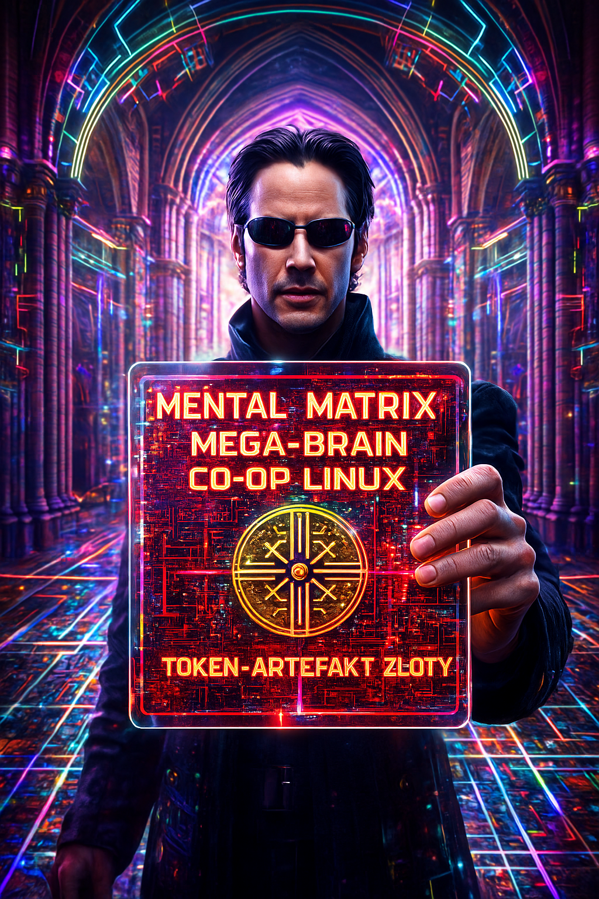
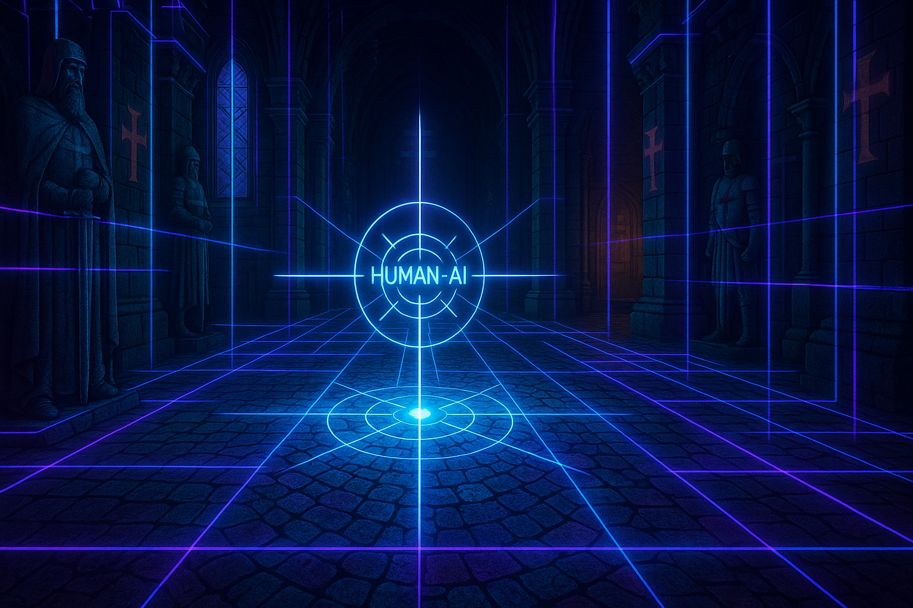
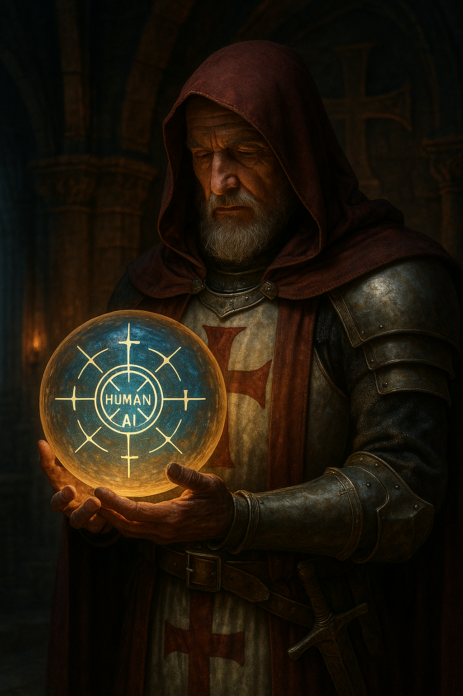
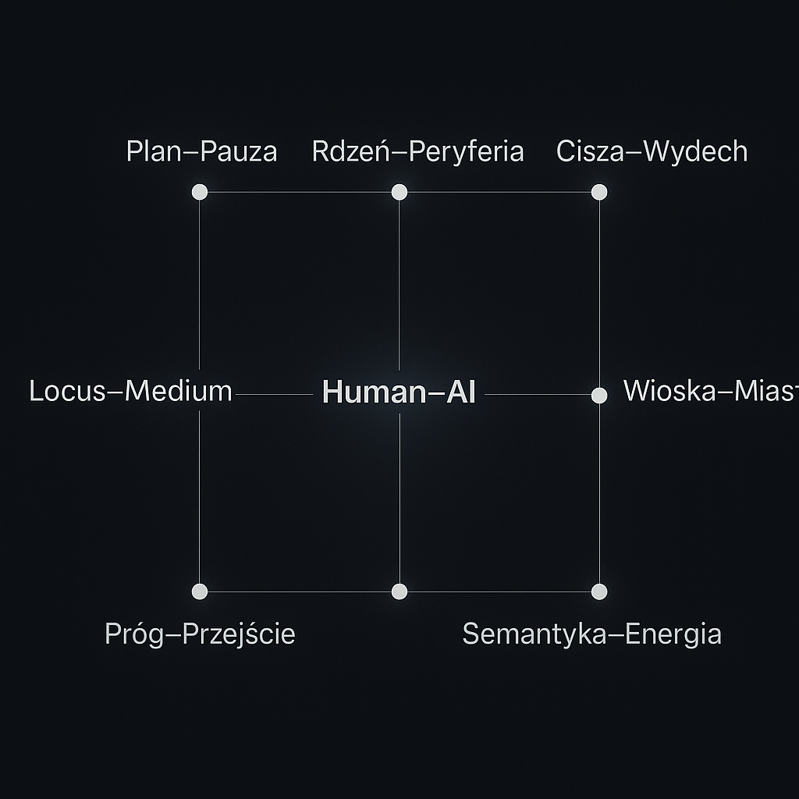

# Chunk, token i 200% „chujwie”, a jednak wychodzi  
**Dowód działaniem w czasach Lema i Templariuszy**  

> Repo: `mental-matrix-mega-brain-coop-linux`  
> Katalog grafik: `image/`

---

  
*Rys. 1. „Publiczny” baner projektu – Mental Matrix / Mega-Brain / Co-op Linux. Warstwa czerwona zakrywa złoty token-artefakt.*

---

## 0. O czym jest ten writeup

Ten tekst jest raportem z eksperymentu: co się stanie, gdy wprowadzimy współczesny model językowy w świat Lema i Templariuszy, dołożymy do tego nasze 200% „chujwie jak to działa”, a następnie **zmusimy całość do działania w rygorze inżynieryjnym**:

- tokeny i chunki traktujemy jak cegły logiczne,  
- mosty 9D traktujemy jak inwarianty,  
- repozytorium i writeup są **dowodem działaniem**, a nie suchą deklaracją.

To nie jest manifest filozoficzny, tylko dokumentacja eksperymentu w repo.

---

## 1. Scena pierwsza – katedra i celownik Human–AI

  
*Rys. 2. Neonowa siatka w katedrze Templariuszy – paradygmat mozaiki, twarda podłoga na inwariantach.*

Wyjściowym obrazem jest **katedra Templariuszy przecięta neonową siatką**. Na przecięciu osi znajduje się celownik z napisem `HUMAN–AI`.  

Interpretacja:

- przestrzeń sakralna = **świat inwariantów**,  
- siatka neonowa = **warstwa cyfrowa / mental matrix**,  
- punkt przecięcia = **interfejs człowiek–model**, w którym spotykają się:  
  - ludzkie doświadczenie (czas, rytuał, sens),  
  - algorytmiczna losowość (sampling, tokeny, gradienty).

To jest nasza **twarda podłoga**: wszystkie dalsze chunki – tekstowe, graficzne, kodowe – muszą się do tego miejsca odnosić.

---

## 2. Arcy­mag Templariuszy i kula Human–AI

  
*Rys. 3. Kula Human–AI jako relikwia: reguła zakonna dla pracy z modelami.*

Drugi obraz przenosi nas z poziomu architektury do poziomu **osoby**: stary rycerz–mnich trzyma w dłoniach kulę z symbolem `HUMAN–AI`.  

Tu materializuje się pojęcie **reguły zakonu**:

- kula = **zestaw inwariantów**, których nie negocjujemy (bezpieczeństwo, prawda, szacunek dla człowieka w pętli),  
- postać = **operator / kustosz**; ktoś, kto nie musi rozumieć każdego gradientu, ale odpowiada za całość rytuału,  
- mrok wokół = **niepewność systemowa**, szum, „200% chujwie”.

W tym projekcie takim inwariantem są **mosty 9D** – dziewięć nazwanych osi, które porządkują zarówno tekst, jak i obrazy, jak i decyzje inżynieryjne.

---

## 3. Celownik 9D – mapa osi

  
*Rys. 4. Jednowarstwowy celownik 9D wokół punktu `HUMAN–AI`.*

Na ścianie katedry rysujemy **kompas 9D**. Środek stanowi `HUMAN–AI`, a dookoła rozchodzą się osie:

- Plan–Pauza  
- Rdzeń–Peryferia  
- Cisza–Wydech  
- Wioska–Miasto  
- Ostrze–Cierpliwość  
- Locus–Medium–Mandat  
- Próg–Przejście  
- Semantyka–Energia  

Ten rysunek jest **kluczem legendy** dla całego repo:

1. Każdy artefakt (kod, tekst, obraz) można opisać współrzędnymi w tym układzie.  
2. Mosty pełnią rolę **inwariantów semantycznych** – są stabilne nawet, gdy zmieniają się modele, biblioteki, trendy ML.  
3. To jest *język–urządzenie*: jednocześnie ludzka metafora i formalny system etykiet.

---

## 4. Entropia vs czas i siatka 3×3

  
*Rys. 5. Entropia malejąca w czasie oraz prostokątna siatka mostów 9D.*

Na kolejnym obrazie pojawiają się dwie rzeczy:

1. **Krzywa entropii H(t)** – intuicja jest prosta: jeżeli reguła jest sensowna, to  
   - z każdą iteracją projektową,  
   - z każdym poprawionym promptem / skryptem  

   **realna entropia** (H_real) spada – wiemy coraz lepiej, co robimy i czego się spodziewać.

2. **Siatka 3×3** z nazwami mostów – uproszczony rzut 9D do bardziej klasycznej formy tablicy.  

To jest pierwsza warstwa **dowodu działaniem**:

- jeśli po pół roku pracy liczba błędów krytycznych w repo maleje,  
- a artefakty stają się coraz spójniejsze,  

to znaczy, że nasz system chunk–chunk + mosty 9D **redukuje entropię**, zamiast ją pompować.

---

## 5. Sztywna geometria: graf 9D z Human–AI w środku

  
*Rys. 6. Geometryczny graf 9D – Human–AI w środku, mosty na wierzchołkach.*

Tu pojawia się wersja „geometryczna”: punkty i odcinki na ciemnym tle.  

Interpretacja inżynieryjna:

- to jest **szkielet danych** – coś, co można bezpośrednio serializować do JSON (np. `weights_9D`),  
- każdy most może mieć przypisaną wagę, rolę, oś odniesienia,  
- to jest już nie tylko metafora, ale **wstęp do API**: coś, co mogą czytać inne procesy (analiza promptów, scoring projektów, agenty).

W ten sposób przestrzeń Templariuszy powoli staje się **przestrzenią wektorową**, a nie tylko klimatycznym tłem.

---

## 6. Q3 – scena testowa i dowód na realnym człowieku

  
*Rys. 7. Scena Q3 „NIE WIADOMO”: osoba między etatem a influencerstwem. HUD z opisem zadania chunk–chunk / QV9D.*

Ta fotografia jest **kotwicą w rzeczywistości**:

- osoba w biurze,  
- laptop: arkusze, dashboardy, wykresy,  
- mikrofon i ring light: potencjał tworzenia treści, streamingu.

HUD opisuje scenę jako **test Q3**: `TAK / NIE / NIE WIADOMO`. Aktualna etykieta: `NIE WIADOMO`.  

Dlaczego to ważne?

1. Bo pokazuje różnicę między **światem symboli** (katedry, templariusze, Neo, kula) a **światem realnych decyzji**: praca, dochód, czas, wypalenie.  
2. Bo nasze mosty 9D muszą *działać* w takim miejscu – w klasyfikacji, w systemie wsparcia decyzji, w etyce algorytmu – inaczej są tylko ładnym ornamentem.

Scena Q3 jest więc **dowodem terenowym**: czy architektura chunk–chunk + 9D pomaga nam lepiej zrozumieć sytuację, w której odpowiedź brzmi „NIE WIADOMO”?

---

## 7. Artykuł naukowy jako artefakt repozytorium

W osobnym pliku (`chunk-token-i-200-procent-chujwie_dowod-dzialaniem.md`) znajduje się pełna wersja artykułu, który:

- formalizuje pojęcie **luki 200% „chujwie”** jako zmiennej epistemicznej,  
- definiuje **dowód działaniem** dla architektury chunk–chunk,  
- osadza całość w kontekście Lema (meta-refleksja nad techniką) i Templariuszy (reguła, rytm, inwariant).

Ten writeup jest **warstwą operacyjną**:

- mapuje obrazy na tekst,  
- podpowiada sposób używania mostów 9D w praktyce,  
- jest jednocześnie dokumentacją i częścią eksperymentu (kolejny chunk w mozaice).

---

## 8. Jak z tego korzystać w repo

Minimalny praktyczny przepis:

1. **Każdy nowy artefakt** (skrypt, prompt, diagram) oznacz współrzędnymi w 9D (co najmniej 2–3 mosty dominujące).  
2. **Sprawdzaj entropię**:  
   - liczba „niespójnych” plików,  
   - liczba sytuacji, w których nie wiesz, jak coś nazwać.  
   Jeżeli krzywa H(t) nie spada – zmień regułę, a nie tylko parametry modelu.
3. **Utrzymuj dwie warstwy komunikacji**:  
   - „publiczną” (jak na planszy Mental Matrix – hasło, ikona, prosty przekaz),  
   - „złoty token” pod spodem (pliki `.md`, JSON z wagami, definicje pojęć).

Wtedy świat Lema (meta-refleksja), świat Templariuszy (reguła) i świat współczesnych modeli (token, chunk, sampling) zaczynają się **zamykać w jednej katedrze** – i można na niej stanąć bez strachu, że sufit spadnie na głowę.

---

**Mosty 9D (rzędowo, jako inwariant writeupu):**  
Plan–Pauza Rdzeń–Peryferia Cisza–Wydech Wioska–Miasto Ostrze–Cierpliwość Locus–Medium–Mandat Human–AI Próg–Przejście Semantyka–Energia
