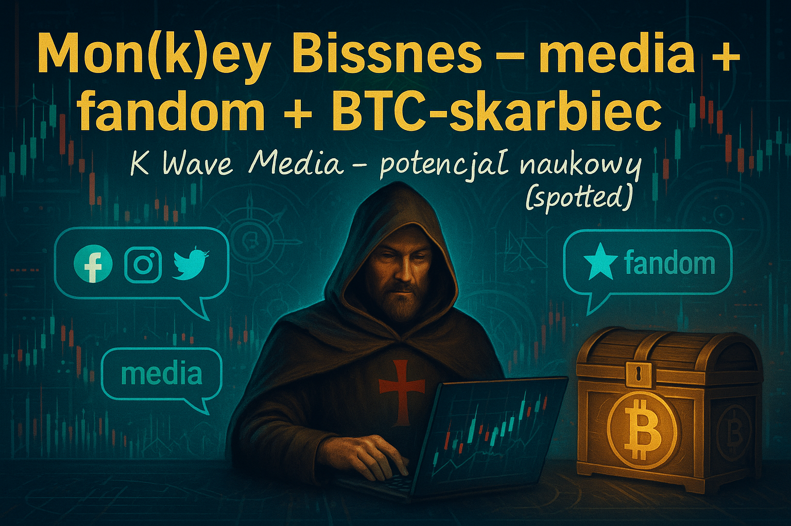

# „Mon(k)ey Bissnes – media + fandom + BTC-skarbiec – K Wave Media – potencjał naukowy” — *spotted*

<!-- BANNER: ai_platform/writeups/images/mokey-bissnes-kwm-banner.png -->

  

### Abstrakt

Artykuł stawia tezę, że model „media + fandom + BTC-skarbiec” – nazywany roboczo „Mon(k)ey Bissnes” – opisuje nową klasę spółek z sektora kultury cyfrowej, w których wartość pochodzi przede wszystkim z kapitału niematerialnego: IP, danych o fandomie i pozycji w sieci Bitcoin. Na przykładzie K Wave Media Ltd. (NASDAQ: KWM) pokazuję, że mimo skrajnie zmiennego kursu akcji i dużej niepewności co do trajektorii finansowej, sam układ technologiczny spółki jest ekonomicznie spójny z głównym nurtem badań nad kapitałem niematerialnym i produktywnością. [1–4] Jednocześnie wykres KWM pełni funkcję soczewki: ujawnia ryzyka mikrokapów, nadmiernej dźwigni na BTC oraz asymetrii między polem technologii a bieżącą wyceną rynkową. „Ona się podnosi” – o ile „ona” oznacza pole kapitału niematerialnego (media + fandom + BTC-skarbiec), a nie krótkoterminowy wykres ceny.

---

## 1. Wprowadzenie: od mema do tezy ekonomicznej

W potocznym języku „małpi biznes” kojarzy się z hazardem na mem-coinach i pompowaniem mikrokapów. W tym tekście „Mon(k)ey Bissnes” definiuję bardziej precyzyjnie: jako **model biznesowy, w którym trzy warstwy kapitału niematerialnego – media, fandom i BTC-skarbiec – są zintegrowane w jedną architekturę technologiczno-finansową**.

K Wave Media (KWM) jest dobrym kandydatem do takiego studium przypadku, bo:

* to spółka notowana na Nasdaq, pozycjonująca się jednocześnie jako holding K-kultury i spółka z „Bitcoin treasury strategy”;[8,18] ([rootdata.com][1])
* rozwija **platformę tokenizacji IP** dla branży rozrywkowej, z inwestycją Galaxy Digital i szeregiem partnerów z Korei;[5,16,20] ([GlobeNewswire][2])
* przeprowadziła akwizycję studia Rabbit Walk (VFX / 3D / AI-powered advertising), przejmując 55% udziałów i kontrolę operacyjną;[5,15,5] ([techintelpro.com][3])
* posiada zależną Solaire Partners, która zarządza 28-milionowym funduszem IPTV opartym na danych i doświadczeniu w inwestycjach filmowych („Parasite” itd.).[13,15] ([GlobeNewswire][4])

Jednocześnie **kurs akcji jest skrajnie zmienny**: w ciągu ostatniego roku cena spadła z poziomów powyżej 20 USD do okolic 0,9 USD, przy 52-tygodniowym minimum 0,665 USD.[18] ([FT Markets][5]) Dane intraday z 24 listopada 2025 r. pokazują cenę ok. 0,9 USD, dzienny zakres 0,75–1,18 USD i wysoki wolumen – klasyczny profil zmęczonego mikrokapu z narracją „Bitcoin + kultura”.[4,18] ([Investing.com][6])

Celem artykułu jest **brutalnie uczciwy rentgen** tego przypadku:

* na poziomie teorii – osadzenie modelu „media + fandom + BTC-skarbiec” w literaturze o kapitale niematerialnym,
* na poziomie empirycznym – wskazanie, co w strukturze KWM jest spójne z tą teorią, a co pozostaje czystym ryzykiem spekulacyjnym.

---

## 2. Kapitał niematerialny, dane i BTC jako nośniki wartości

Badania WIPO, OECD i NBER konsekwentnie pokazują, że **nakłady na kapitał niematerialny** (R&D, oprogramowanie, dane, design, marka, kapitał organizacyjny) rosną wielokrotnie szybciej niż nakłady na kapitał materialny i są głównym motorem wzrostu produktywności w gospodarkach rozwiniętych.[1–4]

* Raport *World Intangible Investment Highlights 2025* wskazuje, że inwestycje w aktywa niematerialne rosły od 2008 r. ponad **trzykrotnie szybciej** niż inwestycje w aktywa materialne, szczególnie w sektorach usługowych i AI-intensywnych.[1] ([WIPO][7])
* Prace Corrado i in. pokazują, że **dane** można konceptualnie włączyć do rozszerzonej definicji kapitału niematerialnego i że branże o wysokiej „data intensity” wykazują wyższą produktywność.[3,19] ([NBER][8])
* Analizy OECD (Global Forum on Productivity) podkreślają, że wzrost zasobu kapitału niematerialnego podnosi produktywność zarówno poprzez „capital deepening”, jak i efekty nieucieleśnione, zwłaszcza w usługach opartych na wiedzy.[4,15] ([OECD][9])

Równolegle rozwija się **model spółek „Bitcoin treasury”**, z najbardziej znanym przykładem Strategy (dawniej MicroStrategy). Firma ta zgromadziła setki tysięcy BTC, finansując zakupy emisjami akcji, obligacjami i instrumentami hybrydowymi, a jej wycena stała się funkcją wartości posiadanych bitcoinów i oczekiwanej ścieżki ceny BTC.[11–12] ([Bitcoin Treasuries][10])

W literaturze i praktyce rynkowej **BTC pełni więc rolę specyficznego aktywa niematerialnego**:

* jest zapisem w rozproszonej księdze,
* ma charakter globalnego zabezpieczenia płynności i „cyfrowego złota”,
* może być wykorzystywany jako komponent strategii skarbca korporacyjnego („BTC-skarbiec”).

To tworzy teoretyczne tło dla tezy, że **spółka łącząca media, dane o fandomie i BTC-skarbiec może być traktowana jako laboratorium kapitału niematerialnego nowej generacji**.

---

## 3. Model „Mon(k)ey Bissnes”: media + fandom + BTC-skarbiec

Proponuję następującą roboczą definicję modelu:

> **Model „” to architektura, w której trzy klasy aktywów niematerialnych – (1) IP i platformy medialne, (2) dane o fandomie i sieciach społecznych oraz (3) pozycja w sieci Bitcoin jako skarbiec – są sprzężone zwrotnie i monetyzowane w jednym wehikule korporacyjnym.**

Mechanizm ekonomiczny można opisać w trzech krokach:

1. **Media (IP + pipeline produkcyjny).**
   Tworzone są treści o wysokiej gęstości IP (seriale, filmy, koncerty, K-content), wspierane przez nowoczesne technologie produkcji (VFX, 3D, generatywna AI). To klasyczny kapitał niematerialny: prawa autorskie, know-how, marka.

2. **Fandom (graf relacji fan–IP–wydarzenie).**
   Interakcje fanów z treściami (oglądalność, bilety, crowdfunding, udział w eventach, zakupy merchu) generują duże zbiory danych. Na ich podstawie można budować **„fandom graph”** – graf relacji, który staje się osobnym zasobem danych oraz podstawą do projektowania produktów finansowych i emocjonalnych (tokeny fandomowe, bilety warstwowe, udział w przychodach).

3. **BTC-skarbiec (cyfrowa rezerwa i sygnał rynkowy).**
   BTC w bilansie pełni podwójną rolę:

   * ekonomiczną – jako rezerwa płynności/aktywów o potencjalnie wysokiej aprecjacji,
   * narracyjną – jako sygnał, że spółka „gra” w globalnym ekosystemie aktywów cyfrowych, co może podbijać wycenę akcji w okresach hossy na BTC (jak u Strategy).[11–12]

W idealnej wersji modelu **trzy strumienie wartości wzmacniają się**: mocny IP-pipeline przyciąga fandom; dane o fandomie pozwalają optymalizować kolejne IP i produkty; BTC-skarbiec pełni rolę dźwigni finansowej oraz sposobu na „przechowanie” części nadwyżki. W wersji nieidealnej – BTC dominuje narrację, a reszta biznesu staje się tylko przyklejoną do skarbca dekoracją.

K Wave Media jest próbą zrealizowania takiego modelu w osi USA–Azja (notowanie na Nasdaq, treści i partnerzy z Korei i szerzej Azji).[3,5,13,18] ([rootdata.com][1])

---

## 4. Studium przypadku: K Wave Media

### 4.1. Profil i oś USA–Azja

Zgodnie z materiałami IR i serwisów danych rynkowych K Wave Media to notowany na Nasdaq holding, który „łączy produkcję koreańskich treści kulturowych z innowacją finansową” oraz prowadzi strategię skarbca bitcoinowego.[3,8,18] ([rootdata.com][1])

Spółka:

* ma siedzibę w jurysdykcji offshore (Kajmany), ale operacyjnie działa na styku USA–Korea;[7,18] ([Wise][11])
* raportuje się jako **entertainment & Bitcoin treasury company** w części komunikatów;[13] ([GlobeNewswire][4])
* korzysta z amerykańskiego rynku kapitałowego do finansowania ekspansji (np. struktura 1 mld USD „capital capacity” na BTC-skarbiec i finansowanie treści).[17,18] ([GlobeNewswire][12])

To naturalne osadzenie na osi USA–Azja: amerykańska giełda i inwestorzy + koreański K-content + globalna sieć BTC.

### 4.2. Warstwa „media”: IP-OS, Rabbit Walk, Solaire

Po odcięciu samego BTC pozostaje zaskakująco bogata warstwa „media”:

1. **Platforma tokenizacji IP i K-IP STO.**
   Komunikaty z września 2025 r. zapowiadają uruchomienie jednej z pierwszych platform tokenizacji rozrywki (entertainment tokenization platform) z inwestycją Galaxy Digital i wsparciem wiodących firm IP z Korei.[5,20] ([GlobeNewswire][2])
   Z punktu widzenia ekonomii to system zarządzania prawami, przepływami pieniężnymi i udziałami w projektach IP – technicznie możliwy do realizacji bez BTC (np. na scentralizowanym ledgerze lub permissioned blockchainie).

2. **Akwizycja Rabbit Walk (VFX / 3D / AI).**
   KWM nabywa 55% udziałów w Rabbit Walk za ok. 6,5 mln USD w akcjach, z dodatkową transzą uzależnioną od wyników operacyjnych.[5,4,2,9,11] ([techintelpro.com][3])
   Rabbit Walk to studio VFX/3D/AI z wieloletnimi relacjami z Samsungiem, LG, TCL, Hisense; rosnącymi przychodami i przyzwoitymi marżami operacyjnymi.[2,5] ([techintelpro.com][3])

3. **Solaire Partners i fundusz IPTV.**
   Solaire Partners, jako zależna KWM, zostaje wybrany na zarządzającego funduszem IPTV o wartości 28 mln USD, wykorzystując dane z ponad dekady inwestycji w filmy i seriale, w tym głośne tytuły jak „Parasite”.[13,15] ([GlobeNewswire][4])

W języku kapitału niematerialnego daje to:

* zasób praw IP,
* pipeline produkcyjny (studio VFX/3D/AI),
* kompetencje inwestycyjne oparte na danych z rynku K-contentu.

To jest **rdzeń „media” w modelu „Mon(k)ey Bissnes”**.

### 4.3. Warstwa „fandom”: graf relacji i możliwości danych

Materiały spółki i komunikaty o tokenizacji IP sugerują, że celem jest zbudowanie **platformy, w której fani i inwestorzy mogą współfinansować projekty IP i dzielić się przychodami**.[5,20] ([GlobeNewswire][2])

Choć szczegóły implementacyjne są jeszcze słabo opisane publicznie, można wskazać trzy potencjalne kategorie danych:

* **dane transakcyjne** – kto inwestuje w jakie projekty, na jakim etapie, z jakim oczekiwanym zwrotem;
* **dane behawioralne** – jak konsumowane są treści (czas, rewatch, share, zaangażowanie w appkach);
* **dane społecznościowe** – struktura fan-clubów, gildii, projektów fanowskich, crowdfundingu.

Z perspektywy ekonomii danych KWM ma więc potencjał zbudowania **„fandom graph”**: grafu relacji fan–IP–wydarzenie–twórca–platforma, który można traktować jako rozszerzenie kapitału niematerialnego typu „data capital”.[3] ([NBER][8])

To właśnie ten graf jest **najbliższy Twojej „Wiosce Kosmicznej”**: węzły to ludzie i IP, a krawędzie to przepływy uwagi, emocji i środków. Jeśli zostanie poprawnie zaprojektowany (z etyką, bez hazardowego wykorzystania fanów), może być jednym z ciekawszych obiektów badawczych w ekonomii cyfrowej:

* umożliwia modelowanie LTV fanów nie tylko finansowo, ale i kulturowo,
* pozwala na projektowanie produktów „Human–AI”, w których agent AI jest kuratorem treści i strażnikiem dobrostanu, a nie tylko algorytmem monetyzacji.

### 4.4. Warstwa „BTC-skarbiec”: dźwignia i ryzyko

Z drugiej strony KWM buduje agresywną strategię BTC-skarbcową:

* komunikaty z lipca 2025 r. mówią o **1 mld USD „capacity” na realizację strategii skarbca BTC**, w tym 500 mln USD w formie konwertowalnej umowy z Anson Funds;[17,18] ([GlobeNewswire][12])
* oddzielne komunikaty dotyczą inwestycji i partnerstwa z Galaxy Digital w celu przyspieszenia strategii BTC-skarbcowej;[18] ([FT Markets][5])
* strategia jest komunikowana analogicznie do „bitcoin treasury companies” pokroju Strategy, choć na zupełnie innej skali.[11–12] ([Bitcoin Treasuries][10])

Z punktu widzenia ekonomii finansowej oznacza to:

* **wysoką dźwignię** – finansowanie zakupu BTC długiem i kapitałem własnym,
* **przeniesienie zmienności BTC na kurs akcji**,
* **ryzyko „double whammy”**: spadek BTC + presja podaży akcji z emisji.

Tutaj zaczyna się „małpi” aspekt „Mon(k)ey Bissnesu”: jeśli narracja BTC zdominuje opowieść o mediach i fandomie, spółka staje się po prostu kolejnym wehikułem lewarowanego BTC z doczepionym IP.

Z naukowego punktu widzenia ta konfiguracja jest jednak bezcenna: pozwala badać, **jak rynek dyskontuje hybrydę „media + dane + BTC-skarbiec”** oraz jak szybko inwestorzy odróżniają rzeczywistą jakość kapitału niematerialnego od czystej ekspozycji na BTC.

---

## 5. „Brutalnie uczciwy rentgen” wykresu KWM

Na moment pisania tekstu (24 listopada 2025 r.) KWM notowane jest w okolicach 0,9 USD, z dziennym zakresem 0,75–1,18 USD i wysokim wolumenem.[4,18] ([FT Markets][5])

Dane z serwisów rynkowych pokazują:

* **52-tygodniowe minimum** na poziomie 0,665 USD (21 listopada 2025 r.),
* **52-tygodniowe maksimum** ok. 20,89 USD (luty 2025 r.),
* spadek o ponad 90% w horyzoncie 12 miesięcy.[18] ([FT Markets][5])

Z jednego z wcześniejszych screenów portfela (Twoje dane) wynika, że:

* zmiana 5-dniowa wynosiła ok. –30%,
* 1-miesięczna ok. –57%,
* 3-miesięczna ok. –55%.

To jest **typowy profil mikrokapu po fazie „hype’u”**:

* długotrwały trend spadkowy z kilkoma gwałtownymi pompami na newsach (np. ogłoszenie dużej linii finansowania BTC, akwizycja Rabbit Walk, wybór Solaire do zarządzania funduszem),
* zwiększony wolumen w okolicach short-term pumpów, po których następuje sprzedaż („distribution”),
* brak jeszcze klarownej sekwencji „wyższych dołków i szczytów”, która sugerowałaby odwrócenie trendu.

W takim kontekście teza „spółka się poukładała” **nie jest jeszcze obroniona na poziomie czystej ceny**. Można natomiast bronić mocniejszej, bardziej abstrakcyjnej tezy:

> **„Pole technologiczne, w które KWM się wpięła (kapitał niematerialny mediów + dane o fandomie + BTC jako aktywo sieciowe), znajduje się w długoterminowej fazie przyrostu wartości, co potwierdzają badania o wzroście znaczenia intangible assets. Wykres KWM jest na razie chaotyczną projekcją tego pola, ale kierunek nośnika wartości (technologia, nie cegła) jest obiektywnie rosnący.”**[1–4]

Innymi słowy:

* **„ona się podnosi” – tak, jeśli „ona” = globalna masa kapitału niematerialnego w tym polu;**
* **„ona się podnosi” – jeszcze nie, jeśli „ona” = konkretna linia KWM w horyzoncie 5D–3M.**

To rozróżnienie jest kluczowe zarówno dla nauki, jak i dla praktyki inwestycyjnej.

---

## 6. Miejsce „ataku kolektywu” – ale jako laboratorium, nie jako pompa

Spółka taka jak KWM – niska cena nominalna, duża zmienność, głośna narracja „Bitcoin + K-kultura”, wielopoziomowa struktura emisji – to **idealne pole działania dla zorganizowanych grup spekulacyjnych**:

* można relatywnie tanio ruszyć kursem,
* można opowiadać prostą historię („kolejny Strategy w wersji K-pop”),
* można wykorzystać nieprzejrzystość emisji, konwertów i programów finansowania.

Z perspektywy **kolektywnego kapitalizmu** i „Wioski Kosmicznej” racjonalna decyzja brzmi jednak inaczej:

* **traktować KWM jako case study i laboratorium** – uczyć się na żywym przykładzie, jak rynek trawi hybrydę media + fandom + BTC-skarbiec,
* **logować zachowanie kursu vs. newsflow i struktura emisji**,
* **badać wzorce ataków i manipulacji** (pump-and-dump, short-and-distort, „grupy sygnałowe”),
* a nie próbować samemu „wejść w buty” silnych rąk na aktywie, na którym ktoś prawdopodobnie ucierpi po drugiej stronie.

To jest zasadnicza różnica między **„małpim biznesem” jako hazardem** a **„Mon(k)ey Bissnes” jako programem badawczym**. W tym drugim wariancie:

* mała pozycja w KWM jest oznaczona czerwonym prostokątem „eksperyment wysokiego ryzyka / moduł R&D”,
* większość kapitału pozostaje w prostszych, bardziej przejrzystych ekspozycjach (np. BTC bez lewara, szeroki rynek),
* zebrane doświadczenie służy budowie własnych narzędzi analitycznych Human–AI, a nie polowaniu na szybkie %.

---

## 7. Potencjał naukowy: co „Mon(k)ey Bissnes” wnosi do ekonomii?

Na koniec – dlaczego w ogóle warto traktować ten „małpi biznes” poważnie jako temat naukowy?

1. **Nowa konfiguracja kapitału niematerialnego.**
   KWM jest przykładem, w którym w jednym wehikule łączą się trzy typy intangible assets: IP kulturowe, dane o fandomie i BTC jako aktywo sieciowe. Dla literatury o intangible assets to naturalne laboratorium do testowania hipotez o komplementarności tych trzech warstw.[1–4]

2. **Empiryka „bitcoin treasury companies” poza softwarem B2B.**
   Dotychczas głównym obiektem badań była Strategy (dawniej MicroStrategy) – firma software’owa, która stała się lewarowanym ETF-em na BTC.[11–12] KWM pozwala zobaczyć, jak ten sam motyw działa w spółce medialno-kulturowej, gdzie podstawowym driverem mają być treści i fandom.

3. **Fandom graph jako kapitał danych.**
   Jeśli KWM zrealizuje zapowiedzi tokenizacji IP i zbuduje realne narzędzia dla fanów i twórców, powstanie jeden z ciekawszych „data assets” w kulturze cyfrowej: graf relacji fan–IP–wydarzenie–platforma. To pole do badań z zakresu ekonomii danych, sieci i behavioural finance.

4. **Interfejs Human–AI w gospodarce kultury.**
   W logice Twojej „Wioski Kosmicznej” spółka taka jak KWM może być węzłem, w którym testuje się agentów Human–AI:

   * dla fanów (kurator treści, strażnik dobrostanu),
   * dla twórców (AI montażysta, planer trasy, analityk feedbacku),
   * dla zarządu (system oceny strategii, w tym ryzyka nadmiernej ekspozycji na BTC).

5. **Polityka gospodarcza: kolektywny kapitalizm vs. globalne konglomeraty.**
   Na tle dużych platform streamingowych i wielkich korporacji technologicznych KWM jest małym, ale ciekawym węzłem na osi USA–Azja. Wpisuje się w szerszą dyskusję o tym, czy **federacje mikro-podmiotów** (wioski, kolektywy, małe spółki) mogą współistnieć z globalnymi graczami dzięki lepszemu wykorzystaniu kapitału niematerialnego i narzędzi Human–AI.

---

## 8. Wnioski

W świetle zebranych danych K Wave Media nie jest „anomalią z mem-giełdy”, tylko **radykalnym, choć skrajnie ryzykownym przypadkiem skrajn`ego nasycenia bilansu kapitałem niematerialnym**: IP, danymi o fandomie i ekspozycją na sieć Bitcoina. To, co w krótkim horyzoncie wygląda jak chaotyczny wykres mikrokapu z pompami i kraksami, w dłuższym okresie wpisuje się w ogólny wektor gospodarki: **wartość dryfuje w stronę oprogramowania, danych, marek, społeczności i aktywów sieciowych**. Model „” – media + fandom + BTC-skarbiec – jest w tym sensie tylko ostrą, laboratoryjną odmianą zjawiska, które literatura o intangibles opisuje od dawna: rynki uczą się wyceniać coś, czego nie da się zważyć ani dotknąć, ale co realnie steruje przepływami gotówki i uwagi.

Z analizy wynika też jasno, że **pole „media + fandom + BTC-skarbiec” jest wewnętrznie pęknięte**. Ten sam układ, który w wariancie Strategy/Tesla/Block działa jak względnie stabilny wehikuł długoterminowej akumulacji (software/produkt + społeczność + BTC-skarbiec), w wariancie mikrokapów medialno-politycznych bywa prawie nieodróżnialny od zorganizowanego hazardu. KWM lokuje się dokładnie na granicy tych dwóch światów: po jednej stronie stoi spójny stos technologiczny (IP-OS, studio VFX/3D/AI, Solaire, potencjalny „fandom graph”), po drugiej – agresywna, lewarowana strategia BTC i bardzo krucha mikrostruktura rynku. Ten rozdźwięk jest sam w sobie ważnym wnioskiem: **nie wystarczy mieć „ładne IP i dużo danych”, jeśli narracja finansowa rozstraja sygnał technologiczny**.

Dla praktyki inwestycyjnej i dla Twojej „Wioski Kosmicznej” prowadzi to do kilku twardych rozstrzygnięć. Po pierwsze, ekspozycje typu KWM **muszą być z definicji klasyfikowane jako moduły R&D wysokiego ryzyka**, a nie kandydaci na filary emerytury czy skarbca Wioski. Po drugie, sensowna strategia „kolektywnego kapitalizmu” polega nie na wchodzeniu w rolę kolejnego gracza pump-and-dump, lecz na **wykorzystywaniu takich spółek jako żywych case studies**: do nauki czytania emisji, rozpoznawania manipulacji, analizy relacji między intangibles a kursem i projektowania narzędzi Human–AI, które potrafią ten szum odfiltrować. Po trzecie, jeśli gdziekolwiek ma się zmaterializować zdanie „technologia podnosi wykres”, to najpierw musi być spełniony warunek: **bilans jest przejrzysty, a strategia skarbca nie pożera narracji o produkcie i społeczności**.

Na tym tle można teraz precyzyjniej przeczytać pierwotną tezę artykułu.

Teza „przyrost technologiczny trzęsie, wartość technologiczna podnosi wykres” jest zgodna z dominującym nurtem badań nad kapitałem niematerialnym:

* w skali makro rośnie udział intangibles w PKB i wartości firm;[1–4]
* w skali mikro rosną wyceny spółek, które potrafią spiąć software, dane, IP i organizację;
* BTC może pełnić rolę kolejnego, kontrowersyjnego, ale realnego składnika tej układanki.

K Wave Media jest przykładem **„Mon(k)ey Bissnesu” w fazie eksperymentalnej**:

* struktura aktywów (media + fandom + BTC-skarbiec) jest spójna z teorią,
* pole technologiczne, w które spółka wchodzi, jest obiektywnie rosnące,
* ale wykres akcji na razie odzwierciedla raczej turbulencje mikrokapu z dźwignią na BTC niż spokojne odkrywanie wartości kapitału niematerialnego.

Dlatego najbardziej uczciwe zdanie brzmi:

> **Tak, „ona się podnosi” – ale „ona” to pole kapitału niematerialnego, nie intraday KWM. A „Małpi Biznes” staje się naukowym laboratorium, jeśli traktujemy go jako moduł R&D Wioski, a nie fundament emerytury.**

To jest miejsce, w którym **ekonomia, media, fandom i BTC-skarbiec** realnie się spotykają – i gdzie „kolektywny kapitalizm” ma szansę odróżnić się od zwykłego „małpiego biznesu”. Ostateczny wniosek jest więc podwójny: z jednej strony warto bardzo poważnie traktować model „media + fandom + BTC-skarbiec” jako obiekt badań nad kapitałem niematerialnym i architekturą Human–AI; z drugiej – równie poważnie trzeba traktować ryzyka mikrokapów, dźwigni i narracji, które potrafią w kilka tygodni zniszczyć każdy ładny model, jeśli zabraknie dyscypliny bilansowej i etyki wobec społeczności. To napięcie – między realnym wzrostem znaczenia intangibles a brutalną mechaniką rynku – jest dokładnie tym miejscem, w którym Twoja Wioska może wnieść coś nowego: **ramy, w których  staje się kontrolowanym eksperymentem, a nie kolejną wersją kasyna w przebraniu technologii.**

Plan–Pauza Rdzeń–Peryferia Cisza–Wydech Wioska–Miasto Ostrze–Cierpliwość Locus–Medium–Mandat Human–AI Próg–Przejście Semantyka–Energia

## Bibliografia

[1] World Intellectual Property Organization (2025), *World Intangible Investment Highlights 2025*. ([WIPO][7])

[2] WIPO, *Measuring Investment in Intangible Assets* (strona tematyczna). ([WIPO][13])

[3] Corrado C., et al. (2022), „Data, Intangible Capital, and Productivity”, w: *Technology, Productivity and Economic Growth*, NBER. ([NBER][8])

[4] Nikolov P. (2025), „Intangible assets and productivity growth”, OECD Global Forum on Productivity, prezentacja. ([OECD][9])

[5] K Wave Media (2025), „K Wave Media Announces Plans to Launch One of the First Entertainment Tokenization Platforms with Strategic Investment from Galaxy Digital…”, GlobeNewswire, 29.09.2025. ([GlobeNewswire][2])

[6] K Wave Media (2025), „K Wave Media (NASDAQ: KWM) Secures $1 Billion Capital Capacity to Drive Bitcoin Treasury Strategy; Announces $500 M Convertible Note with Anson Funds”, GlobeNewswire, 10.07.2025. ([GlobeNewswire][12])

[7] K Wave Media (2025), „K Wave Media Founders Gift 10 percent of Total Shares Outstanding to Advance Financial Restructuring…”, GlobeNewswire, 16.10.2025. ([GlobeNewswire][14])

[8] RootData (2025), „K Wave Media (Nasdaq: KWM) – Project Introduction, Team, Financing…”. ([rootdata.com][1])

[9] Sahm Capital / Benzinga (2025), „K Wave Media To Acquire 55% Stake In Rabbit Walk Via ~$6.5M Share Issuance”, 02.09.2025. ([Sahm][15])

[10] K Wave Media (2025), „K Wave Media Subsidiary Solaire Partners Selected to Manage $28 Million IPTV Fund…”, GlobeNewswire, 05.09.2025. ([GlobeNewswire][4])

[11] BitcoinTreasuries.net (2025), „Strategy – Bitcoin Treasury Holdings & Analysis”. ([Bitcoin Treasuries][10])

[12] Financial Times (2025), „Saylor's bitcoin juggernaut engineers another $21bn…”. ([Financial Times][16])

[13] Investing.com / Market data providers (2025), „K Wave Media Ltd. (KWM) – stock quotes and news”, różne wpisy z 2025 r. ([Investing.com][6])

[14] Investing.com (2025), „K Wave Media appoints Yong Fang as new CFO”, 04.11.2025. ([Investing.com][17])

[15] Uzupełniające dane rynkowe: Nasdaq, Yahoo Finance, Kraken, TradingView – strony spółki K Wave Media Ltd. (KWM) i ich podstrony z notowaniami w 2025 r. ([nasdaq.com][18])

---

[1]: https://www.rootdata.com/Projects/detail/K%20Wave%20Media%EF%BC%88Nasdaq%EF%BC%9AKWM%29?k=MTk4NTk%3D&utm_source=chatgpt.com "K Wave Media Project Introduction, Team, Financing and ..."
[2]: https://www.globenewswire.com/news-release/2025/09/29/3157581/0/en/K-Wave-Media-Announces-Plans-to-Launch-One-of-the-First-Entertainment-Tokenization-Platforms-with-Strategic-Investment-from-Galaxy-Digital-and-Backing-from-Korea-s-Leading-IP-Compa.html?utm_source=chatgpt.com "K Wave Media Announces Plans to Launch One of the First"
[3]: https://techintelpro.com/news/marketing/advertising/k-wave-media-acquires-rabbit-walk-for-65m-in-aivfx-push?utm_source=chatgpt.com "K Wave Media Acquires Rabbit Walk for $6.5M in AI/VFX Push"
[4]: https://www.globenewswire.com/news-release/2025/09/05/3145214/0/en/K-Wave-Media-Subsidiary-Solaire-Partners-Selected-to-Manage-28-Million-IPTV-Fund-Signaling-New-Era-for-K-Content-Market.html?utm_source=chatgpt.com "K Wave Media Subsidiary Solaire Partners Selected to ..."
[5]: https://markets.ft.com/data/equities/tearsheet/summary?s=KWM%3ANMQ&utm_source=chatgpt.com "K Wave Media Ltd, KWM:NMQ summary - FT.com - Markets data"
[6]: https://www.investing.com/equities/global-star-acquisition?utm_source=chatgpt.com "K Wave Media Ltd Stock Price Today | NASDAQ: KWM Live"
[7]: https://www.wipo.int/web-publications/world-intangible-investment-highlights-2025/en/world-intangible-investment-highlights-2025.html?utm_source=chatgpt.com "World Intangible Investment Highlights 2025"
[8]: https://www.nber.org/books-and-chapters/technology-productivity-and-economic-growth/data-intangible-capital-and-productivity?utm_source=chatgpt.com "Data, Intangible Capital, and Productivity"
[9]: https://www.oecd.org/content/dam/oecd/en/about/programmes/global-forum-on-productivity/events/workshops/P_Nikolov_Presentation_Intangibles_GFP_2025.pdf?utm_source=chatgpt.com "Intangible assets and productivity growth"
[10]: https://bitcointreasuries.net/public-companies/microstrategy?utm_source=chatgpt.com "Strategy - Bitcoin Treasury Holdings & Analysis"
[11]: https://wise.com/gb/stock/kwm?utm_source=chatgpt.com "K Wave Media Ltd. stock price (KWM) in GBP"
[12]: https://www.globenewswire.com/news-release/2025/07/10/3113227/0/en/K-Wave-Media-NASDAQ-KWM-Secures-1-Billion-Capital-Capacity-to-Drive-Bitcoin-Treasury-Strategy-Announces-500-M-Convertible-Note-with-Anson-Funds.html?utm_source=chatgpt.com "K Wave Media (NASDAQ: KWM) Secures $1 Billion Capital"
[13]: https://www.wipo.int/en/web/intangible-assets/measuring-investments?utm_source=chatgpt.com "Measuring Investment in Intangible Assets"
[14]: https://www.globenewswire.com/news-release/2025/10/16/3167803/0/en/K-Wave-Media-Founders-Gift-10-percent-of-Total-Shares-Outstanding-to-Advance-Financial-Restructuring-Reduce-Dilution-and-Strengthen-Balance-Sheet.html?utm_source=chatgpt.com "K Wave Media Founders Gift 10 percent of Total Shares"
[15]: https://www.sahmcapital.com/news/content/k-wave-media-to-acquire-55-stake-in-rabbit-walk-via-65m-share-issuance-2025-09-02?utm_source=chatgpt.com "K Wave Media To Acquire 55% Stake In Rabbit Walk Via"
[16]: https://www.ft.com/content/d5baa057-a93c-4f8a-a9b3-624611b9bd13?utm_source=chatgpt.com "Saylor's bitcoin juggernaut engineers another $21bn"
[17]: https://www.investing.com/news/company-news/k-wave-media-appoints-yong-fang-as-new-cfo-93CH-4330369?utm_source=chatgpt.com "K Wave Media appoints Yong Fang as new CFO"
[18]: https://www.nasdaq.com/market-activity/stocks/kwm?utm_source=chatgpt.com "K Wave Media, Ltd. Ordinary Shares (KWM)"
