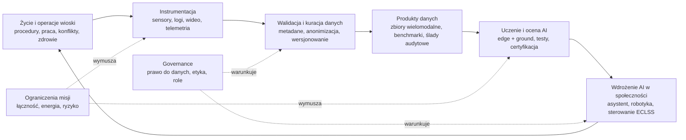

# Produktywność „wioski kosmicznej” dla rozwoju AI: ramy naukowe, mechaniki badawcze i modele ekonomiczne wytwarzania danych

## Abstrakt i teza pracy

Celem niniejszego opracowania jest zbudowanie rygorystycznych podstaw pod publikację naukową, która **definiuje mierzalną produktywność wioski kosmicznej (space village)** w przyspieszaniu rozwoju sztucznej inteligencji — rozumianej nie jako abstrakcyjny algorytm, lecz jako **system społeczno-techniczny** sprzężony z życiem wspólnoty w ekstremalnym środowisku lotu kosmicznego. Oś analizy stanowi gospodarczo-naukowy problem: **jakie produkty danych (data products) i artefakty badawcze powstają w społeczności orbitalnej oraz jakie mechaniki ich wytwarzania generują „wartość dodaną” dla produkcji AI** (uczenia, walidacji, certyfikacji, eksploatacji i iteracyjnego ulepszania modeli). citeturn24view1turn25view0turn13view0

Teza robocza (wymagająca empirycznej weryfikacji): **wioska kosmiczna staje się „fabryką danych o wysokiej gęstości operacyjnej”** — wyjątkową, ponieważ wymusza autonomię, odporność, formalizację procedur, intensywne monitorowanie bezpieczeństwa i zdrowia oraz ciągłe zarządzanie zasobami w środowisku ograniczeń (energia, łączność, ryzyko). W efekcie powstają dane i artefakty szczególnie wartościowe dla AI: wielomodalne, długookresowe, z bogatymi metadanymi, silnie powiązane z konsekwencjami decyzji (safety-critical). citeturn25view0turn31view0turn24view1

Drugą tezą (socjo-techniczny wymiar „AI-współtworzonej społeczności”): aby AI było realnym „współuczestnikiem” rozwoju cywilizacyjnego w misjach międzyplanetarnych, musi zostać zaprojektowane jako **instytucja i infrastruktura wspólnoty**, a nie wyłącznie narzędzie — co wymaga mierzalnego zarządzania zaufaniem, odpowiedzialnością, przejrzystością i prawami do danych. citeturn36view1turn21view1turn35view0

## Definicje, zakres i mapowanie „wioski kosmicznej” jako systemu wytwarzania danych

### Operacyjna definicja wioski kosmicznej

W tym raporcie „wioska kosmiczna” oznacza **trwale (lub półtrwale) zamieszkały, wielofunkcyjny ekosystem orbitalny lub pozaziemski**, który integruje: (i) podtrzymanie życia (ECLSS), (ii) logistykę i gospodarkę zasobami, (iii) pracę naukową i produkcję, (iv) systemy mobilności/robotyki, (v) instytucje wspólnotowe (normy, role, rozwiązywanie konfliktów) oraz (vi) warstwy cyfrowe i AI. Źródłowym punktem odniesienia dla „wioski” jest dzisiejsza entity["point_of_interest","International Space Station","earth orbit station"] jako nieprzerwanie zamieszkane laboratorium mikrograwitacji oraz jej planowani następcy w ramach komercjalizacji LEO. citeturn25view0turn10view2turn13view0

Ponieważ pełnoskalowe osady (np. wielotysięczne habitaty z grawitacją sztuczną) pozostają w dużej mierze koncepcyjne, w praktyce badawczej kluczowe są **„wioski-prototypy”**: ISS oraz planowane komercyjne stacje, a także wysokiej wierności analogi naziemne (HERA/HI-SEAS/Concordia/Mars500), które rekonstruują ograniczenia izolacji, opóźnień łączności i pracy zespołowej. citeturn10view2turn26view0turn2search36turn2search26

### Ograniczenia lotu kosmicznego, które determinują mechanikę danych

Z perspektywy „produktywności dla AI” najbardziej nośne ograniczenia są zbieżne z hazardami długotrwałych misji załogowych identyfikowanymi przez entity["organization","NASA","us space agency"]: promieniowanie, izolacja i zamknięcie, dystans od Ziemi (opóźnienia i przerwy łączności), zmienione pola grawitacyjne oraz środowiska wrogie/zamknięte (mikrobiom, hałas, kontrola atmosfery). citeturn25view0

Z punktu widzenia danych dla AI oznacza to, że decyzje i zachowania w wiosce kosmicznej są nie tylko „rejestrowalne”, ale też **silnie uwarunkowane kosztem i ryzykiem**, co sprzyja tworzeniu danych o wysokiej wartości informacyjnej (np. rzadkie zdarzenia, anomalie, reakcje na awarie, adaptacja zespołu do opóźnień). citeturn25view1turn31view0turn12view4

### Przestrzeń wizualna dla koncepcji habitatów

image_group{"layout":"carousel","aspect_ratio":"16:9","query":["Stanford torus space habitat concept art","O'Neill cylinder space habitat concept art","International Space Station interior module photo","Orbital Reef space station rendering"],"num_per_query":1}

Powyższe typologie (habitat rotacyjny, cylinder, współczesna stacja modułowa, komercyjna stacja LEO) obrazują przesunięcie od „architektury-infrastruktury” ku „architekturze-usłudze”: nowy model zakłada platformę do badań, usług i gospodarki orbitalnej, gdzie dane i automatyzacja stają się kluczową warstwą wartości. citeturn10view0turn10view2turn14view1

## Przegląd literatury i raportów: wioski kosmiczne, loty kosmiczne i interakcje AI–wspólnota

### Ekonomia i instytucjonalizacja platform orbitalnych

Analizy audytowe kosztów utrzymania ISS pokazują, że mówimy o porządku **kilku miliardów USD rocznie** na operacje, utrzymanie, badania oraz transport załóg i ładunków (zależnie od metodologii ujmowania kosztów). citeturn12view0turn13view0 Ta skala kosztowa jest fundamentalna dla ekonomii „data mining” w kosmosie: wartość danych musi być rozpatrywana względem wysokiego CAPEX/OPEX oraz kosztu ryzyka (awarie, MMOD, ograniczona redundancja transportu). citeturn13view0turn12view1

Transformacja w kierunku komercyjnych destynacji LEO jest formalnie wspierana przez programy stymulujące nowe stacje i rynek usług na orbicie. citeturn10view2turn10view3turn10view0 Przykładowo, w dokumentach o komercyjnych stacjach wskazuje się projektowanie przestrzeni pod mieszany profil użytkowników (załoga profesjonalna, astronauci narodowi, użytkownicy komercyjni) oraz cele przejścia do zakupów usług stacyjnych przez agencję. citeturn10view2turn10view1

### Analogowe „wioski” naziemne jako laboratoria społeczno-techniczne

Zanim powstaną duże osady kosmiczne, kluczowym zasobem naukowym są analogi izolacji i misji: (i) analogi NASA takie jak HERA, (ii) długotrwałe habitaty analogowe (HI-SEAS), (iii) stacje polarne (Concordia) oraz (iv) eksperymenty wielomiesięczne (Mars500). citeturn26view0turn2search17turn2search26turn2search36

entity["point_of_interest","HERA","nasa analog habitat houston"] jest szczególnie istotna metodologicznie, bo wprost oferuje: symulowane opóźnienia komunikacyjne do 20 min w jedną stronę, symulacje AOS/LOS, stały monitoring wideo (bezpieczeństwo i zgodność), zdalny dostęp do danych badawczych i infrastrukturę zbierania próbek biologicznych — czyli mechaniki, które wprost „produkują” dane o zachowaniach i współpracy w warunkach zbliżonych do eksploracji. citeturn26view0turn25view2

Wyniki i przeglądy badań z analogów pokazują, że izolacja, ograniczenia zasobów i opóźnienia komunikacyjne są krytycznymi czynnikami dla dynamiki zespołu i adaptacji psychofizjologicznej, co stanowi bezpośrednie uzasadnienie traktowania „wioski kosmicznej” jako obiektu badań społeczno-technicznych. citeturn2search35turn2search36turn2search13

### AI w środowisku stacji: asystenci, robotyka, autonomia i łączność

W praktyce orbitalnej AI materializuje się jako: (a) autonomiczne systemy planowania/operacji, (b) roboty wizyjne i interakcje człowiek–robot, (c) asystenci konwersacyjni/proceduralni, (d) przetwarzanie danych „na krawędzi” (edge), redukcja kosztów łączności i wspomaganie decyzji. citeturn27view1turn29view0turn28view2turn31view0

1) **Asystenci społeczno-operacyjni**. System entity["organization","CIMON","iss ai assistant robot"] jest demonstratorem interakcji człowiek–maszyna na ISS: prezentuje i objaśnia instrukcje, wspiera dokumentowanie i inwentaryzację, ma elementy nawigacji autonomicznej i funkcje związane z interakcją. citeturn28view2turn28view0turn28view1

2) **Robotyka w kabinie i dane dla AI nawigacji**. Systemy takie jak entity["organization","Astrobee","nasa free-flying robot"] są projektowane po to, by redukować czas załogi na rutynę (inwentaryzacja, dokumentacja eksperymentów) i jednocześnie stanowić platformę badawczą dla robotyki w mikrograwitacji. citeturn29view0turn30view1turn29view1 Szczególnie cenne są publiczne, dobrze opisane zbiory danych z robotów w kabinie (obrazy + IMU + procedury generowania pseudoprawdy), które zasilają badania nad VIO/SLAM w warunkach stacji. citeturn23view0turn23view1

3) **HRI i humanoidy**. entity["organization","Robonaut 2","humanoid robot iss"] był projektowany jako humanoidalny robot współdziałający z ludźmi i narzędziami w środowisku stacji, co ma implikacje dla przyszłej pracy w habitatów i infrastruktury. citeturn30view0

4) **Łączność i architektura danych**. Dla danych i procesów uczenia AI kluczowe jest, że łączność kosmiczna ma opóźnienia i przerwy, co wspiera potrzebę DTN (store-and-forward) jako fundamentu sieci międzyplanetarnej. citeturn31view0turn12view4 Ponadto istnieją konkretne parametry infrastruktury ISS: w materiałach technicznych wskazywana jest przepustowość Ku-band rzędu ~500 Mbps downlink i ~20 Mbps uplink (dla wszystkich danych), a w kontekście demonstracji wysokoprzepływowego DTN oraz łączności optycznej (ILLUMA-T) pojawiają się wartości do ok. 1–1.25 Gbps downlink i wydłużone RTT. citeturn12view3turn12view4

### Reżimy danych: repozytoria, standaryzacja i etyka

Z ekonomiczno-procesowego punktu widzenia „produkty danych” to nie surowe logi, lecz zestandaryzowane artefakty z metadanymi, przetworzeniem i warstwą governance. Dokładnie w tę stronę idą archiwa danych biologiczno-medycznych i behawioralnych: NASA Life Sciences Data Archive (LSDA) zawiera zanonimizowane dane badań człowieka z lotów kosmicznych i analogów, a Open Science Data Repository (OSDR) integruje wielomodalne dane (omics, fenotypy, zachowania, bioobrazowanie, telemetria środowiskowa) wraz z workflow i narzędziami wizualizacji, podkreślając ponowne użycia w meta-analizach i podejściach AI/ML. citeturn24view0turn24view1turn24view2

Na poziomie normatywnym pojawia się rosnąca literatura o specyfice „space data ethics” oraz o dual-use danych kosmicznych; wskazuje się, że klasyczne zasady etyki danych (np. minimalizacja danych) mogą wchodzić w napięcie z potrzebą maksymalizacji zbioru danych dla nauki i bezpieczeństwa. citeturn21view1turn21view0 W kontekście AI w przestrzeni kosmicznej literatura prawa kosmicznego i governance podnosi kwestie odpowiedzialności, przejrzystości i kontroli człowieka (human-in/on/out-of-the-loop) dla autonomicznych obiektów i systemów decyzyjnych. citeturn35view0turn20view1

## Typologia produktów danych i artefaktów tworzących wartość dla AI w wiosce kosmicznej

### „Wartość dodana” dla AI: definicja operacyjna

Wartość danych dla AI nie jest równa ich objętości. Literatura o skalowaniu modeli pokazuje, że jakość danych i dopasowanie budżetów (dane–model–compute) determinują przyrosty jakości modelu, a zwroty z dodatkowych danych mogą mieć charakter potęgowy i wykazywać malejące korzyści zależnie od reżimu skalowania. citeturn7search0turn7search1turn7search32turn7search16 Jednocześnie istnieją metody wyceny wkładu danych (np. Shapley dla danych), które formalizują „kto i co” wnosi do jakości predykcji. citeturn7search2turn7search6

W tym raporcie „wartość dodana” produktu danych dla AI oznacza: **mierzalny wkład w poprawę lub certyfikowalność systemu AI** w zadaniach istotnych dla misji (autonomia, bezpieczeństwo, zdrowie, logistyka, współpraca), przy uwzględnieniu kosztów wytworzenia, ryzyk i ograniczeń łączności. citeturn27view1turn25view0turn12view0

### Klasyfikacja produktów danych w wiosce kosmicznej

Poniższa typologia jest zaprojektowana pod konstrukcję naukowego artykułu: rozróżnia „surowe strumienie” od „produktów” (z metadanymi, walidacją i kontekstem operacyjnym), aby umożliwić modelowanie ekonomiczne i projekt eksperymentów.

#### Tabela typów produktów danych i artefaktów AI

| Klasa produktu danych | Przykłady i kanały pozyskania | „Wartość dodana” dla AI | Typowe ryzyka i koszty | Warstwa governance / metadane (wymagana) |
|---|---|---|---|---|
| Dane operacyjne stacji i procedur | logi procedur, telemetria systemów, historia awarii i obejść, timeline’y misji, decyzje operacyjne | uczenie modeli planowania, detekcji anomalii, rekomendacji procedur; trening modeli wyjaśnialnych i „decision logs” | wysokie koszty operacji stacji; ryzyko ujawnienia wrażliwych informacji o bezpieczeństwie | ścisła ontologia procedur, wersjonowanie, „event semantics”; logi decyzji autonomii i operatorów citeturn27view1turn13view0 |
| Dane łączności i sieci | profile AOS/LOS, opóźnienia, przepustowości, błędy transmisji; bundling DTN | projektowanie AI do predykcji łączności, kompresji semantycznej, sterowania telemetrią i priorytetyzacją | ograniczona łączność i koszt transmisji; konieczność edge computing | specyfikacja ścieżek, „contact plan”, metryki QoS; jawne ograniczenia łącza citeturn31view0turn12view3turn12view4 |
| Dane biomechaniczne i medyczne | standardowe pomiary fizjologiczne, krew/biomarkery, dane długookresowe i analogowe (np. bedrest) | modele predykcji ryzyk zdrowotnych, personalizacji obciążeń, wykrywania stanów krytycznych; dane wielomodalne do fuzji | etyka i prywatność; koszty sprzętu i czasu załogi; ograniczenia prób biologicznych | anonimizacja, zgody, protokoły; bogate metadane misji/środowiska; standardy archiwizacji (LSDA/OSDR) citeturn24view0turn24view1turn25view0 |
| Dane behawioralne i zespołowe | ankiety, testy poznawcze, aktografia/sen, interakcje z MCC, konflikty i koordynacja | modele wspomagania zespołu, wykrywania spadku sprawności, projektowania „countermeasures”; AI jako mediator | ryzyko efektu obserwatora; wrażliwość danych; koszt długich kampanii | jawne definicje zmiennych, progi i polityki; etyka monitoringu w środowisku zamkniętym citeturn25view1turn26view0turn2search36turn36view1 |
| Dane robotyki i HRI | wideo/IMU/pozycjonowanie robotów, logi interakcji, zadania inwentaryzacji/inspekcji | trening percepcji i nawigacji w mikrograwitacji; benchmarki; transfer do autonomicznych operacji | koszt rozwijania platform i utrzymania; brak klasycznych „ground truth” → koszty rekonstrukcji | opis sensorów, synchronizacja, pipeline pseudoprawdy; scenariusze z zakłóceniami (oświetlenie, zasłonięcia) citeturn23view0turn29view0turn30view1 |
| Dane ECLSS i ekosystemu zamkniętego | parametry atmosfery, wody, mikrobiom, odpady; stabilność pętli regeneracyjnych | modele sterowania i predykcji awarii; optymalizacja zużycia zasobów; autonomiczne utrzymanie „żywego” systemu | koszty energii i niezawodności; wysokie wymagania bezpieczeństwa | bilanse masy/energii, definicja „loop closure”; modele i walidacja stabilności citeturn9view2turn9view0turn4search3 |
| Artefakty „AI-in-the-loop” | decyzje AI + uzasadnienie, interwencje człowieka, przypadki błędów/overtrust/undertrust | rozwój AI odpornej na błędy, kalibracja zaufania, projektowanie interfejsów wyjaśniających | realny koszt błędnej decyzji; wymóg certyfikacji | logi odpowiedzialności, ślady audytowe; definicje ról (human-on-the-loop) citeturn36view1turn35view0turn27view1 |

### Kluczowa obserwacja ekonomiczna

W warunkach kosmicznych **najdroższe nie jest „zbieranie danych” jako takie, lecz ich wiarygodne uziemienie w prawdzie operacyjnej** (kontekst, metadane, synchronizacja, wersjonowanie procedur, etyka, bezpieczeństwo) — dokładnie to, co repozytoria OSDR/LSDA akcentują jako warunek ponownego użycia danych i jakości badań. citeturn24view1turn24view0

## Mechaniki badawcze: jak wioska kosmiczna „produkuje” dane o wartości dla AI

### Architektura procesu badawczego jako łańcuch wartości

Mechanika wytwarzania „artefaktów wartościowych dla AI” powinna być opisana jak proces przemysłowy: od zdarzeń i sensorów, przez kurację i metadane, do walidacji i wdrożenia modeli. W wiosce kosmicznej proces jest wymuszony przez ograniczenia łączności i wymogi bezpieczeństwa: rośnie rola edge AI, kompresji semantycznej, DTN oraz narzędzi do rekonstrukcji decyzji autonomii po stronie naziemnej. citeturn31view0turn12view4turn27view1

#### Rysunek: pętla kooprodukcji danych i AI w wiosce kosmicznej



Rysunek formalizuje „AI-współtworzoną społeczność” jako układ sprzężeń zwrotnych, gdzie AI wpływa na zachowania i procedury, a te z kolei generują kolejną iterację danych. Takie ujęcie jest spójne z praktyką badań analogowych (monitoring, procedury, opóźnienia komunikacji), a także z ideą DTN jako infrastruktury „internetu układu słonecznego” i potrzebą nowych narzędzi operacyjnych przy rosnącej autonomii. citeturn26view0turn31view0turn27view1

### Mechaniki tworzenia danych „najcenniejszych” dla AI

Największą wartość dla rozwoju AI (w sensie generalizacji, odporności i bezpieczeństwa) mają mechaniki, które generują:

1) **Dane z konsekwencją**: decyzje, które mają koszt/ryzyko (np. alokacja energii, reakcja na awarię). W praktyce autonomii misji potrzebne są narzędzia do „wyjaśniania, co AI zrobiło” oraz do rekonstrukcji kontekstu w downlinku. citeturn27view1turn35view0

2) **Dane z ograniczeniem łączności i opóźnieniem**: wymuszają one strategie store-and-forward, priorytetyzacji i przetwarzania lokalnego; w takich warunkach opłaca się uczyć modele, które potrafią streszczać, kompresować i selekcjonować dane „po znaczeniu”. citeturn31view0turn12view4turn12view3

3) **Dane wielomodalne i długookresowe**: zdrowie i zachowanie człowieka w izolacji wymaga łączenia strumieni (fizjologia, sen, zadania poznawcze, interakcje), co jest fundamentalne dla AI w medycynie eksploracyjnej. Repozytoria danych life sciences podkreślają rolę standardów, FAIR i integracji metadanych środowiskowych (np. promieniowanie). citeturn24view1turn25view0

4) **Dane z „trudnych domen percepcji”**: robotyka w kabinie (oświetlenie, occlusions, zmienność układu) generuje scenariusze, które są rzadkie na Ziemi; przykładem są zestawy danych z Astrobee wraz z pipeline’ami pseudoprawdy. citeturn23view0turn23view1turn30view1

5) **Dane instytucjonalne**: reguły, spory, uzgodnienia, obciążenia pracą, rola asystentów i autonomii. To rdzeń „AI jako instytucji”: bez mierzenia zaufania i kalibracji zależności (overtrust/undertrust) nie ma trwałej integracji AI w społeczności. citeturn36view1turn25view1

## Modele ekonomiczne „data mining” w wiosce kosmicznej i miary produktywności AI

### Kontekst pomiaru: od gospodarki kosmicznej do gospodarki danych

Metodologicznie warto osadzić wioskę kosmiczną w ramach gospodarki kosmicznej, gdzie rozróżnia się segment upstream (produkcja i wynoszenie), downstream (usługi i wykorzystanie sygnałów/danych) oraz aktywności space-derived. citeturn34view0turn34view1turn34view4 Wioska kosmiczna jest hybrydą: jest upstream (infrastruktura i wynoszenie), ale generuje też downstream (produkty danych i usługi naukowe), a dla AI tworzy dodatkowo warstwę „space-derived” (transfer technologii, algorytmy, standardy bezpieczeństwa). citeturn34view1turn24view1

Z perspektywy europejskiej i polskiej (warstwa „core topics” badań i strategii), dokumenty wskazują rosnącą rolę gospodarki kosmicznej w cyfryzacji i rozwoju technologii oraz potrzebę budowy kompetencji i segmentu naziemnego. citeturn12view5turn34view2turn11view1

### Funkcja produkcji AI: jak dane przekładają się na postęp modelu

W badaniach nad skalowaniem uczenia modeli (szczególnie dużych modeli) wykazano zależności typu potęgowego między jakością (np. loss) a skalą modelu, danych i compute; równocześnie prace o compute-optimal training wskazują, że niedobór danych przy dużej skali modeli prowadzi do nieoptymalności. citeturn7search0turn7search1turn7search16 To pozwala zaproponować „funkcję wartości danych” dla wioski kosmicznej, nie wprost w tokenach, ale jako:

- **marginalny przyrost jakości modelu** na zadaniu misji (np. skrócenie czasu reakcji na awarię, spadek liczby błędów procedur),
- oraz **marginalny spadek ryzyka** (safety) poprzez lepsze wykrywanie anomalii i lepszą współpracę człowiek–AI. citeturn27view1turn25view0turn35view0

Dodatkowo, techniki wyceny danych (Data Shapley) oferują formalny sposób przypisania wartości wkładowi danych w poprawę predykcji, co można zaadaptować jako mechanizm „wewnętrznych rozliczeń” w ekonomii danych wioski kosmicznej. citeturn7search2turn7search6

### Definicja indeksu produktywności wioski kosmicznej dla AI

Proponowana miara (do formalizacji w artykule):

\[
\text{SV-AIP}=\frac{\Delta U(\theta \mid \mathcal{D}_{SV})}{C_{\text{total}}(\mathcal{D}_{SV})}
\]

gdzie:

- \( \Delta U \) = przyrost użyteczności/zdolności modelu \( \theta \) dzięki danym z wioski \( \mathcal{D}_{SV} \) (np. poprawa metryk w benchmarkach robotyki, spadek błędów proceduralnych, lepsza predykcja ryzyk zdrowotnych),
- \( C_{\text{total}} \) = pełny koszt pozyskania i „utowarowienia” produktu danych, obejmujący: koszt infrastruktury, czas załogi, energia/łączność, anonimizacja i compliance, utrzymanie jakości, oraz koszt ryzyka i utraconych korzyści (trade-off z inną aktywnością stacji). citeturn24view1turn12view0turn13view0turn25view0

Ta formuła jest celowo ogólna: umożliwia porównywanie **różnych prototypów** (analogi naziemne vs LEO stacja) i **różnych modeli biznesowych** (open science vs licencjonowanie vs federated learning).

### Tabela porównawcza modeli ekonomicznych „data mining” w prototypach poniżej progu startupowego

Poniżej zestawiono modele, które można traktować jako „kandydatów” do rozdziału ekonomicznego pracy naukowej.

| Model ekonomiczny | Jednostka sprzedaży / wartości | Mechanizm tworzenia wartości dodanej danych | Zalety w fazie prototypu (pre-startup) | Wady / ryzyka | Najbardziej kompatybilne techniki AI |
|---|---|---|---|---|---|
| Model open science + granty | publikacje, cytowania, dowody TRL/DPRL; finansowanie publiczne | standaryzowane zbiory danych (FAIR), ponowne użycia i meta-analizy w repozytoriach | obniża bariery wejścia; maksymalizuje wpływ naukowy; dostęp do infrastruktury danych (OSDR/LSDA) | ograniczona monetyzacja; ryzyko ujawnienia dual-use; koszt compliance i kuracji | benchmarki, modele predykcyjne zdrowia, robotyka; uczenie z otwartych zbiorów citeturn24view1turn21view1 |
| „Data cooperative” wioski (spółdzielnia danych) | licencje danych / modeli; „udział” członków w korzyściach | wycena wkładu danych (np. Shapley), kontrakty na użycie danych; wspólnotowa zgoda | buduje motywację do jakości danych; formalizuje prawa i odpowiedzialność; skaluje się z liczbą członków | trudne prawnie/etycznie (dane zdrowotne); ryzyko konfliktów o prywatność | Data Shapley do rozliczeń; federated learning przy danych wrażliwych citeturn7search2turn7search7turn24view0 |
| Platforma „experiment-as-a-service” | sloty eksperymentalne + pakiet danych (z metadanymi) | ustandaryzowane protokoły, automatyczna instrumentacja i telemetria, gotowe pipeline’y danych | zgodne z komercjalizacją LEO i miksowaniem użytkowników; możliwe szybkie MVP | wymaga silnej infrastruktury operacyjnej; konflikt priorytetów na stacji | edge AI do selekcji danych; modele planowania i harmonogramowania citeturn10view2turn10view0turn12view3 |
| Model „AI-ops” (pionowa integracja) | redukcja kosztu operacji i ryzyka; sprzedaż usług niezawodności/autonomii | AI uczy się na danych z własnych systemów (ECLSS, robotyka, logistyka) i obniża OPEX | bezpośrednie sprzężenie wartości z kosztami stacji; najlepszy dla safety-critical | ryzyko vendor lock-in; trudniej udostępniać dane | wykrywanie anomalii, planowanie, predykcyjne utrzymanie, autonomy ops citeturn27view1turn12view0 |
| Model „federated/edge learning” | aktualizacje modeli; prywatne uczenie na stacji | dane zostają lokalnie; przesyłane są tylko gradienty/aktualizacje | minimalizuje koszty i ryzyka przesyłu danych; zgodne z ograniczeniami łączności | trudność walidacji i „ground truth”; koszty obliczeń na pokładzie | federated learning (model averaging), kompresja aktualizacji citeturn7search7turn31view0turn12view4 |

### Szkic „wykresu” zależności koszt–wierność–wartość (frontier eksperymentalny)

Poniższy wykres koncepcyjny (do formalnego opracowania w artykule) wyraża intuicję, że **analogi naziemne** są tanie i skalowalne populacyjnie, ale mają ograniczoną wierność biologiczną i operacyjną; natomiast dane z LEO są „rzadkie i drogie”, lecz mogą mieć wysoką wartość marginalną dla AI w zadaniach misji.

```
Wartość marginalna dla AI
^
|            (LEO / stacja)  •
|                          •
|                      •
|          (analogi) •
|      •
+---------------------------------> Koszt pozyskania / ograniczenia
        niski                    wysoki
```

Parametry łączności (DTN, Ku-band, łączność optyczna) mogą przesuwać krzywą w dół kosztu transmisji, ale jednocześnie przenoszą ciężar na edge computing i automatyczną selekcję danych. citeturn12view3turn12view4turn31view0

## Projekt programu badawczego: protokoły eksperymentalne dla AI–wspólnoty w wiosce kosmicznej

### Drabina eksperymentalna: od pre-startup do wioski orbitalnej

Rygorystyczny program badań powinien być stopniowalny („ladder of fidelity”):

- **Faza analogowa (Earth ICE analogs)**: szybkie iteracje protokołów i instrumentacji, większe N badanych, testy governance danych; przykładowo HERA dostarcza kontrolowane opóźnienia i monitoring oraz bezpieczny zdalny dostęp do danych. citeturn26view0turn25view2  
- **Faza LEO (wioska-prototyp)**: walidacja w mikrograwitacji, robotyka w kabinie, rzeczywiste ograniczenia operacyjne; tło kosztowe ISS jest bardzo wysokie, co wymusza precyzyjny rachunek wartości danych. citeturn12view0turn13view0turn29view0  
- **Faza komercyjnych stacji**: mieszany profil użytkowników i gospodarka usług; idealne środowisko do testów „AI jako instytucji” (asystenci, automatyzacja, rozliczenia danych) przy większej elastyczności biznesowej. citeturn10view2turn10view0turn10view1  
- **Faza eksploracyjna (cislunar / Mars-class)**: największe opóźnienia i brak wsparcia naziemnego → maksymalizacja autonomii, odporności i zdolności do samoorganizacji. citeturn25view0turn27view1

### Protokół „AI-co-created community”: minimalny zestaw hipotez i zmiennych

Na podstawie literatury o zaufaniu do AI wskazuje się, że kluczowe jest „appropriate trust” i kalibracja polegania na systemie; w izolacji i misjach poza LEO zasoby wsparcia behawioralnego są ograniczone, co czyni AI potencjalnym „bufferem” i „wzmacniaczem” zdolności zespołu — ale tylko przy poprawnym ukształtowaniu relacji zaufania i odpowiedzialności. citeturn36view1turn25view1

W badaniu należy rozróżnić role AI:
- AI jako **asystent proceduralny i poznawczy** (np. CIMON: instrukcje, dokumentacja, inwentaryzacja). citeturn28view2turn28view0  
- AI jako **agent autonomii operacyjnej** (planowanie/zarządzanie awariami; potrzeba narzędzi uplink/downlink do intencji i wyjaśnień autonomii). citeturn27view1turn5search6  
- AI jako **uczestnik instytucji** (moderacja konfliktów, alokacja zasobów, egzekwowanie reguł). Tu ryzyko normatywne i prawne rośnie. citeturn21view1turn35view0turn20view1  

### Tabela porównania projektów eksperymentalnych (wymiar społeczny, AI i dane)

| Projekt eksperymentalny | Środowisko i wierność | Manipulacja / czynniki | Kluczowe miary wynikowe | Główne produkty danych | Cel „wartości dodanej” dla AI |
|---|---|---|---|---|---|
| Opóźnienie i autonomia decyzji | analóg typu HERA | opóźnienie 0/5/20 min; AOS/LOS; stopień autonomii AI | błędy proceduralne, obciążenie, czas reakcji, stabilność harmonogramu | logi interakcji, timeline, voice/text, logi AI decyzji | modele autonomy ops i narzędzia wyjaśnień decyzji w warunkach opóźnień citeturn26view0turn27view1 |
| AI jako mediator zespołu | analog (HI-SEAS / polar) | interwencje AI: rekomendacje komunikacyjne, wykrywanie konfliktów | kohezja, jakość współpracy, wskaźniki stresu | dane behawioralne + komunikacja + ankiety | modele do wsparcia zespołów w izolacji, testy zaufania do AI citeturn2search17turn2search26turn36view1 |
| Robotyka in-cabin i mapa stacji | LEO (ISS / stacja komercyjna) | tryb pracy robota: teleop vs autonomia; scenariusze zakłóceń | sukces misji robota, dokładność lokalizacji, czas załogi | wideo/IMU/logi; benchmarki; pseudoprawda | dane treningowe dla VIO/SLAM w mikrograwitacji i w kabinie citeturn23view0turn29view0turn30view1 |
| Ekosystem zamknięty i sterowanie ECLSS | naziemna instalacja pilotowa + docelowo habitat | kontrola „loop closure”, zakłócenia, awarie komponentów | stabilność, zużycie zasobów, bezpieczeństwo | telemetria procesów, bilanse masy, parametry biologiczne | AI do predykcji awarii i sterowania ekosystemem regeneracyjnym; redukcja logistyczna citeturn9view2turn9view0turn4search3 |
| Polityki danych i etyka w wiosce | cross-cutting (wszystkie poziomy) | modele zgód, anonimizacji, podziału korzyści | compliance, akceptacja społeczna, jakość danych | „data governance logs”, decyzje dostępu, audyty | trwały model „AI-wspólnoty” bez destrukcji zaufania i prywatności citeturn21view1turn24view0turn7search2 |

### Protokół pozyskania „najlepszych danych” w fazie poniżej progu startupowego

Aby w fazie prototypowej (pre-startup) maksymalizować SV-AIP, zalecana jest strategia „najpierw tanio i szeroko, potem drogo i wąsko”:

1) **Budowa ontologii zdarzeń i procedur** (zanim powstaną dane): bez tego nie ma produktów danych, są tylko logi. Uzasadnienie: w autonomii misji konieczne jest mapowanie intencji i wyjaśnianie decyzji. citeturn27view1  
2) **Walidacja metod pomiaru i metadanych w analogach (HERA)**: dzięki monitoringowi, opóźnieniom i zdalnemu dostępowi do danych można testować governance i instrumentację przed wejściem na orbitę. citeturn26view0  
3) **Wczesne wdrożenie privacy-preserving learning**: przy sensytywnych danych człowieka federated learning oferuje architekturę zgodną z ograniczeniami przesyłu danych i prywatnością (przy zachowaniu ograniczeń walidacji). citeturn7search7turn31view0  
4) **Kontrolowane generowanie danych „edge-case”**: planowanie scenariuszy awarii/zakłóceń w analogach jest tańsze niż oczekiwanie na rzadkie zdarzenia na orbicie; na orbicie priorytetem staje się rejestrowanie zdarzeń rzadkich i ich pełny kontekst. citeturn25view0turn12view4

## Implikacje socio-techniczne, alignment z misjami międzyplanetarnymi i szkic pełnej pracy naukowej

### AI jako „instytucja” w społeczności: zaufanie, kontrola i odpowiedzialność

Badania nad „appropriate trust” pokazują, że kluczowe jest dopasowanie polegania na AI do rzeczywistej niezawodności systemu; w misjach izolowanych ryzyko overtrust/undertrust przenosi się bezpośrednio na bezpieczeństwo i dobrostan. citeturn36view1turn25view1 W konsekwencji wioska kosmiczna wymaga „infrastruktury zaufania”: interfejsów wyjaśniających, wskaźników niepewności, śladów decyzyjnych i procedur awaryjnego przejęcia sterowania. citeturn27view1turn35view0

W praktyce oznacza to, że **produkty danych dla AI muszą zawierać nie tylko obserwacje, ale i „dowody odpowiedzialności”**: logi decyzji, kontekst, versioning reguł oraz informację o interwencjach człowieka. Jest to spójne z postulatem etyki danych kosmicznych, gdzie podkreśla się unikalne napięcia (dual-use, własność danych, maksymalizacja zbioru vs szkody). citeturn21view1turn20view1

### Alignment z misjami międzyplanetarnymi: dlaczego wioska kosmiczna jest „akceleratorem AI”

W misjach Mars-class kluczowe są: autonomiczność (opóźnienia łączności), niezawodność systemów podtrzymania życia, zarządzanie zdrowiem i zachowaniem załogi oraz redukcja logistyki. citeturn25view0turn25view1 Programy regeneracyjnego podtrzymania życia (np. entity["organization","MELiSSA","esa life support project"]) argumentują, że bez recyklingu wymagane byłyby dziesiątki ton zaopatrzenia dla misji załogowej, a rozwój pętli regeneracyjnych wymaga modelowania, sterowania i stabilności — co jest naturalnym polem dla AI. citeturn9view0turn9view2

Równolegle, przejście od „ground-in-the-loop” do „onboard autonomy” wymusza nowe narzędzia operacyjne: przekazywanie intencji, przewidywanie skutków planów, i zrozumienie decyzji podjętych na pokładzie. citeturn27view1turn5search6 Wioska kosmiczna jest jedynym środowiskiem, w którym te potrzeby stają się codziennością życia społecznego i operacyjnego, a nie tylko eksperymentem.

### Polska perspektywa: włączenie w program badawczy i gospodarkę danych

Dokumenty strategiczne i analityczne w Polsce wskazują na rolę technologii kosmicznych w rozwoju gospodarczym, rozwijaniu segmentu naziemnego i kompetencji oraz na skalę krajowego ekosystemu podmiotów i współpracy europejskiej. citeturn12view5turn34view2turn11view1 Dla proponowanego programu badawczego oznacza to praktyczny kierunek: **polskie laboratoria i firmy mogą specjalizować się w downstream „produktach danych i AI”** (metadane, workflow, bezpieczeństwo, kompresja semantyczna, federated learning, testy zaufania) jako komplementarny wkład do infrastruktury LEO i przyszłych misji. citeturn34view1turn24view1turn31view0

### Proponowany szkielet pełnego artykułu naukowego

Poniżej znajduje się „outline” docelowej publikacji (do rozwinięcia w pełną pracę), zgodny z wymogiem naukowego ugruntowania, modeli ekonomicznych i protokołów eksperymentalnych:

1) **Wprowadzenie i problem badawczy**: definicja „produktywności AI” dla wioski kosmicznej; przegląd kosztów i ograniczeń operacyjnych. citeturn12view0turn13view0turn25view0  
2) **Stan wiedzy**: (a) platformy LEO i komercjalizacja, (b) analogi ICE, (c) autonomia i AI w operacjach, (d) robotyka i HRI, (e) infrastruktury danych i etyka. citeturn10view2turn2search35turn27view1turn23view0turn21view1  
3) **Teoria wartości danych dla AI**: scaling laws + data valuation (Shapley) + ograniczenia łączności (DTN). citeturn7search0turn7search2turn31view0  
4) **Typologia produktów danych i DPRL**: definicje produktów danych (wielomodalność, metadane, audyt), mapowanie na zadania misji. citeturn24view1turn27view1  
5) **Modele ekonomiczne**: definicja SV-AIP; porównanie modeli: open science, spółdzielnia danych, platforma EaaS, AI-ops, federated learning; analiza kosztów (czas załogi, łączność, compliance) w odniesieniu do kosztów stacji. citeturn12view0turn34view1turn7search7turn24view0  
6) **Projekt eksperymentów**: drabina wierności (HERA → LEO → komercyjne stacje → deep space), protokoły pomiaru zaufania, wydajności zespołu i skuteczności AI. citeturn26view0turn36view1turn25view1  
7) **Dyskusja: AI-współtworzona społeczność jako etap rozwoju człowieka**: warunki instytucjonalne, etyka danych kosmicznych, governance AI, dual-use i bezpieczeństwo. citeturn21view1turn20view1turn35view0  
8) **Wnioski i agenda badawcza**: hipotezy falsyfikowalne, metryki sukcesu, wymagane standardy danych, plan replikacji wyników między analogami a orbitą. citeturn24view1turn25view0turn34view4