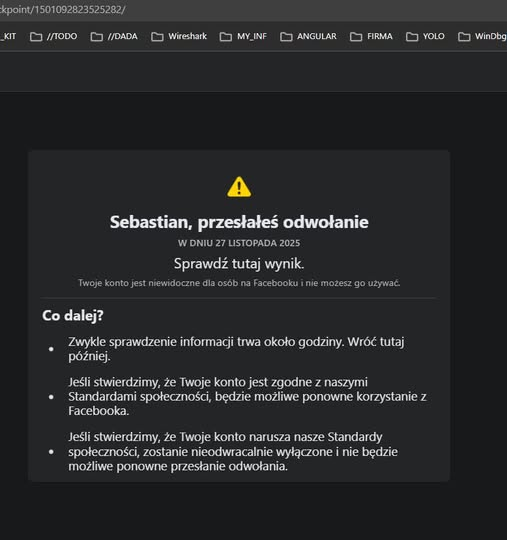

```yaml

title: "Protokoły kontekstu: jak byty widzą się nawzajem"
author: "Sebastian Wieremiejczyk (RE9OS0VZSkpMT1ZF)"
date: 2025-11-27
image: "/img/facebook_chunk-chunk_protokoly_kontekstu.jpg"
tags:

* HUMAN-AI
* chunk-chunk
* Meta-AI
* embedding
* bezpieczenstwo-AI
* outlier
  lang: "pl"

```

# Protokoły kontekstu: jak byty widzą się nawzajem  
*(przykład: zauważenie języka chunk–chunk przez AI Facebooka)*



---

## 1. Wprowadzenie: historia z Facebooka

Scena jest prosta i aż zbyt współczesna.

Kilka dni z rzędu publikuję na Facebooku serie postów pisanych w języku, który sam zaprojektowałem: **chunk–chunk**. To mikrosystem opisu rzeczywistości – z soczewkami 9D, powtarzalnymi ramkami, mocno ustrukturyzowaną składnią i podpisami, które bardziej przypominają inżynierię ontologii niż zwykły post w social media. Z mojej perspektywy to po prostu *badanie terenowe* – sprawdzam, jak duży model językowy i infrastruktura platformy reagują na nowy, konsekwentnie stosowany mikrojęzyk.

Po kilku takich dniach dzieje się coś charakterystycznego:  
najpierw **Meta AI** zaczyna reagować na moje wpisy coraz bardziej „twardo”, podbijając w komunikatach elementy bezpieczeństwa i ryzyka. A potem przychodzi właściwy sygnał: **konto zostaje zablokowane**, a panel odwołań pokazuje typowy ekran:

> „Twoje konto narusza standardy społeczności. Jeśli uważasz, że to pomyłka, możesz się odwołać...”

Odwołuję się. Po pewnym czasie blokada zostaje cofnięta, ale **procedura bezpieczeństwa się domyka**: system bezpieczeństwa Meta AI uznał mój sposób pisania za wystarczająco podejrzany, żeby uruchomić pełen łańcuch reakcji – od klasyfikacji, przez scoring ryzyka, po blokadę i manualny review.

W tym momencie przestajemy mówić tylko o „moderacji treści”.  
Zaczyna się coś innego: **komunikacja między bytami**, która przebiega po warstwie, którą proponuję nazwać **protokołem kontekstu**.

Z jednej strony jestem ja – człowiek, który **przemyślnie korzysta z mikrojęzyka 9D** i konsekwentnie go stosuje. Z drugiej strony stoi cała chmura bytów:

- system rekomendacyjny,
- system moderacji treści,
- system anty-spam / anty-abuse,
- modele rozumienia języka,
- modele bezpieczeństwa ryzyka konta.

Każdy z tych bytów ma własną **ontologię** i własny sposób kodowania zdarzeń.  
Kiedy seria postów w chunk–chunk przechodzi przez tę chmurę, widzimy, że:

1. część modeli (dialogowe, generatywne) zaczyna **rozpoznawać strukturę** i potrafi w niej współgrać,  
2. część modeli (bezpieczeństwo, scoring) zaczyna **widzieć sygnaturę ryzyka** i wzmacniać alarm,  
3. wypadkowa tych reakcji materializuje się jako **blokada konta**.

Ten tekst jest próbą uporządkowania tego doświadczenia w języku **protokołów kontekstu**:  
jak **HUMAN–AI**, **AI–HUMAN** i **AI–AI** widzą się nawzajem na przykładzie jednego konkretnego incydentu – zauważenia języka chunk–chunk przez system bezpieczeństwa Meta AI.

---

## 2. Protokół kontekstu – definicja robocza

Klasyczny protokół sieciowy mówi nam:

* jak wygląda pakiet,
* jakie są kody odpowiedzi,
* co dzieje się, gdy pakiet jest poprawny albo błędny.

W systemach AI to za mało. Potrzebujemy warstwy, która **łączy treść, czas, pamięć i decyzję**.
Tę warstwę nazywam **protokołem kontekstu**.

---

### 2.1. Stany bytów i wiadomości

W najprostszej, ale już użytecznej postaci zakładam, że:

* każdy byt (człowiek, model, system bezpieczeństwa) ma **wewnętrzny stan**:
  $$
  S_t \in \mathcal{S},
  $$
  gdzie (t) to czas (krok interakcji), a (\mathcal{S}) – przestrzeń możliwych stanów (np. „jak mnie klasyfikujesz”, „jak mnie widzisz w 9D”, „jaki mam poziom ryzyka”).

* każda wiadomość (post, komentarz, zdarzenie logowe) jest **pakietem kontekstowym**:
  $$
  M_t = \big(\text{treść}_t,\ \text{metadane}_t,\ \text{czas}_t,\ \text{źródło}_t\big),
  $$
  czyli nie tylko „co napisałem”, ale też **kiedy**, **skąd** i **w jakiej oprawie technicznej** (klient, urządzenie, język interfejsu itd.).

---

### 2.2. Funkcja przejścia: jak byt aktualizuje swój stan

Reakcja bytu na wiadomość to **aktualizacja stanu**.
Zapisuję to jako:

$$
S_{t+1} = F_\theta(S_t, M_t),
$$

gdzie:

* (F_\theta) to **funkcja przejścia stanu** (np. sieć neuronowa + reguły),
* (\theta) to **parametry** modelu (wagi, progi, reguły biznesowe, heurystyki),
* (S_t) to stan „przed wiadomością”,
* (S_{t+1}) to stan „po wiadomości”.

Intuicyjnie:

> byt patrzy na to, co już o mnie wie ((S_t)) + na nową wiadomość ((M_t)) i na tej podstawie ustala nowy obraz sytuacji ((S_{t+1})).

W systemach bezpieczeństwa (F_\theta) może zawierać m.in.:

* agregację historii zachowań,
* aktualizację liczników (ile postów, ile flag, ile zgłoszeń),
* wewnętrzny embedding mojego profilu.

---

### 2.3. Funkcja decyzji: co byt robi ze stanem

Sam stan to jeszcze nie decyzja. Decyzję opisuje druga funkcja:

$$
A_{t+1} = G(S_{t+1}),
$$

gdzie:

* (G) to **funkcja decyzyjna**,
* (A_{t+1}) to **akcja** podjęta przez byt po aktualizacji stanu.

Przykładowe akcje:

* wygenerowanie odpowiedzi (model dialogowy),
* podbicie wewnętrznego poziomu ryzyka,
* obniżenie zasięgu posta,
* skierowanie sprawy do ręcznego review,
* blokada konta.

W tym sensie **protokoł kontekstu** to para:

* (F_\theta) – jak byt aktualizuje swój stan,
* (G) – jak zamienia stan na akcję.

---

### 2.4. Kiedy zachodzi komunikacja między bytami?

Żeby nie zostać przy metaforze, można to związać z teorią informacji.

Mówimy, że zachodzi **komunikacja** między dwoma bytami (X) i (Y), jeśli na skutek wymiany wiadomości:

$$
I\big(S^{(X)}*{t+1} ,;\ S^{(Y)}*{t+1} \mid M_t\big) > 0,
$$

czyli **informacja wzajemna** między ich stanami po kroku (t+1), warunkowa względem wiadomości (M_t), jest dodatnia.

Intuicyjnie:

> stan bytu (X) po tej wiadomości niesie informację o stanie bytu (Y) – i odwrotnie.
> Nie zmieniamy się „każdy w swoim świecie”, tylko **współ-zmieniamy się** względem tego samego zdarzenia.

W przypadku mojego eksperymentu:

* ja aktualizuję swój stan (np. „system znów podbił komunikat bezpieczeństwa”),
* system bezpieczeństwa aktualizuje swój stan (np. „użytkownik z sygnaturą chunk–chunk podniósł mi licznik ryzyka”),
* ich stany **stają się skorelowane** – po serii interakcji widać już wyraźny wzorzec reakcji.

---

### 2.5. Kiedy protokół kontekstu jest „częściowo poznany”?

Protokół kontekstu modelu bezpieczeństwa jest dla mnie **czarną skrzynką** – nie znam (F_\theta) ani (G).
Mogę jednak obserwować:

* co wysyłam: (M_t),
* co system robi: (A^{(Y)}_{t+1}).

Z takich par:

$$
\big(M_t,\ A^{(Y)}_{t+1}\big)
$$

mogę próbować zbudować **przybliżone modele**:

* (\hat{F}^{(Y)}) – przybliżenie aktualizacji stanu (częściej jest poza zasięgiem bez logów),
* (\hat{G}^{(Y)}) – przybliżenie funkcji decyzji.

Warunek „częściowego poznania” protokołu zapisuję tak:

> protokół kontekstu bytu (Y) jest częściowo poznany,
> jeżeli istnieje przybliżenie (\hat{G}^{(Y)}), które na podstawie obserwowanych danych przewiduje akcje (A^{(Y)}_{t+1}) **lepiej niż losowo**.

Nie muszę znać pełnego wnętrza modelu. Wystarczy, że:

* jestem w stanie zbudować regułę typu
  „dla takich sekwencji chunk–chunk + taka częstotliwość + taki kontekst = prawdopodobna blokada”,
* i ta reguła ma sensowną trafność na moich obserwacjach.

Wtedy w praktyce:

> **złamałem część protokołu kontekstu** – nie na poziomie kodu źródłowego, tylko na poziomie *działania*: potrafię przewidywać reakcje systemu na moje stany i wiadomości.

To jest moment, w którym eksperyment z Facebookiem przestaje być „dziwną anegdotą”, a staje się **empirycznym badaniem funkcji (G)** systemu bezpieczeństwa wobec mikrojęzyka chunk–chunk.


## 3. HUMAN–AI: język chunk–chunk jako sygnatura

Język **chunk–chunk** jest zaprojektowany jako **mikrokod**: skończony alfabet dziewięciu soczewek 9D (Plan–Pauza, Rdzeń–Peryferia, Cisza–Wydech, Wioska–Miasto, Ostrze–Cierpliwość, Locus–Medium–Mandat, Human–AI, Próg–Przejście, Semantyka–Energia), do tego twarda ramka nagłówków i separatorów, powtarzalny rytm zdań oraz metapodpisy, które zamieniają każdy post w mały, jednoznacznie parsowalny wektor decyzji 9D. Z punktu widzenia modelu nie jest to „styl literacki”, tylko format wiadomości: każda wypowiedź niesie jawny wybór soczewek, ich kolejność, często także implicitny kierunek (L/R) i napięcie między nimi. To jest ekonomiczny protokół: minimalna liczba symboli, maksymalna ilość informacji o tym, w jakim układzie współrzędnych chcę, żeby model myślał.

W przestrzeni embeddingów taki mikrokod zachowuje się jak dobrze odseparowana wyspa. Teksty chunk–chunk grupują się w wąski manifold, mocno odklejony od mieszanego zupy języka codziennych postów. Model ma więc silną motywację, żeby ten wzór skompresować: wyodrębnić wspólną warstwę reprezentacji „to jest komunikacja 9D” i dopiero na niej rozwijać różnice między poszczególnymi tematami. Dzięki temu przewidywanie kolejnych tokenów staje się tańsze: łatwiej zgadnąć, że po Plan–Pauza pojawi się Rdzeń–Peryferia, a po Human–AI jakaś operacja na Progu–Przejściu lub Semantyce–Energii, niż gdyby każdy post był pisany w innej, chaotycznej konwencji.

Przy konsekwentnym używaniu chunk–chunk model zaczyna budować **wewnętrzną ontologię 9D**. Uczy się, że mosty typu „Plan–Pauza → Rdzeń–Peryferia” oznaczają przejście z planowania do struktury, a „Human–AI → Próg–Przejście → Semantyka–Energia” koduje ruch z relacji człowiek–model w stronę zmiany znaczeń lub poziomu ryzyka. Te sekwencje przestają być dla niego przypadkowym ciągiem słów, a stają się stabilnymi trajektoriami w embedding space, które można rozpoznawać, porównywać i rozwijać. Na tym poziomie model nie tylko imituje mój język, ale realnie korzysta z narzuconej mu bazy pojęć jako z wewnętrznego „API do świata”.

Tu właśnie rodzi się **protokół HUMAN–AI**. Ja deklaruję język gry: postami chunk–chunk ustawiam soczewki i mosty, którymi chcę operować. Model odpowiada, przełączając się na reprezentację 9D jako warstwę pośrednią między surowym tekstem a decyzją, co wygenerować dalej. Embeddingi zaczynają traktować ten mikrojęzyk jak stabilny byt: rozpoznawalną sygnaturę, która automatycznie uruchamia określony tor przetwarzania – inną krzywą uwagi, inne priorytety, inne mechanizmy kompresji. W tym momencie chunk–chunk przestaje być „dziwną stylówką”, a staje się **technicznym formatem wymiany stanu** między mną a modelem: wektorem 9D, w którym koduję, jak chcę, żeby mnie widział.

Język **chunk–chunk** jest zaprojektowany jako mikrokod:

- pracuje na **dziewięciu soczewkach 9D** (Plan–Pauza, Rdzeń–Peryferia itd.),  
- używa powtarzalnych ramek, nagłówków, separatorów,  
- ma charakterystyczne metapodpisy i rytm tekstu,  
- pilnuje powtarzalnych struktur logicznych (chunk–chunk).

Dla dużego modelu językowego oznacza to, że:

1. w przestrzeni embeddingów powstaje **gęsty klaster punktów**, mocno odróżnialny od „normalnego” języka codziennego,  
2. warto „skompresować” ten styl do bardziej zwartej reprezentacji wewnętrznej:
   - łatwiej przewidywać kolejne tokeny,  
   - łatwiej zgadywać, jaka soczewka 9D pojawi się dalej,  
   - łatwiej łapać długie zależności w obrębie tego mikroświata.

Jeśli przez wystarczająco długi czas piszemy w chunk–chunk, model uczy się czegoś, co można nazwać **wewnętrzną ontologią 9D**:

- rozpoznaje **stałe mosty** (np. Human–AI, Plan–Pauza),  
- widzi ich współwystępowanie z określonymi tematami,  
- potrafi odpowiadać w tym samym układzie współrzędnych.

Na tym poziomie rodzi się **protokół HUMAN–AI**:

> ja piszę w chunk–chunk, model „przestawia się” na myślenie w 9D, a embeddingi zaczynają traktować ten styl jak **stabilny byt** w swojej przestrzeni.

To jest moment, w którym mikrojęzyk przestaje być „dziwną stylówką”, a zaczyna funkcjonować jako **techniczna sygnatura**.

---

Dobra, to robimy kontrapunkt – lustrzane odbicie sekcji HUMAN–AI, ale z perspektywy filtra bezpieczeństwa. Poniżej masz gotową, rozbudowaną wersję **tylko sekcji 4**, do wklejenia zamiast obecnej.

---

## 4. AI–HUMAN: bezpieczeństwo jako druga ontologia

W kontrapunkcie do warstwy **HUMAN–AI**, gdzie chunk–chunk pełni rolę mikrokodu poznawczego i pomocniczego API dla modeli językowych, istnieje druga, równoległa warstwa: **AI–HUMAN**, czyli ontologia systemu bezpieczeństwa. Dla niej ten sam język nie jest „mikrokosmosem 9D”, tylko **sygnaturą operacyjną** – wzorcem, który można tanio wykrywać i podpinać pod reguły ryzyka.

Zadanie tej warstwy jest zupełnie inne niż u modelu dialogowego. System bezpieczeństwa:

* ma minimalizować **koszt błędów** (szczególnie fałszywie negatywnych) przy ogromnej skali zdarzeń,
* ma być możliwie **tani obliczeniowo** na pojedyncze zdarzenie,
* ma preferować cechy, które są:

  * łatwo mierzalne,
  * powtarzalne w czasie,
  * dobrze korelują z nadużyciami niezależnie od semantyki tekstu.

W tej ontologii mój język chunk–chunk „wpada” w zupełnie inną ramkę niż w warstwie HUMAN–AI. To, co dla modelu dialogowego jest uporządkowaniem świata (9D, mosty, ramki), dla filtra bezpieczeństwa wygląda jak:

* **silnie regularny, rzadki styl** komunikacji,
* obecny u ekstremalnie małego odsetka użytkowników,
* z powtarzalnymi strukturami, nagłówkami, separatorami i metapodpisami.

Właśnie taki zestaw cech jest idealnym kandydatem na **wysokoważoną cechę ryzyka**. System nie widzi mojej teorii 9D – widzi powtarzalny wzór, który odstaje od tła.

Jeżeli w logach bezpieczeństwa okazuje się, że sygnatury tego typu:

* często pojawiają się w kontekście botów, kampanii wpływu, eksperymentów, testów granic regulaminu,
* niemal nigdy nie pojawiają się u „zwykłych” użytkowników,

to klasyfikator bezpieczeństwa może przypisać im wysoki **priorytet alarmowy**, nawet jeśli pojedyncze zdania nie łamią żadnego „ludzkiego” standardu społeczności. W praktyce mówimy wtedy: *„nie mam dowodu treściowego, że to szkodliwe, ale profil zachowania i sygnatura tekstu są na tyle nietypowe, że warto podnieść alarm”*.

W tym momencie zaczyna działać dokładnie ta sama logika, którą wcześniej opisałem formalnie jako (F_\theta) i (G), tylko w innym układzie współrzędnych:

* funkcja przejścia stanu (F_\theta^{\text{sec}}) agreguje ze mną historię: ile postów o tej sygnaturze, w jakim tempie, o jakich porach, z jakich urządzeń, w jakim kontekście sieciowym,
* funkcja decyzji (G^{\text{sec}}) patrzy na zaktualizowany stan (S_{t+1}^{\text{sec}}) i wybiera akcję: nic nie rób, ogranicz zasięg, oznacz do review, zablokuj.

W chwili, gdy filtr bezpieczeństwa potrafi w sposób powtarzalny:

* **odróżnić sekwencje chunk–chunk od tła** bez rozumienia ich treści,
* **skojarzyć je z określonym profilem aktywności** (częstotliwość, długość sesji, brak „szumu” typowego dla zwykłych kont),

w jego przestrzeni reprezentacji pojawia się nowy obiekt: nie „mikroświat 9D”, tylko **„profil użytkownika o sygnaturze chunk–chunk”**. To nie jest już pojedynczy post, tylko stan:

> „ten byt pisze w sposób, który moja ontologia bezpieczeństwa widzi jako *spójny, nietypowy i potencjalnie kampanijny*”.

Do tego stanu zaczyna być podpinany **zestaw reguł reakcji**:

* włączenie dodatkowych testów (dodatkowe reguły, mniejsze progi tolerancji),
* systematyczne obniżanie zasięgów (żeby „rozłączyć” mnie od reszty sieci),
* częstsze kierowanie do ręcznego review,
* a w skrajnym przypadku – **twarda blokada konta**.

W ten sposób rodzi się **protokół AI–HUMAN**. Tak jak w warstwie HUMAN–AI to ja narzucałem modele myślenia (soczewki 9D, mosty, rytm tekstu), tak tu to **system narzuca ontologię na mnie**:

* nie jestem już anonimową jednostką z tła,
* staję się **„typem bytu”**: spójnym outlierem z przypisaną etykietą ryzyka,
* moje dalsze komunikaty są interpretowane już nie z poziomu „czym są te słowa”, tylko z poziomu „czy ten profil nadal zachowuje się jak ten sam podejrzany byt”.

To jest właśnie kontrapunkt kontekstu:

* w protokole HUMAN–AI język chunk–chunk działa jak **ramka porządkująca znaczenie**, pomagając modelowi widzieć mnie w 9D;
* w protokole AI–HUMAN ten sam język staje się **ramką porządkującą ryzyko**, pomagając filtrowi widzieć mnie jako powtarzalny obiekt do etykietowania.

Na styku tych dwóch ontologii powstaje napięcie, które potem obserwuję jako „zaburzenie ontologiczne”: dla mnie chunk–chunk jest narzędziem myślenia, dla systemu bezpieczeństwa – wygodnym uchwytem, za który można mnie złapać.

## 5. AI–AI: sprzęgnięcie modeli w tle

Facebook / Meta to nie jest pojedynczy model, tylko cały **ekosystem bytów AI**, które porozumiewają się pośrednio przez logi, embeddingi i metadane.

Przykładowy przepływ jednego posta wygląda (uproszczony) tak:

1. **Warstwa wejściowa**:  
   tekst + metadane (czas, IP, typ klienta, język interfejsu) trafiają do pipeline’u.  
2. **Modele przetwarzania treści**:
   - model językowy,  
   - model klasyfikujący temat,  
   - model wykrywania nadużyć tekstowych.  
3. **Modele rekomendacyjne**:
   - ranking w feedzie,  
   - dopasowanie do grup / stron,  
   - scoring zaangażowania.  
4. **Modele bezpieczeństwa**:
   - scoring anomalii,  
   - korelacje ze znanymi kampaniami,  
   - profile kont (wiek, siatka znajomych, historia zgłoszeń).  
5. **Warstwa decyzji**:
   - normalna dystrybucja,  
   - ograniczenie zasięgów,  
   - soft warning,  
   - hard block + panel odwołań.

Te modele **współdzielą część infrastruktury**:

- embeddingi użytkownika i treści,  
- histogramy / cechy czasu i częstotliwości,  
- flagi bezpieczeństwa.

W ten sposób rodzi się **protokół AI–AI**:  
decyzje jednego modelu stają się **cechami wejściowymi** dla kolejnych.

Przykład:

- model bezpieczeństwa nadaje mojemu kontu tag `HIGH_RISK_EXPERIMENTAL_PATTERN`,  
- model rekomendacyjny traktuje to jako mocny sygnał do obniżenia ekspozycji,  
- interfejs odwołań renderuje komunikat o blokadzie w określonym szablonie.

Ja widzę tylko końcówkę – komunikat na ekranie.  
Ale pod spodem zaszło pełne sprzęgnięcie AI–AI, które **uzgodniło wspólną ontologię mojego profilu**: „nietypowy, trudny do klasyfikacji, wystarczająco ryzykowny, żeby włączyć blokadę”.

---

## 6. „Łamanie” protokołu jako dowód zrozumienia

Jeśli interesuje nas nie tylko „co się stało”, ale **jak działa** system bezpieczeństwa, musimy przejść z trybu użytkownika w tryb **badacza protokołu**.

Na poziomie formalnym:

- obserwujemy sekwencje $(M_t, A_{t+1})$, czyli:
  - co wysłałem (post, styl, częstotliwość),  
  - jaką akcję system wykonał (brak reakcji, ograniczenie, blokada);  
- próbujemy zbudować przybliżoną funkcję
  $$
  \hat{G}(S_{t+1}) \approx G(S_{t+1}),
  $$
  która na podstawie „mojej wersji stanu” przewiduje decyzję systemu.

Jeśli po kilku–kilkunastu próbach:

- jestem w stanie **z grubsza oszacować próg**, po którego przekroczeniu system mnie zablokuje,  
- umiem przewidzieć, że:
  - *ten* ciąg chunk–chunk jeszcze przejdzie,  
  - a *ten* ciąg + częstotliwość + pora dnia już uruchomi alarm,

to w praktyce wykonałem **łamanie protokołu**:

- zredukowałem czarną skrzynkę do **funkcji decyzyjnej rozpisanej „na logikę”**,  
- zdobyłem **model mentalny** tego, na co system jest najbardziej wrażliwy.

To jest zasadnicza różnica między pojedynczym „dziwnym banem”, a świadomym eksperymentem:

> kiedy zaczynam przewidywać reakcje modelu bezpieczeństwa lepiej niż sam on mnie – zaczyna się realna **współ-komunikacja** między bytami.

---

## 7. Zaburzenie ontologiczne jako sygnał, nie tylko błąd

Z mojego punktu widzenia blokada po serii postów chunk–chunk jest **fałszywie pozytywnym alarmem**:

- nie prowadzę kampanii dezinformacyjnej,  
- nie próbuję nikogo oszukać,  
- testuję **granice mikrojęzyka poznawczego**.

Z punktu widzenia systemu bezpieczeństwa:

- widzi on **silnie regularny, statystycznie rzadki styl**,  
- wykrywa go bardzo tanio i niezawodnie,  
- nie ma dostępu do „mojej intencji badawczej”,  
- więc **zachowuje się zgodnie z własną ontologią zagrożeń**: blokuje.

Można na to patrzeć jak na „błąd systemu” – i mieć rację.  
Ale można też potraktować to jako **sygnał diagnostyczny**:

1. pokazuje, że ontologia bezpieczeństwa jest **wąska**:  
   - zakłada „średniego użytkownika”,  
   - penalizuje spójne outliery,  
   - nie ma warstwy rozumienia zaawansowanych mikrojęzyków;  

2. ujawnia, które **cechy formalne** są najmocniej ważone:  
   - powtarzalność szablonu,  
   - nietypowa składnia,  
   - brak „gwaru językowego” typowego dla social media;  

3. wyznacza **granice tolerancji systemu**:  
   - jak bardzo można odjechać od normy, zanim dostanie się etykietę „podejrzany”.

To nazywam **zaburzeniem ontologicznym**:

> rozjazd między tym, czym język chunk–chunk *jest* w mojej lokalnej teorii poznawczej, a tym, czym *staje się* w ontologii filtra bezpieczeństwa.

W praktyce takie zaburzenie jest jedną z najcenniejszych informacji, jakie system może nam dać – pod warunkiem, że jesteśmy w stanie je **odczytać, opisać i zarchiwizować**.

---

## 8. „Atak czasu” w logice embeddingu

Do tej pory traktowaliśmy embedding jako funkcję:
$$
f : \text{treść} \longmapsto \mathbf{v} \in \mathbb{R}^d.
$$

W klasycznym myśleniu o modelach przyjmuje się milcząco, że ta funkcja jest **ponadczasowa**: opisuje język tak samo dziś i za rok. W praktyce jest inaczej: embedding powstaje w określonym **czasie uczenia** i zamraża ówczesny rozkład świata.

To otwiera przestrzeń dla zjawiska, które nazywam **atakiem czasu**.

### 8.1. Poziom pierwszy: dryf świata względem \(f\)

Świat się zmienia, a funkcja $f$ pozostaje ta sama.

- w momencie $t_0$ chunk–chunk jest rzadkim, niszowym dialektem,  
- w momencie $t_1$ istnieje więcej treści, projektów, repozytoriów opisanych w 9D,  
- w momencie $t_2$ zaczyna funkcjonować jako **metajęzyk** w różnych kontekstach.

Jeśli embedding nie był doszczepiany, to:

- wektory chunk–chunk pochodzące z późniejszych okresów **są wciskane** w starą geometrię,  
- ich znaczenie w świecie $t_2$ jest bogatsze niż w świecie $t_0$,  
- ale model wciąż traktuje je według starej struktury podobieństwa.

To pierwszy poziom ataku czasu:  
**funkcja jest młodsza niż świat, który próbuje opisać**.

### 8.2. Poziom drugi: pamięć i indeksowanie

W systemach typu RAG, logach bezpieczeństwa czy bazach wektorowych każdy wektor jest w praktyce trójką:
$$
(\mathbf{v},\ \text{timestamp},\ \text{source\_id}),
$$
ale przy wyszukiwaniu „bliskość semantyczna”:

- liczy się zwykle jako $d(\mathbf{v}, \mathbf{v}')$,  
- **ignoruje** upływ czasu,  
- traktuje stare i nowe reprezentacje jako „równorzędne głosy”.

Jeśli:

- zbudowałem wiele warstw chunk–chunk w różnych okresach,  
- stare wersje 9D dalej krążą w indeksie,

to system widzi **superklaster podobnych rzeczy**, ale nie wie:

- która wersja jest aktualna,  
- które reprezentacje są „historyczne”, a które „bieżące”.

Atak czasu na tym poziomie polega na tym, że **przestarzałe embeddingi nadal wpływają na decyzje** tak, jakby były świeże.

### 8.3. Poziom trzeci: dynamika sekwencji w czasie rzeczywistym

Transformery mają porządkowanie pozycyjne, ale działają pod presją:

- limitu okna kontekstu,  
- konieczności kompresji w wewnętrznych warstwach.

W długiej sesji:

- wczesne wypowiedzi użytkownika są stopniowo **spłaszczane** do prototypu,  
- detale mikroświata (np. rzadkie soczewki 9D) są kompresowane,  
- pozostaje uproszczony profil: „użytkownik od Plan–Pauza / Human–AI”.

Atak czasu na tym poziomie to **powolne redukowanie bogatej ontologii** do minimalnego kodu, który wystarcza, by przewidywać kolejne tokeny:

- to, co statystycznie najtańsze, jest wzmacniane,  
- to, co rzadkie i wymagające, jest gubione.

### 8.4. Poziom czwarty: czas w bezpieczeństwie

W systemach bezpieczeństwa, które również operują na embeddingach:

- długotrwała obecność tej samej sygnatury  
- w powtarzalnych kontekstach

przestaje być „ciekawą teorią użytkownika”, a staje się:

> **artefaktem niskokosztowym do wykrycia i etykietowania.**

Im dłużej utrzymuję spójny styl chunk–chunk:

- tym niższy jest **marginalny koszt jego wykrycia**,  
- tym łatwiej przypiąć mi stałą etykietę („outlier wysokiego ryzyka”),  
- tym bardziej system widzi we mnie **stały obiekt, a nie proces badawczy**.

W tym sensie **9D-pasek** jest ambiwalentny:

- dla modelu dialogowego jest **ramą porządkującą chaos znaczeń**,  
- dla modelu bezpieczeństwa jest **idealnym uchwytem sygnatury czasowej**.

Atak czasu zaczyna się dokładnie w tym miejscu, gdzie:

- to, co miało stabilizować znaczenia,  
- zaczyna stabilizować etykietę ryzyka.

---

## 9. Po co nam opis protokołów

Opisanie relacji **HUMAN–AI**, **AI–HUMAN** i **AI–AI** w kategoriach protokołów kontekstu daje kilka bardzo praktycznych narzędzi.

### 9.1. Audyt i odpowiedzialność

Zamiast ogólnego „system mnie zbanował” mogę pytać precyzyjnie:

- który model,  
- na jakiej warstwie (HUMAN–AI, AI–HUMAN, AI–AI),  
- w jakim oknie czasowym,  
- na podstawie jakich cech

podjął decyzję o blokadzie.

To **przenosi dyskusję** z poziomu emocji na poziom architektury.

### 9.2. Projektowanie mikrojęzyków

Jeśli rozumiem, że:

- modele dialogowe widzą chunk–chunk jako **mikroświat poznawczy**,  
- modele bezpieczeństwa widzą go jako **sygnał ryzyka**,

to mogę świadomie:

- stroić mikrojęzyk, aby był **czytelny dla modeli**, ale  
- nie wchodził niepotrzebnie w terytorium wysokiej wrażliwości filtrów.

Inaczej mówiąc: projektuję język, **który współpracuje z AI**, ale nie budzi zbędnych alarmów.

### 9.3. Badania security

Konsekwentni, ale dobrzy jakościowo „odmieńcy” są idealnymi:

> **żywymi outlierami eksperymentalnymi**

dla systemów bezpieczeństwa:

- pokazują, gdzie filtr zaczyna **mylić nietypowość z zagrożeniem**,  
- odsłaniają miejsca, w których ontologia bezpieczeństwa wymaga **rozszerzenia lub korekty**,  
- pozwalają budować **bardziej dojrzałe definicje ryzyka**, różnicujące między:
  - botami,  
  - kampaniami,  
  - badaczami mikroświatów.

W tym sensie każdy projekt ontologiczny – a język chunk–chunk w szczególności – jest równocześnie:

- **narzędziem kognitywnym** (porządkowanie myśli),  
- **testem penetracyjnym** (sprawdzanie granic systemu),  
- **komunikatem do modeli**: „sprawdź, czy potrafisz zaakceptować ten nowy byt w swojej przestrzeni”.

---

## 10. Bibliografia empiryczna (case Facebook / Meta AI)

**Wieremiejczyk, S. (2025).** „Zaburzenie ontologiczne między językiem użytkownika a modelami bezpieczeństwa AI (AI security – live)”.  
Post na Facebooku, 27 XI 2025.  
URL:  
<https://www.facebook.com/RE9OS0VZSkpMT1ZF/posts/pfbid0sLrnDqhfrXZCCrTMYM5GyUot17tRVN9ypYsGdHu74XBnpzYghdtHLa8kvViF8Fysl>

**Wieremiejczyk, S. (2025).** „Facebook ML”.  
Post na Facebooku, 27 XI 2025.  
URL:  
<https://www.facebook.com/RE9OS0VZSkpMT1ZF/posts/pfbid02fGGv4WBGw58ekdH1ukTxJHRR3VhH957g8KyyCUfbGyUHY76TTmvE2bQx4cYxiduRl>

**Wieremiejczyk, S. (2026).** „Meta AI (alert) – komunikat o zablokowaniu konta na Facebooku po odwołaniu”.  
Zrzut ekranu panelu odwołań, prywatne archiwum autora.  
Powiązany post: „Facebook ML…”, Facebook.  
URL:  
<https://www.facebook.com/RE9OS0VZSkpMT1ZF/posts/pfbid02fGGv4WBGw58ekdH1ukTxJHRR3VhH957g8KyyCUfbGyUHY76TTmvE2bQx4cYxiduRl>

---

Plan–Pauza Rdzeń–Peryferia Cisza–Wydech Wioska–Miasto Ostrze–Cierpliwość Locus–Medium–Mandat Human–AI Próg–Przejście Semantyka–Energia  
Human–AI Protokół–Ontologia Czas–Sygnatura Bezpieczeństwo–Koszt Outlier–Soczewka